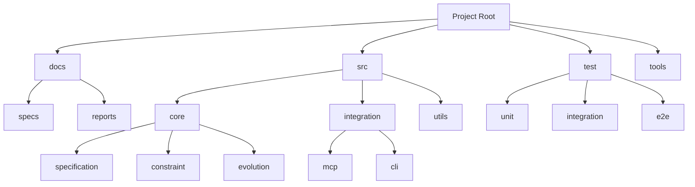

# Dynamic Specification Growth System (DNASPEC) Design Document

## 1. Overview
This document outlines the technical design for the Dynamic Specification Growth System (DNASPEC), a system that manages software engineering complexity through hierarchical, context-aware constraints. The system follows a phased approach, starting with a lightweight MVP and evolving into a full-featured specification management system. The design emphasizes minimal dependencies for the MVP while providing a clear path for future enhancements.

## 2. Architecture
The system follows a strict hierarchical, tree-structured architecture with top-down design and bottom-up implementation principles:



The architecture enforces strict organizational principles:
- Tree-structured directory hierarchy with pyramid-style documentation
- Single responsibility principle for all components
- Top-down design with bottom-up implementation
- Minimal token consumption for AI context generation

All directories and files follow strict naming conventions:
- No plural forms in names
- CamelCase for all identifiers
- Maximum 500 lines per script file
- External interfaces documented at the top of each file
- Directory-level functionality and specifications documented in README.md

## 3. Components and Interfaces

### 3.1 Core Components

#### 3.1.1 SpecificationManager
- **Responsibility**: Manages the lifecycle of specifications (BSL, TCC, etc.)
- **Interface**: 
  ```typescript
  /**
   * Loads a specification from the specified path
   * @param path - The file path to load the specification from
   * @returns The loaded Specification object
   * @throws Error if the specification cannot be loaded or is invalid
   */
  function loadSpecification(path: string): Specification;

  /**
   * Saves a specification to the specified path
   * @param spec - The Specification object to save
   * @param path - The file path to save the specification to
   * @throws Error if the specification cannot be saved
   */
  function saveSpecification(spec: Specification, path: string): void;

  /**
   * Validates a specification against the defined schema
   * @param spec - The Specification object to validate
   * @returns ValidationResult indicating success or failure with details
   */
  function validateSpecification(spec: Specification): ValidationResult;
  ```

#### 3.1.2 ConstraintGenerator
- **Responsibility**: Generates constraints based on task context and type
- **Interface**:
  ```typescript
  /**
   * Generates constraints based on the provided task context capsule
   * @param tcc - The TaskContextCapsule containing task details and context
   * @returns Array of Constraint objects that should be applied to the task
   * @throws Error if constraint generation fails due to invalid context
   */
  function generateConstraints(tcc: TaskContextCapsule): Constraint[];

  /**
   * Matches constraint templates to the specified task type
   * @param taskType - The type of task to find templates for
   * @returns Array of ConstraintTemplate objects that match the task type
   */
  function matchTemplates(taskType: string): ConstraintTemplate[];
  ```

#### 3.1.3 EvolutionManager
- **Responsibility**: Manages the system's own evolution and self-referential specification
- **Interface**:
  ```typescript
  /**
   * Gets the current evolutionary stage of the system
   * @returns EvolutionStage indicating the current phase of system development
   */
  function getCurrentStage(): EvolutionStage;

  /**
   * Generates constraints for the system's own development based on current stage
   * @returns Array of Constraint objects that should be applied to system development
   * @throws Error if self-constraint generation fails
   */
  function generateSelfConstraints(): Constraint[];

  /**
   * Migrates the system to the next evolutionary stage
   * @returns MigrationResult indicating success or failure with details
   * @throws Error if migration is not possible or fails
   */
  function migrateToNextStage(): MigrationResult;
  ```

### 3.2 Integration Interfaces

#### 3.2.1 McpAdapter
- **Responsibility**: Provides MCP-compliant interface for IDE integration
- **Interface**: Implements MCP server protocol for communication with Cline/VS Studio

#### 3.2.2 CliInterface
- **Responsibility**: Provides command-line interface for CI/CD integration
- **Interface**: Standard POSIX-compliant CLI with appropriate exit codes

## 4. Data Models

### 4.1 Basic Survival Laws (BSL)
```json
{
  "version": "1.0",
  "bsl": [
    "NO_DEADLOCK",
    "MINIMAL_PRIVILEGE",
    "NO_RESOURCE_LEAK",
    "INPUT_VALIDATION",
    "ERROR_HANDLING"
  ],
  "metadata": {
    "created": "2025-03-28T00:00:00Z",
    "modified": "2025-03-28T00:00:00Z",
    "author": "system"
  }
}
```

### 4.2 Task Context Capsule (TCC)
```json
{
  "taskId": "string",
  "goal": "string",
  "taskType": "string",
  "context": {
    "relevantConstraints": ["string"],
    "systemState": {
      "loadLevel": "LOW|MED|HIGH",
      "dependencies": ["string"]
    },
    "creationTime": "string"
  },
  "size": "number"
}
```

### 4.3 Constraint Template
```json
{
  "id": "string",
  "name": "string",
  "category": "SECURITY|PERFORMANCE|ARCHITECTURE|OTHER",
  "description": "string",
  "rule": "string",
  "applicableTasks": ["string"],
  "severity": "WARNING|ERROR"
}
```

## 5. Error Handling
The system implements a comprehensive error handling strategy:

### 5.1 Error Categories
- **Validation Errors**: Specification format violations
- **Constraint Violations**: Code that violates defined constraints
- **System Errors**: Internal system failures
- **Integration Errors**: Issues with external systems

### 5.2 Error Response Format
```json
{
  "errorId": "string",
  "severity": "INFO|WARNING|ERROR|FATAL",
  "message": "string",
  "suggestions": ["string"],
  "context": "object",
  "timestamp": "string"
}
```

### 5.3 Recovery Strategies
- **Graceful Degradation**: Continue operation with reduced functionality
- **Fallback Mechanisms**: Use default constraints when templates are unavailable
- **Circuit Breaker**: Prevent cascading failures in constraint evaluation

## 6. Testing Strategy

### 6.1 Test Levels
- **Unit Tests**: Individual components and functions
- **Integration Tests**: Component interactions and MCP integration
- **System Tests**: End-to-end functionality
- **Acceptance Tests**: Validation against requirements

### 6.2 Test Coverage Goals
- 90%+ code coverage for core components
- 100% coverage for constraint evaluation logic
- Performance testing for constraint generation (<100ms)
- Load testing for IDE integration (<5% CPU overhead)

### 6.3 Testing Tools
- **Jest**: Unit and integration testing
- **Puppeteer**: End-to-end testing with IDE integration
- **JMeter**: Performance and load testing
- **Cypress**: User interaction testing

## 7. Evolution Path

### 7.1 MVP Phase (Phase 0)
- File-based specification storage (JSON)
- JavaScript-based constraint evaluation
- Basic MCP integration
- Manual evolution management

### 7.2 Enhanced Phase (Phase 1)
- OPA integration for advanced policy evaluation
- Neo4j for specification graph storage
- Automated CI/CD integration
- Basic self-monitoring

### 7.3 Intelligent Phase (Phase 2)
- Machine learning for constraint suggestion
- Natural language processing for requirement parsing
- Predictive constraint generation
- Automated evolution based on metrics

### 7.4 Autonomous Phase (Phase 3)
- Full self-referential operation
- Autonomous evolution decisions
- Cross-project specification sharing
- Self-optimizing architecture
