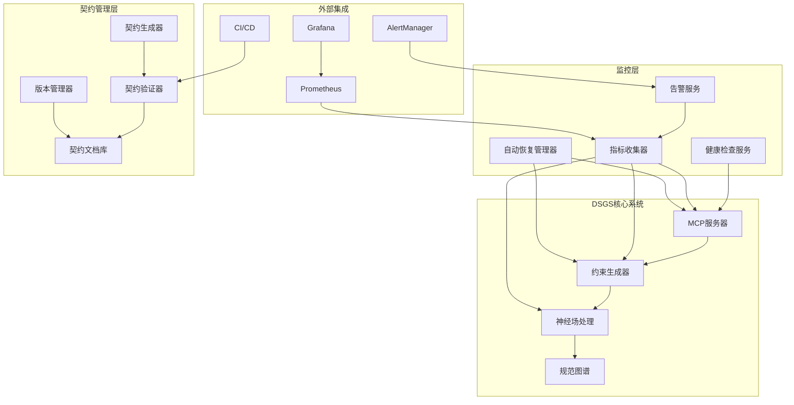
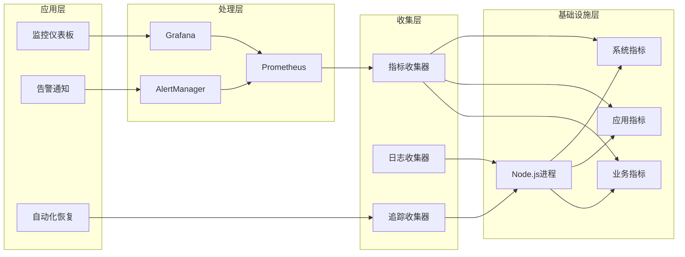
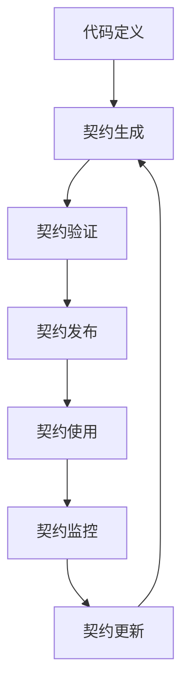

# **DSGS服务监控与契约文档增强设计文档**
**版本：2.0**  
**日期：2025年8月6日**

## **1. 架构设计**

### 1.1 整体架构



### 1.2 监控架构设计

#### 1.2.1 监控组件层次



#### 1.2.2 健康检查设计

```typescript
// 健康检查核心接口
interface HealthCheckService {
  // 系统整体健康状态
  getSystemHealth(): Promise<SystemHealth>;
  
  // 组件健康状态
  getComponentHealth(component: string): Promise<ComponentHealth>;
  
  // 深度诊断
  getDiagnostics(): Promise<Diagnostics>;
  
  // 健康检查历史
  getHealthHistory(period: string): Promise<HealthHistory[]>;
}

interface SystemHealth {
  status: 'healthy' | 'degraded' | 'unhealthy';
  timestamp: string;
  version: string;
  uptime: number;
  components: ComponentHealth[];
  metrics: SystemMetrics;
  issues: HealthIssue[];
}

interface ComponentHealth {
  name: string;
  status: 'healthy' | 'degraded' | 'unhealthy';
  details: string;
  lastCheck: string;
  metrics?: ComponentMetrics;
  dependencies?: string[];
}
```

### 1.3 契约管理架构设计

#### 1.3.1 契约生命周期



#### 1.3.2 契约文档结构

```typescript
// 契约文档核心结构
interface ApiContract {
  metadata: ContractMetadata;
  endpoints: ApiEndpoint[];
  dataModels: DataModel[];
  webhooks: WebhookDefinition[];
  events: EventDefinition[];
  compatibility: CompatibilityMatrix;
  examples: ExampleCollection;
}

interface ApiEndpoint {
  path: string;
  method: 'GET' | 'POST' | 'PUT' | 'DELETE' | 'PATCH';
  summary: string;
  description: string;
  parameters: Parameter[];
  requestBody?: RequestBody;
  responses: ResponseDefinition[];
  security: SecurityRequirement[];
  tags: string[];
}

interface DataModel {
  name: string;
  type: 'object' | 'array' | 'string' | 'number' | 'boolean';
  description: string;
  properties?: PropertyDefinition[];
  required?: string[];
  example?: any;
}
```

## **2. 详细设计**

### 2.1 监控服务设计

#### 2.1.1 健康检查服务

```typescript
// src/core/monitoring/HealthCheckService.ts
export class HealthCheckService {
  private components: Map<string, HealthChecker> = new Map();
  private metrics: MetricsCollector;
  private recoveryManager: RecoveryManager;
  
  constructor() {
    this.initializeComponents();
    this.startHealthChecks();
  }
  
  private initializeComponents() {
    // 注册所有需要监控的组件
    this.components.set('mcpServer', new McpServerHealthChecker());
    this.components.set('constraintGenerator', new ConstraintGeneratorHealthChecker());
    this.components.set('neuralField', new NeuralFieldHealthChecker());
    this.components.set('database', new DatabaseHealthChecker());
  }
  
  async getSystemHealth(): Promise<SystemHealth> {
    const componentHealths = await Promise.all(
      Array.from(this.components.values()).map(checker => checker.check())
    );
    
    const overallStatus = this.calculateOverallStatus(componentHealths);
    const metrics = await this.metrics.collectSystemMetrics();
    const issues = this.identifyIssues(componentHealths);
    
    return {
      status: overallStatus,
      timestamp: new Date().toISOString(),
      version: process.env.VERSION || '2.0.0',
      uptime: process.uptime(),
      components: componentHealths,
      metrics,
      issues
    };
  }
  
  private calculateOverallStatus(components: ComponentHealth[]): SystemHealth['status'] {
    const hasUnhealthy = components.some(c => c.status === 'unhealthy');
    const hasDegraded = components.some(c => c.status === 'degraded');
    
    if (hasUnhealthy) return 'unhealthy';
    if (hasDegraded) return 'degraded';
    return 'healthy';
  }
}
```

#### 2.1.2 指标收集器

```typescript
// src/core/monitoring/MetricsCollector.ts
export class MetricsCollector {
  private prometheusClient: PrometheusClient;
  private metrics: Map<string, Metric> = new Map();
  
  constructor() {
    this.prometheusClient = new PrometheusClient();
    this.initializeMetrics();
  }
  
  private initializeMetrics() {
    // 系统指标
    this.createGauge('system_uptime', 'System uptime in seconds');
    this.createGauge('system_memory_usage_bytes', 'System memory usage in bytes');
    this.createGauge('system_cpu_usage_percent', 'System CPU usage percentage');
    
    // MCP服务器指标
    this.createCounter('mcp_requests_total', 'Total MCP requests', ['method', 'status']);
    this.createHistogram('mcp_request_duration_seconds', 'MCP request duration', ['method']);
    this.createGauge('mcp_active_connections', 'Active MCP connections');
    
    // 约束生成器指标
    this.createHistogram('constraint_generation_duration', 'Constraint generation duration');
    this.createCounter('constraint_template_matches_total', 'Total template matches', ['template_id']);
    this.createCounter('constraint_validation_errors_total', 'Total validation errors', ['error_type']);
    
    // 神经场指标
    this.createHistogram('neural_field_processing_time', 'Neural field processing time');
    this.createCounter('constraint_conflicts_detected_total', 'Total constraint conflicts detected');
    this.createHistogram('attractor_convergence_time', 'Attractor convergence time');
  }
  
  recordMcpRequest(method: string, duration: number, status: string) {
    this.metrics.get('mcp_requests_total')?.inc({ method, status });
    this.metrics.get('mcp_request_duration_seconds')?.observe({ method }, duration);
  }
  
  recordConstraintGeneration(duration: number, templateId?: string) {
    this.metrics.get('constraint_generation_duration')?.observe(duration);
    if (templateId) {
      this.metrics.get('constraint_template_matches_total')?.inc({ template_id: templateId });
    }
  }
}
```

#### 2.1.3 自动恢复管理器

```typescript
// src/core/monitoring/RecoveryManager.ts
export class RecoveryManager {
  private recoveryStrategies: Map<string, RecoveryStrategy> = new Map();
  private healthCheckService: HealthCheckService;
  
  constructor() {
    this.initializeRecoveryStrategies();
    this.startMonitoring();
  }
  
  private initializeRecoveryStrategies() {
    this.recoveryStrategies.set('mcpServer', new McpServerRecoveryStrategy());
    this.recoveryStrategies.set('constraintGenerator', new ConstraintGeneratorRecoveryStrategy());
    this.recoveryStrategies.set('neuralField', new NeuralFieldRecoveryStrategy());
  }
  
  private startMonitoring() {
    setInterval(async () => {
      const health = await this.healthCheckService.getSystemHealth();
      
      for (const component of health.components) {
        if (component.status !== 'healthy') {
          await this.attemptRecovery(component.name, component.status);
        }
      }
    }, 30000); // 每30秒检查一次
  }
  
  private async attemptRecovery(componentName: string, status: ComponentHealth['status']) {
    const strategy = this.recoveryStrategies.get(componentName);
    if (!strategy) return;
    
    try {
      console.log(`Attempting recovery for ${componentName} (${status})`);
      await strategy.recover(status);
      
      // 验证恢复是否成功
      await this.verifyRecovery(componentName);
    } catch (error) {
      console.error(`Recovery failed for ${componentName}:`, error);
      // 触发告警
      await this.triggerAlert(componentName, error);
    }
  }
}

interface RecoveryStrategy {
  recover(status: ComponentHealth['status']): Promise<void>;
}

class McpServerRecoveryStrategy implements RecoveryStrategy {
  async recover(status: ComponentHealth['status']): Promise<void> {
    switch (status) {
      case 'degraded':
        await this.restartGracefully();
        break;
      case 'unhealthy':
        await this.forceRestart();
        break;
    }
  }
  
  private async restartGracefully() {
    // 优雅重启：完成现有请求后重启
    console.log('Gracefully restarting MCP server...');
    // 实现重启逻辑
  }
  
  private async forceRestart() {
    // 强制重启：立即停止并重启
    console.log('Force restarting MCP server...');
    // 实现强制重启逻辑
  }
}
```

### 2.2 契约管理设计

#### 2.2.1 契约生成器

```typescript
// src/core/contract/ContractGenerator.ts
export class ContractGenerator {
  private typeAnalyzer: TypeAnalyzer;
  private commentAnalyzer: CommentAnalyzer;
  private schemaAnalyzer: SchemaAnalyzer;
  
  constructor() {
    this.typeAnalyzer = new TypeAnalyzer();
    this.commentAnalyzer = new CommentAnalyzer();
    this.schemaAnalyzer = new SchemaAnalyzer();
  }
  
  async generateContract(): Promise<ApiContract> {
    const endpoints = await this.extractEndpoints();
    const dataModels = await this.extractDataModels();
    const webhooks = await this.extractWebhooks();
    const events = await this.extractEvents();
    
    return {
      metadata: await this.generateMetadata(),
      endpoints,
      dataModels,
      webhooks,
      events,
      compatibility: await this.generateCompatibilityMatrix(),
      examples: await this.generateExamples()
    };
  }
  
  private async extractEndpoints(): Promise<ApiEndpoint[]> {
    const endpoints: ApiEndpoint[] = [];
    
    // 从MCP服务器实现中提取端点
    const mcpMethods = await this.extractMcpMethods();
    
    for (const method of mcpMethods) {
      const endpoint = await this.analyzeMcpMethod(method);
      endpoints.push(endpoint);
    }
    
    return endpoints;
  }
  
  private async extractMcpMethods(): Promise<McpMethodInfo[]> {
    // 分析MCP服务器代码，提取所有方法
    const methods: McpMethodInfo[] = [];
    
    // 从McpStdioServer.ts中提取方法
    methods.push({
      name: 'checkConstraints',
      description: 'Check code constraints',
      parameters: [
        { name: 'tccPath', type: 'string', required: true },
        { name: 'specPath', type: 'string', required: true }
      ],
      response: {
        constraints: 'array',
        violations: 'array',
        timestamp: 'string'
      }
    });
    
    methods.push({
      name: 'getSystemStatus',
      description: 'Get system status',
      parameters: [],
      response: {
        status: 'string',
        version: 'string',
        uptime: 'number',
        timestamp: 'string'
      }
    });
    
    return methods;
  }
}
```

#### 2.2.2 契约验证器

```typescript
// src/core/contract/ContractValidator.ts
export class ContractValidator {
  private contract: ApiContract;
  private typeChecker: TypeChecker;
  
  constructor(contract: ApiContract) {
    this.contract = contract;
    this.typeChecker = new TypeChecker();
  }
  
  async validateImplementation(): Promise<ValidationResult> {
    const errors: ValidationError[] = [];
    
    // 验证所有端点实现
    for (const endpoint of this.contract.endpoints) {
      const endpointErrors = await this.validateEndpoint(endpoint);
      errors.push(...endpointErrors);
    }
    
    // 验证数据模型实现
    for (const model of this.contract.dataModels) {
      const modelErrors = await this.validateDataModel(model);
      errors.push(...modelErrors);
    }
    
    return {
      isValid: errors.length === 0,
      errors,
      timestamp: new Date().toISOString()
    };
  }
  
  private async validateEndpoint(endpoint: ApiEndpoint): Promise<ValidationError[]> {
    const errors: ValidationError[] = [];
    
    try {
      // 检查端点是否实现
      const isImplemented = await this.checkEndpointImplementation(endpoint);
      if (!isImplemented) {
        errors.push({
          type: 'MISSING_IMPLEMENTATION',
          message: `Endpoint ${endpoint.method} ${endpoint.path} is not implemented`,
          severity: 'ERROR'
        });
      }
      
      // 检查参数类型匹配
      const paramErrors = await this.validateParameterTypes(endpoint);
      errors.push(...paramErrors);
      
      // 检查响应类型匹配
      const responseErrors = await this.validateResponseTypes(endpoint);
      errors.push(...responseErrors);
      
    } catch (error) {
      errors.push({
        type: 'VALIDATION_ERROR',
        message: `Error validating endpoint ${endpoint.method} ${endpoint.path}: ${error.message}`,
        severity: 'ERROR'
      });
    }
    
    return errors;
  }
  
  private async validateDataModel(model: DataModel): Promise<ValidationError[]> {
    const errors: ValidationError[] = [];
    
    try {
      // 检查类型定义是否存在
      const typeExists = await this.typeChecker.checkTypeExists(model.name);
      if (!typeExists) {
        errors.push({
          type: 'MISSING_TYPE',
          message: `Data model type ${model.name} is not defined`,
          severity: 'ERROR'
        });
      }
      
      // 检查属性类型匹配
      const propertyErrors = await this.validatePropertyTypes(model);
      errors.push(...propertyErrors);
      
    } catch (error) {
      errors.push({
        type: 'VALIDATION_ERROR',
        message: `Error validating data model ${model.name}: ${error.message}`,
        severity: 'ERROR'
      });
    }
    
    return errors;
  }
}
```

#### 2.2.3 版本管理器

```typescript
// src/core/contract/VersionManager.ts
export class VersionManager {
  private versions: Map<string, ApiContract> = new Map();
  private compatibilityMatrix: CompatibilityMatrix;
  
  constructor() {
    this.loadExistingVersions();
    this.initializeCompatibilityMatrix();
  }
  
  async createVersion(contract: ApiContract, version: string): Promise<void> {
    // 验证新版本
    const validation = await this.validateNewVersion(contract, version);
    if (!validation.isValid) {
      throw new Error(`Invalid version: ${validation.errors.map(e => e.message).join(', ')}`);
    }
    
    // 保存版本
    this.versions.set(version, contract);
    await this.saveVersion(contract, version);
    
    // 更新兼容性矩阵
    await this.updateCompatibilityMatrix(version, contract);
  }
  
  private async validateNewVersion(contract: ApiContract, version: string): Promise<ValidationResult> {
    const errors: ValidationError[] = [];
    
    // 检查版本格式
    if (!this.isValidVersionFormat(version)) {
      errors.push({
        type: 'INVALID_VERSION_FORMAT',
        message: `Version ${version} does not follow semantic versioning`,
        severity: 'ERROR'
      });
    }
    
    // 检查版本唯一性
    if (this.versions.has(version)) {
      errors.push({
        type: 'DUPLICATE_VERSION',
        message: `Version ${version} already exists`,
        severity: 'ERROR'
      });
    }
    
    // 检查向后兼容性
    if (this.isBreakingChange(contract)) {
      errors.push({
        type: 'BREAKING_CHANGE',
        message: `Version ${version} contains breaking changes`,
        severity: 'WARNING'
      });
    }
    
    return {
      isValid: errors.filter(e => e.severity === 'ERROR').length === 0,
      errors,
      timestamp: new Date().toISOString()
    };
  }
  
  private isBreakingChange(newContract: ApiContract): boolean {
    // 获取最新版本
    const latestVersion = this.getLatestVersion();
    if (!latestVersion) return false;
    
    const latestContract = this.versions.get(latestVersion);
    if (!latestContract) return false;
    
    // 检查破坏性变更
    return this.checkBreakingChanges(latestContract, newContract);
  }
  
  private checkBreakingChanges(oldContract: ApiContract, newContract: ApiContract): boolean {
    // 检查端点变更
    for (const oldEndpoint of oldContract.endpoints) {
      const newEndpoint = newContract.endpoints.find(
        e => e.path === oldEndpoint.path && e.method === oldEndpoint.method
      );
      
      if (!newEndpoint) {
        // 端点被删除
        return true;
      }
      
      if (this.isEndpointBreakingChange(oldEndpoint, newEndpoint)) {
        return true;
      }
    }
    
    // 检查数据模型变更
    for (const oldModel of oldContract.dataModels) {
      const newModel = newContract.dataModels.find(m => m.name === oldModel.name);
      
      if (!newModel) {
        // 数据模型被删除
        return true;
      }
      
      if (this.isDataModelBreakingChange(oldModel, newModel)) {
        return true;
      }
    }
    
    return false;
  }
}
```

## **3. 数据库设计**

### 3.1 监控数据存储

```sql
-- 监控指标表
CREATE TABLE monitoring_metrics (
    id SERIAL PRIMARY KEY,
    metric_name VARCHAR(255) NOT NULL,
    metric_value DECIMAL(20, 6) NOT NULL,
    labels JSONB,
    timestamp TIMESTAMP WITH TIME ZONE DEFAULT CURRENT_TIMESTAMP,
    INDEX idx_metric_name (metric_name),
    INDEX idx_timestamp (timestamp)
);

-- 健康检查历史表
CREATE TABLE health_check_history (
    id SERIAL PRIMARY KEY,
    component_name VARCHAR(255) NOT NULL,
    status VARCHAR(50) NOT NULL,
    details TEXT,
    metrics JSONB,
    timestamp TIMESTAMP WITH TIME ZONE DEFAULT CURRENT_TIMESTAMP,
    INDEX idx_component_status (component_name, status),
    INDEX idx_timestamp (timestamp)
);

-- 告警历史表
CREATE TABLE alert_history (
    id SERIAL PRIMARY KEY,
    alert_type VARCHAR(255) NOT NULL,
    severity VARCHAR(50) NOT NULL,
    message TEXT NOT NULL,
    component_name VARCHAR(255),
    resolved BOOLEAN DEFAULT FALSE,
    created_at TIMESTAMP WITH TIME ZONE DEFAULT CURRENT_TIMESTAMP,
    resolved_at TIMESTAMP WITH TIME ZONE,
    INDEX idx_alert_type (alert_type),
    INDEX idx_severity (severity),
    INDEX idx_resolved (resolved)
);
```

### 3.2 契约文档存储

```sql
-- 契约版本表
CREATE TABLE contract_versions (
    id SERIAL PRIMARY KEY,
    version VARCHAR(50) NOT NULL UNIQUE,
    contract_data JSONB NOT NULL,
    metadata JSONB,
    created_at TIMESTAMP WITH TIME ZONE DEFAULT CURRENT_TIMESTAMP,
    created_by VARCHAR(255),
    is_active BOOLEAN DEFAULT FALSE,
    INDEX idx_version (version),
    INDEX idx_active (is_active)
);

-- 契约验证历史表
CREATE TABLE contract_validation_history (
    id SERIAL PRIMARY KEY,
    contract_version VARCHAR(50) NOT NULL,
    validation_result JSONB NOT NULL,
    validation_time TIMESTAMP WITH TIME ZONE DEFAULT CURRENT_TIMESTAMP,
    INDEX idx_contract_version (contract_version),
    INDEX idx_validation_time (validation_time)
);

-- API端点表
CREATE TABLE api_endpoints (
    id SERIAL PRIMARY KEY,
    contract_version VARCHAR(50) NOT NULL,
    path VARCHAR(500) NOT NULL,
    method VARCHAR(10) NOT NULL,
    specification JSONB NOT NULL,
    FOREIGN KEY (contract_version) REFERENCES contract_versions(version),
    UNIQUE(contract_version, path, method)
);
```

## **4. 接口设计**

### 4.1 监控API接口

```typescript
// 健康检查接口
interface HealthCheckApi {
  @Get('/health')
  getHealth(): Promise<SystemHealth>;
  
  @Get('/health/components/{component}')
  getComponentHealth(@Path() component: string): Promise<ComponentHealth>;
  
  @Get('/health/history')
  getHealthHistory(@Query() period: string = '24h'): Promise<HealthHistory[]>;
  
  @Get('/metrics')
  getMetrics(@Query() format: 'json' | 'prometheus' = 'json'): Promise<any>;
}

// 告警管理接口
interface AlertApi {
  @Get('/alerts')
  getAlerts(@Query() status: 'active' | 'resolved' = 'active'): Promise<Alert[]>;
  
  @Post('/alerts/{alertId}/resolve')
  resolveAlert(@Path() alertId: string): Promise<void>;
  
  @Get('/alerts/rules')
  getAlertRules(): Promise<AlertRule[]>;
  
  @Put('/alerts/rules/{ruleId}')
  updateAlertRule(@Path() ruleId: string, @Body() rule: AlertRule): Promise<AlertRule>;
}
```

### 4.2 契约管理接口

```typescript
// 契约文档接口
interface ContractApi {
  @Get('/contract')
  getContract(@Query() version?: string): Promise<ApiContract>;
  
  @Get('/contract/versions')
  getContractVersions(): Promise<ContractVersion[]>;
  
  @Post('/contract/validate')
  validateContract(@Body() contract: ApiContract): Promise<ValidationResult>;
  
  @Post('/contract/publish')
  publishContract(@Body() request: PublishContractRequest): Promise<ApiContract>;
  
  @Get('/contract/diff')
  getContractDiff(@Query() from: string, @Query() to: string): Promise<ContractDiff>;
}

// 契约验证接口
interface ContractValidationApi {
  @Post('/contract/validate/implementation')
  validateImplementation(@Query() version?: string): Promise<ValidationResult>;
  
  @Get('/contract/validation/history')
  getValidationHistory(@Query() version?: string): Promise<ValidationHistory[]>;
}
```

## **5. 部署设计**

### 5.1 Docker化部署

```dockerfile
# 监控服务Dockerfile
FROM node:18-alpine

WORKDIR /app

# 复制package文件
COPY package*.json ./

# 安装依赖
RUN npm ci --only=production

# 复制源代码
COPY . .

# 构建应用
RUN npm run build

# 暴露端口
EXPOSE 3000 9090

# 启动命令
CMD ["npm", "start"]
```

### 5.2 Kubernetes部署

```yaml
# monitoring-deployment.yaml
apiVersion: apps/v1
kind: Deployment
metadata:
  name: dsgs-monitoring
spec:
  replicas: 2
  selector:
    matchLabels:
      app: dsgs-monitoring
  template:
    metadata:
      labels:
        app: dsgs-monitoring
    spec:
      containers:
      - name: monitoring
        image: dsgs/monitoring:2.0
        ports:
        - containerPort: 3000
        - containerPort: 9090
        env:
        - name: NODE_ENV
          value: "production"
        - name: PROMETHEUS_URL
          value: "http://prometheus:9090"
        resources:
          requests:
            memory: "256Mi"
            cpu: "250m"
          limits:
            memory: "512Mi"
            cpu: "500m"
        livenessProbe:
          httpGet:
            path: /health
            port: 3000
          initialDelaySeconds: 30
          periodSeconds: 10
        readinessProbe:
          httpGet:
            path: /health
            port: 3000
          initialDelaySeconds: 5
          periodSeconds: 5
```

### 5.3 配置管理

```yaml
# monitoring-config.yaml
server:
  port: 3000
  metrics:
    port: 9090

monitoring:
  healthCheck:
    interval: 30000
    timeout: 5000
    
  metrics:
    enabled: true
    prometheus:
      enabled: true
      port: 9090
      
  alerts:
    enabled: true
    providers:
      email:
        enabled: true
        smtp:
          host: "smtp.gmail.com"
          port: 587
          username: "${EMAIL_USERNAME}"
          password: "${EMAIL_PASSWORD}"
      slack:
        enabled: true
        webhook: "${SLACK_WEBHOOK}"
        
  recovery:
    enabled: true
    maxAttempts: 3
    backoffMultiplier: 2
    
contract:
  generation:
    enabled: true
    autoUpdate: true
    
  validation:
    enabled: true
    strictMode: true
    
  versioning:
    enabled: true
    autoIncrement: true
```

## **6. 安全设计**

### 6.1 认证与授权

```typescript
// API认证中间件
export class AuthMiddleware {
  private jwtService: JwtService;
  
  async authenticate(request: Request): Promise<AuthContext> {
    const token = this.extractToken(request);
    if (!token) {
      throw new UnauthorizedError('Missing authentication token');
    }
    
    try {
      const payload = await this.jwtService.verify(token);
      return {
        userId: payload.sub,
        roles: payload.roles,
        permissions: payload.permissions
      };
    } catch (error) {
      throw new UnauthorizedError('Invalid authentication token');
    }
  }
  
  async authorize(context: AuthContext, requiredPermissions: string[]): Promise<void> {
    const hasPermission = requiredPermissions.every(permission =>
      context.permissions.includes(permission)
    );
    
    if (!hasPermission) {
      throw new ForbiddenError('Insufficient permissions');
    }
  }
}
```

### 6.2 数据加密

```typescript
// 敏感数据加密
export class EncryptionService {
  private algorithm = 'aes-256-gcm';
  private key: Buffer;
  
  constructor() {
    this.key = Buffer.from(process.env.ENCRYPTION_KEY, 'hex');
  }
  
  encrypt(data: string): { encrypted: string; iv: string; tag: string } {
    const iv = crypto.randomBytes(16);
    const cipher = crypto.createCipher(this.algorithm, this.key);
    
    let encrypted = cipher.update(data, 'utf8', 'hex');
    encrypted += cipher.final('hex');
    
    const tag = cipher.getAuthTag();
    
    return {
      encrypted,
      iv: iv.toString('hex'),
      tag: tag.toString('hex')
    };
  }
  
  decrypt(encrypted: string, iv: string, tag: string): string {
    const decipher = crypto.createDecipher(this.algorithm, this.key);
    decipher.setAuthTag(Buffer.from(tag, 'hex'));
    
    let decrypted = decipher.update(encrypted, 'hex', 'utf8');
    decrypted += decipher.final('utf8');
    
    return decrypted;
  }
}
```

## **7. 测试策略**

### 7.1 单元测试

```typescript
// 健康检查服务测试
describe('HealthCheckService', () => {
  let healthCheckService: HealthCheckService;
  
  beforeEach(() => {
    healthCheckService = new HealthCheckService();
  });
  
  it('should return system health status', async () => {
    const health = await healthCheckService.getSystemHealth();
    
    expect(health.status).toBeOneOf(['healthy', 'degraded', 'unhealthy']);
    expect(health.timestamp).toBeDefined();
    expect(health.components).toHaveLength(4);
  });
  
  it('should detect unhealthy component', async () => {
    // 模拟不健康的组件
    jest.spyOn(healthCheckService['components'].get('mcpServer')!, 'check')
      .mockResolvedValue({
        name: 'mcpServer',
        status: 'unhealthy',
        details: 'Connection failed',
        lastCheck: new Date().toISOString()
      });
    
    const health = await healthCheckService.getSystemHealth();
    
    expect(health.status).toBe('unhealthy');
    expect(health.components.find(c => c.name === 'mcpServer')?.status)
      .toBe('unhealthy');
  });
});
```

### 7.2 集成测试

```typescript
// 监控系统集成测试
describe('Monitoring Integration', () => {
  let app: Application;
  let metricsCollector: MetricsCollector;
  
  beforeAll(async () => {
    app = await createTestApp();
    metricsCollector = app.get(MetricsCollector);
  });
  
  it('should collect MCP request metrics', async () => {
    // 模拟MCP请求
    await request(app.getHttpServer())
      .post('/mcp')
      .send({
        method: 'checkConstraints',
        params: { tccPath: 'test.tcc', specPath: 'test.json' }
      });
    
    // 验证指标被收集
    const metrics = await metricsCollector.getMetrics();
    expect(metrics.get('mcp_requests_total')).toBeDefined();
  });
  
  it('should trigger alert on unhealthy component', async () => {
    // 模拟不健康状态
    await metricsCollector.recordComponentHealth('mcpServer', 'unhealthy');
    
    // 验证告警被触发
    const alerts = await app.get(AlertService).getActiveAlerts();
    expect(alerts.some(a => a.component === 'mcpServer')).toBe(true);
  });
});
```

## **8. 性能优化**

### 8.1 监控性能优化

```typescript
// 指标收集优化
export class OptimizedMetricsCollector extends MetricsCollector {
  private metricBuffer: Map<string, Metric[]> = new Map();
  private flushInterval: NodeJS.Timeout;
  
  constructor() {
    super();
    this.startBufferFlush();
  }
  
  recordMetric(name: string, value: number, labels?: Record<string, string>) {
    const metric = { name, value, labels, timestamp: Date.now() };
    
    if (!this.metricBuffer.has(name)) {
      this.metricBuffer.set(name, []);
    }
    
    this.metricBuffer.get(name)!.push(metric);
    
    // 缓冲区满时立即刷新
    if (this.metricBuffer.get(name)!.length >= 1000) {
      this.flushMetrics(name);
    }
  }
  
  private startBufferFlush() {
    this.flushInterval = setInterval(() => {
      this.flushAllMetrics();
    }, 10000); // 每10秒刷新一次
  }
  
  private flushAllMetrics() {
    for (const [name, metrics] of this.metricBuffer) {
      if (metrics.length > 0) {
        this.flushMetrics(name);
      }
    }
  }
  
  private flushMetrics(name: string) {
    const metrics = this.metricBuffer.get(name);
    if (!metrics || metrics.length === 0) return;
    
    // 批量写入指标
    this.batchWriteMetrics(name, metrics);
    
    // 清空缓冲区
    this.metricBuffer.set(name, []);
  }
}
```

### 8.2 契约验证优化

```typescript
// 契约验证缓存
export class CachedContractValidator extends ContractValidator {
  private validationCache: Map<string, ValidationResult> = new Map();
  private cacheTTL: number = 300000; // 5分钟
  
  async validateImplementation(): Promise<ValidationResult> {
    const cacheKey = this.generateCacheKey();
    
    // 检查缓存
    const cached = this.validationCache.get(cacheKey);
    if (cached && !this.isCacheExpired(cached)) {
      return cached;
    }
    
    // 执行验证
    const result = await super.validateImplementation();
    
    // 缓存结果
    this.validationCache.set(cacheKey, result);
    
    return result;
  }
  
  private generateCacheKey(): string {
    const contractHash = this.generateContractHash(this.contract);
    const implementationHash = this.generateImplementationHash();
    return `${contractHash}:${implementationHash}`;
  }
  
  private isCacheExpired(result: ValidationResult): boolean {
    return Date.now() - new Date(result.timestamp).getTime() > this.cacheTTL;
  }
}
```

---

**设计说明**：本文档详细描述了DSGS服务监控与契约文档增强的完整设计方案，包括架构设计、详细实现、数据库设计、接口设计、部署策略、安全设计、测试策略和性能优化等方面。该设计确保了系统的可观测性、稳定性和契约一致性。