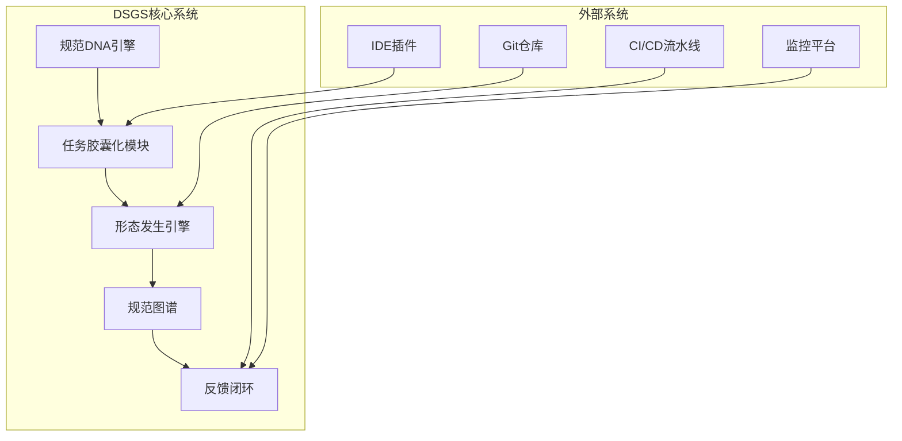

# **动态规范生长系统（DNASPEC）需求规格说明书**  
**版本：1.0**  
**日期：2025年3月28日**

## **1. 引言**
### 1.1 目的
构建一个受生命系统启发的AI驱动编程规范治理系统，实现：
- **动态约束生成**：按需、局部生成规范，避免静态规范爆炸
- **树状演化一致性**：支持项目目录树状扩展，保持全局功能协同
- **自适应进化**：通过反馈闭环实现约束自我优化

### 1.2 参考标准
| 标准来源         | 借鉴点                          | 应用场景                  |
|------------------|-------------------------------|-------------------------|
| **IEEE 830**     | 需求结构化表达                  | 文档框架                 |
| **Kiro Spec**    | 结构化规范描述、版本控制        | 规范DNA存储格式         |
| **Cursor Rules** | 目录级规则作用域                | 任务胶囊化（TCC）设计    |
| **OPA**          | 策略即代码、分层决策            | 元约束规则（MCR）引擎    |
| **Neo4j**        | 图数据库、关系推理              | 规范图谱（SG）存储       |

### 1.3 目标读者
- **架构师**：设计系统核心机制
- **AI工程师**：实现约束生成算法
- **DevOps工程师**：集成CI/CD流程
- **安全审计**：验证约束有效性

## **2. 项目范围**
### 2.1 系统边界


### 2.2 核心功能
| 功能模块         | 输入                          | 输出                          | 创新点                  |
|------------------|-----------------------------|-----------------------------|------------------------|
| **规范DNA管理**   | 形式化SOF/CTC/MCR/BSL        | 版本化规范包                 | 极简元规范（<50条规则） |
| **任务胶囊化**    | 原子任务单元（ATU）           | 任务上下文胶囊（TCC）        | 上下文压缩（<10KB）    |
| **动态约束生成**  | TCC + 约束模板库             | 具体局部约束（CLC）          | 按需生成（<100ms）     |
| **一致性校验**    | CLC + 规范图谱               | 冲突报告/修复建议            | 增量图计算（<500ms）   |
| **反馈进化**      | 监控指标/人工反馈             | 更新的MCR参数/模板库         | RL策略自动优化         |

## **3. 功能需求**
### 3.1 规范DNA管理（FR-DNA）
| ID   | 需求描述                                                                 | 验收标准                          |
|------|------------------------------------------------------------------------|---------------------------------|
| FR1  | 支持JSON Schema定义SOF（系统目标函数）                                  | 可解析 `Maximize(UserValue) - λ*Complexity` |
| FR2  | 用Graphviz格式定义CTC（核心拓扑约束）                                  | 自动生成模块依赖图可视化          |
| FR3  | 基于Rego语言编写MCR（元约束规则）                                      | 示例规则：`金融任务→激活审计约束` |
| FR4  | OPA策略包管理BSL（基础生存法则）                                        | 内置5条规则（无死锁/无泄露等）    |

### 3.2 任务胶囊化（FR-TCC）
| ID   | 需求描述                                                                 | 验收标准                          |
|------|------------------------------------------------------------------------|---------------------------------|
| FR5  | 解析Git提交信息生成ATU（原子任务单元）                                  | 提取`TaskID/Goal/PreConditions`  |
| FR6  | 基于Tree-sitter构建代码依赖图                                          | 增量解析速度<1s/1000行代码        |
| FR7  | 生成TCC（任务上下文胶囊）：<br>- 相关CTC片段<br>- 邻近约束<br>- 系统状态快照 | TCC大小<10KB（压缩后）           |

### 3.3 动态约束生成（FR-GEN）
| ID   | 需求描述                                                                 | 验收标准                          |
|------|------------------------------------------------------------------------|---------------------------------|
| FR8  | 约束模板库管理（安全/性能/架构等分类）                                  | 预置50+模板（如“输入验证”“重试机制”） |
| FR9  | 基于任务类型自动匹配模板                                                | 金融任务→自动激活“审计日志”模板    |
| FR10 | 支持自然语言转约束（集成LLM）                                          | 输入“检查密码强度”→生成`Regex约束` |

### 3.4 一致性校验（FR-CHECK）
| ID   | 需求描述                                                                 | 验收标准                          |
|------|------------------------------------------------------------------------|---------------------------------|
| FR11 | 用Neo4j Cypher查询检测约束冲突                                          | 查询响应<500ms（10万节点图谱）     |
| FR12 | 增量影响分析：仅校验变更相关路径                                        | 相比全量扫描提速90%               |
| FR13 | 生成冲突修复建议（如“调整约束优先级”）                                  | 建议采纳率>80%                   |

### 3.5 反馈进化（FR-EVOLVE）
| ID   | 需求描述                                                                 | 验收标准                          |
|------|------------------------------------------------------------------------|---------------------------------|
| FR14 | 集成Prometheus指标：约束违反率/任务成功率                              | 指标采集延迟<1s                  |
| FR15 | RL策略调整MCR参数（如λ值）                                              | 任务失败率降低>20%               |
| FR16 | 支持人工反馈标注（“有效/无效约束”）                                    | 反馈数据自动用于模型微调          |

## **4. 非功能需求**
### 4.1 性能需求
| 指标               | 目标值                          | 测试方法                  |
|--------------------|-------------------------------|-------------------------|
| 约束生成响应时间    | <100ms（P99）                 | JMeter压力测试          |
| 规范图谱更新延迟    | <2s（10万节点）               | Neo4j Profiler          |
| TCC生成速度        | <50ms/任务                    | 单元测试                |

### 4.2 可扩展性
| 需求               | 实现方案                      |
|--------------------|-----------------------------|
| 支持1000+模块项目   | Neo4j集群部署                |
| 约束模板扩展        | 插件化架构（支持第三方模板） |
| 多语言支持          | Tree-sitter多语言解析器      |

### 4.3 安全需求
| 需求               | 实现方案                      |
|--------------------|-----------------------------|
| 规范DNA防篡改       | Git签名 + 只读策略包         |
| 约束执行沙盒        | Firecracker微虚拟机         |
| 敏感信息脱敏        | OPA内置数据掩码规则         |

## **5. 设计约束**
### 5.1 技术栈约束
| 组件         | 必选技术                      | 可选技术                  |
|--------------|-----------------------------|-------------------------|
| 规范引擎      | OPA（Open Policy Agent）     | Kyverno                 |
| 图数据库      | Neo4j                        | ArangoDB                |
| 代码解析      | Tree-sitter                  | Sourcegraph             |
| RL框架        | Ray RLlib                    | Stable Baselines3       |

### 5.2 兼容性要求
- **IDE插件**：VS Code（优先）、JetBrains IDEs
- **代码仓库**：Git（GitHub/GitLab兼容）
- **CI/CD**：Jenkins、GitHub Actions、GitLab CI

## **6. 数据模型**
### 6.1 规范DNA（JSON Schema）
```json
{
  "SOF": "Maximize(UserValue) - 0.2*Complexity",
  "CTC": {
    "modules": ["AuthService", "PaymentService"],
    "allowedInteractions": [
      {"from": "AuthService", "to": "PaymentService", "type": "RPC"}
    ]
  },
  "MCR": [
    {"if": "task.type=='financial'", "then": "activate('audit')"}
  ],
  "BSL": ["NO_DEADLOCK", "MINIMAL_PRIVILEGE"]
}
```

### 6.2 任务胶囊（TCC）
```yaml
task_id: "T001"
goal: "ProcessPayment"
context:
  ctc_fragments:
    - "PaymentService→UserDB: ReadOnly"
  active_constraints:
    - "InputValidation@PaymentService"
  system_state:
    db_load: "Medium"
```

## **7. 验收标准**
### 7.1 核心场景测试
| 场景                     | 步骤                                                                 | 预期结果                          |
|--------------------------|--------------------------------------------------------------------|---------------------------------|
| **动态约束生成**         | 1. 提交金融任务<br>2. SME生成TCC<br>3. 匹配审计模板                  | 自动添加`AuditLog`约束到PaymentService |
| **冲突检测**             | 1. 手动添加冲突约束<br>2. 触发增量校验                              | 5秒内报告冲突并建议优先级调整      |
| **反馈进化**             | 1. 模拟约束违反事件<br>2. 观察RL策略调整                            | λ值自动增加，后续任务约束强化      |

### 7.2 性能基准
| 测试项               | 工具          | 目标值               |
|----------------------|--------------|---------------------|
| 10万节点图谱查询     | Neo4j Benchmark | <500ms             |
| 1000并发任务胶囊生成 | Locust       | 平均延迟<100ms      |

## **8. 附录**
### 8.1 术语表
| 术语         | 全称                          | 定义                          |
|--------------|-----------------------------|-----------------------------|
| **DNASPEC**     | Dynamic Specification Growth System | 动态规范生长系统              |
| **SOF**      | System Objective Function    | 系统目标函数（用户价值-复杂度）|
| **TCC**      | Task Context Capsule         | 任务上下文胶囊                |
| **MCR**      | Meta-Constraint Rules        | 元约束规则                   |

### 8.2 现有工具对比
| 维度         | DNASPEC                          | Kiro Spec               | Cursor Rules            |
|--------------|-----------------------------|------------------------|------------------------|
| **动态性**   | ✅ 按需生成约束                | ❌ 静态规范              | ✅ 目录级动态规则       |
| **一致性**   | ✅ 图谱增量校验               | ⚠️ 手动管理             | ❌ 无跨文件校验         |
| **进化能力** | ✅ RL反馈闭环                 | ❌ 无                   | ❌ 无                   |
| **适用规模** | ✅ 千模块级系统               | ✅ 中小项目             | ⚠️ 单仓库项目           |

## **9. 未来演化路线图**
### 阶段0：MVP验证（0-3个月）
- ✅ 实现规范DNA存储（OPA）
- ✅ 任务胶囊化原型（Tree-sitter）
- ✅ 基础约束生成（50+模板）

### 阶段1：闭环落地（3-6个月）
- 🔄 集成Prometheus监控
- 🔄 Neo4j规范图谱
- 🔄 Git Pre-commit Hook

### 阶段2：智能进化（6-12个月）
- 🚀 RL策略训练（Ray RLlib）
- 🚀 自然语言转约束（LLM集成）
- 🚀 多语言支持（Python/Java/Go）

### 阶段3：生态扩展（12+个月）
- 🌐 约束模板市场
- 🌐 跨项目规范迁移
- 🌐 自治软件工厂原型
