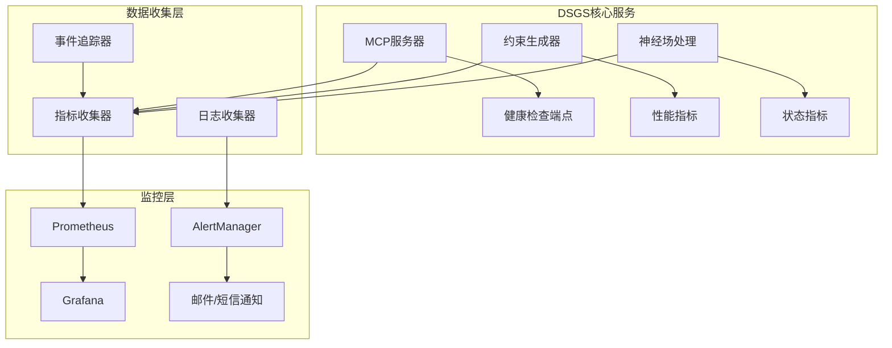
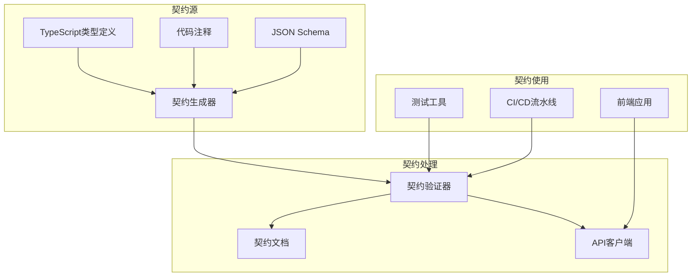

# **DSGS服务监控与契约文档增强需求规格说明书**
**版本：2.0**  
**日期：2025年8月6日**

## **1. 增强背景**

基于现有DSGS系统架构，为提升生产环境稳定性和团队协作效率，新增以下核心功能：

### 1.1 服务稳定性监控
- **实时健康检查**：监控MCP服务器、约束生成器、神经场等核心组件
- **自动恢复机制**：服务异常时自动重启、降级处理
- **性能指标收集**：响应时间、错误率、资源使用率等关键指标

### 1.2 完整契约文档
- **API接口规范**：前后端交互接口完整定义
- **数据模型字典**：所有数据结构的标准化描述
- **版本兼容性矩阵**：接口版本演进路线图

## **2. 功能需求**

### 2.1 服务监控模块（FR-MONITOR）

| ID   | 需求描述                                                                 | 验收标准                          |
|------|------------------------------------------------------------------------|---------------------------------|
| FR17 | 实现健康检查端点 `/health`，返回系统整体状态                            | 响应时间<50ms，包含所有组件状态    |
| FR18 | 监控MCP服务器连接状态、消息处理延迟、错误率                            | 每秒采集指标，异常时5秒内告警     |
| FR19 | 监控约束生成器性能：生成时间、成功率、模板匹配准确率                    | P99响应时间<100ms                |
| FR20 | 监控神经场处理状态：约束冲突检测时间、吸引子收敛速度                    | 冲突检测<500ms，收敛<1s          |
| FR21 | 实现服务自动恢复：异常时重启服务、降级处理、熔断机制                    | 故障恢复时间<30s，数据不丢失     |
| FR22 | 集成Prometheus指标导出，支持Grafana可视化                              | 暴露20+关键指标，支持自定义仪表板 |

### 2.2 契约文档管理（FR-CONTRACT）

| ID   | 需求描述                                                                 | 验收标准                          |
|------|------------------------------------------------------------------------|---------------------------------|
| FR23 | 建立API接口规范文档，包含所有MCP方法的请求/响应格式                     | 覆盖100%的公开接口                |
| FR24 | 创建数据模型字典，标准化描述TCC、约束模板、规范DNA等数据结构            | 包含字段类型、验证规则、示例      |
| FR25 | 维护版本兼容性矩阵，明确接口变更策略                                    | 向后兼容性保证，破坏性变更明确标识 |
| FR26 | 实现契约文档自动生成，从代码注释和TypeScript类型定义生成文档            | 代码变更后文档自动更新            |
| FR27 | 提供契约验证工具，确保前后端实现与契约一致                              | 集成到CI/CD流程，阻止不兼容变更   |

## **3. 系统架构设计**

### 3.1 监控架构



### 3.2 契约管理架构



## **4. 详细设计**

### 4.1 健康检查设计

```typescript
interface HealthStatus {
  status: 'healthy' | 'degraded' | 'unhealthy';
  timestamp: string;
  version: string;
  components: {
    mcpServer: ComponentHealth;
    constraintGenerator: ComponentHealth;
    neuralField: ComponentHealth;
    database: ComponentHealth;
  };
  metrics: {
    uptime: number;
    requestCount: number;
    errorRate: number;
    responseTime: number;
  };
}

interface ComponentHealth {
  status: 'healthy' | 'degraded' | 'unhealthy';
  details: string;
  lastCheck: string;
  metrics?: Record<string, number>;
}
```

### 4.2 监控指标设计

```typescript
// 核心监控指标
const MONITORING_METRICS = {
  // MCP服务器指标
  mcp_requests_total: 'Counter',
  mcp_request_duration_seconds: 'Histogram',
  mcp_errors_total: 'Counter',
  
  // 约束生成器指标
  constraint_generation_duration: 'Histogram',
  constraint_template_matches: 'Counter',
  constraint_validation_errors: 'Counter',
  
  // 神经场指标
  neural_field_processing_time: 'Histogram',
  constraint_conflicts_detected: 'Counter',
  attractor_convergence_time: 'Histogram',
  
  // 系统指标
  system_uptime: 'Gauge',
  memory_usage_bytes: 'Gauge',
  cpu_usage_percent: 'Gauge'
};
```

### 4.3 契约文档结构

```yaml
# API契约文档结构
api_contract:
  version: "2.0"
  last_updated: "2025-08-06T00:00:00Z"
  
  # MCP接口定义
  mcp_methods:
    checkConstraints:
      description: "检查代码约束"
      parameters:
        tccPath: { type: "string", required: true }
        specPath: { type: "string", required: true }
      response:
        constraints: { type: "array" }
        violations: { type: "array" }
        timestamp: { type: "string" }
    
    getSystemStatus:
      description: "获取系统状态"
      response:
        status: { type: "string" }
        version: { type: "string" }
        uptime: { type: "number" }
        timestamp: { type: "string" }

  # 数据模型定义
  data_models:
    TaskContextCapsule:
      type: "object"
      properties:
        task_id: { type: "string" }
        goal: { type: "string" }
        context: { type: "object" }
    
    ConstraintTemplate:
      type: "object"
      properties:
        id: { type: "string" }
        category: { type: "string" }
        template: { type: "object" }
        validation_rules: { type: "array" }

  # 版本兼容性
  compatibility:
    "2.0":
      backward_compatible: ["1.0"]
      breaking_changes: []
      deprecated_features: []
```

## **5. 实现任务清单**

### 5.1 服务监控任务

| 任务ID | 任务描述                                                                 | 优先级 | 预估工时 | 负责人 |
|--------|------------------------------------------------------------------------|--------|----------|--------|
| T001   | 创建健康检查端点实现                                                   | 高     | 4h       |        |
| T002   | 实现Prometheus指标收集器                                               | 高     | 6h       |        |
| T003   | 开发服务自动恢复机制                                                   | 高     | 8h       |        |
| T004   | 配置Grafana监控仪表板                                                  | 中     | 4h       |        |
| T005   | 实现告警规则和通知机制                                                 | 中     | 6h       |        |
| T006   | 编写监控单元测试                                                       | 中     | 4h       |        |
| T007   | 性能基准测试和优化                                                     | 低     | 8h       |        |

### 5.2 契约文档任务

| 任务ID | 任务描述                                                                 | 优先级 | 预估工时 | 负责人 |
|--------|------------------------------------------------------------------------|--------|----------|--------|
| T008   | 设计契约文档生成器架构                                                 | 高     | 4h       |        |
| T009   | 实现TypeScript类型定义解析器                                           | 高     | 8h       |        |
| T010   | 开发契约验证工具                                                       | 高     | 6h       |        |
| T011   | 创建API接口规范文档                                                   | 高     | 4h       |        |
| T012   | 建立数据模型字典                                                       | 中     | 4h       |        |
| T013   | 实现版本兼容性检查                                                     | 中     | 6h       |        |
| T014   | 集成契约验证到CI/CD流程                                               | 中     | 4h       |        |
| T015   | 编写契约文档使用指南                                                   | 低     | 2h       |        |

## **6. 验收标准**

### 6.1 监控功能验收

| 测试项               | 测试步骤                                                                 | 预期结果                          |
|----------------------|------------------------------------------------------------------------|---------------------------------|
| 健康检查             | 调用`/health`端点                                                      | 返回完整系统状态，响应<50ms      |
| 服务恢复             | 模拟MCP服务器崩溃                                                      | 30秒内自动恢复，数据不丢失       |
| 指标收集             | 生成100个约束                                                          | Prometheus收集到完整指标数据    |
| 告警通知             | 触发错误率阈值                                                        | 5秒内发送告警通知                |

### 6.2 契约文档验收

| 测试项               | 测试步骤                                                                 | 预期结果                          |
|----------------------|------------------------------------------------------------------------|---------------------------------|
| 契约生成             | 修改TypeScript类型定义                                                 | 自动更新契约文档                  |
| 契约验证             | 提交不兼容的API变更                                                    | CI/CD流水线失败，提示具体错误    |
| 文档完整性           | 检查生成的契约文档                                                     | 覆盖100%的公开接口和数据模型      |

## **7. 部署要求**

### 7.1 监控组件部署

```yaml
# docker-compose.yml
version: '3.8'
services:
  prometheus:
    image: prom/prometheus:latest
    ports:
      - "9090:9090"
    volumes:
      - ./prometheus.yml:/etc/prometheus/prometheus.yml
  
  grafana:
    image: grafana/grafana:latest
    ports:
      - "3000:3000"
    environment:
      - GF_SECURITY_ADMIN_PASSWORD=admin
  
  alertmanager:
    image: prom/alertmanager:latest
    ports:
      - "9093:9093"
    volumes:
      - ./alertmanager.yml:/etc/alertmanager/alertmanager.yml
```

### 7.2 契约文档部署

- 文档托管在 `/docs/api-contract` 目录
- 支持Markdown和JSON格式
- 提供Web界面查看和搜索
- 集成到项目文档站点

## **8. 风险评估**

### 8.1 技术风险

| 风险项               | 可能性 | 影响程度 | 缓解措施                          |
|----------------------|--------|----------|---------------------------------|
| 监控数据量过大       | 中     | 中       | 实现指标采样和数据保留策略        |
| 契约生成不准确       | 低     | 高       | 人工审核 + 自动化测试验证         |
| 服务恢复失败         | 低     | 高       | 实现多重恢复机制 + 数据备份        |

### 8.2 项目风险

| 风险项               | 可能性 | 影响程度 | 缓解措施                          |
|----------------------|--------|----------|---------------------------------|
| 开发时间超期         | 中     | 中       | 分阶段交付，优先核心功能          |
| 团队学习成本         | 中     | 低       | 提供培训文档和技术支持            |

## **9. 附录**

### 9.1 监控指标清单

```typescript
// 完整的监控指标定义
interface MonitoringMetrics {
  // 系统级指标
  system_uptime: Gauge;
  system_memory_usage: Gauge;
  system_cpu_usage: Gauge;
  
  // MCP服务器指标
  mcp_requests_total: Counter;
  mcp_request_duration: Histogram;
  mcp_active_connections: Gauge;
  mcp_errors_total: Counter;
  
  // 约束生成器指标
  constraint_generation_duration: Histogram;
  constraint_template_matches: Counter;
  constraint_validation_errors: Counter;
  constraint_cache_hits: Counter;
  
  // 神经场指标
  neural_field_processing_time: Histogram;
  constraint_conflicts_detected: Counter;
  attractor_convergence_time: Histogram;
  neural_field_memory_usage: Gauge;
}
```

### 9.2 契约文档模板

```markdown
# DSGS API契约文档 v2.0

## 概述
本文档定义了DSGS系统的所有API接口和数据模型，确保前后端协作的一致性。

## 版本信息
- 当前版本: 2.0
- 发布日期: 2025-08-06
- 向后兼容: 1.0

## API接口

### checkConstraints
检查代码约束

**请求参数**
```typescript
interface CheckConstraintsRequest {
  tccPath: string;     // 任务上下文胶囊路径
  specPath: string;     // 规范文件路径
}
```

**响应格式**
```typescript
interface CheckConstraintsResponse {
  constraints: Constraint[];     // 生成的约束列表
  violations: Violation[];       // 约束违反列表
  timestamp: string;            // 处理时间戳
}
```

## 数据模型

### TaskContextCapsule
任务上下文胶囊

```typescript
interface TaskContextCapsule {
  task_id: string;              // 任务唯一标识
  goal: string;                 // 任务目标
  context: {                    // 任务上下文
    ctc_fragments: string[];    // 核心拓扑约束片段
    active_constraints: string[]; // 活跃约束列表
    system_state: object;       // 系统状态快照
  };
}
```
```

---

**文档维护**：此文档将随着系统开发持续更新，确保与实际实现保持一致。