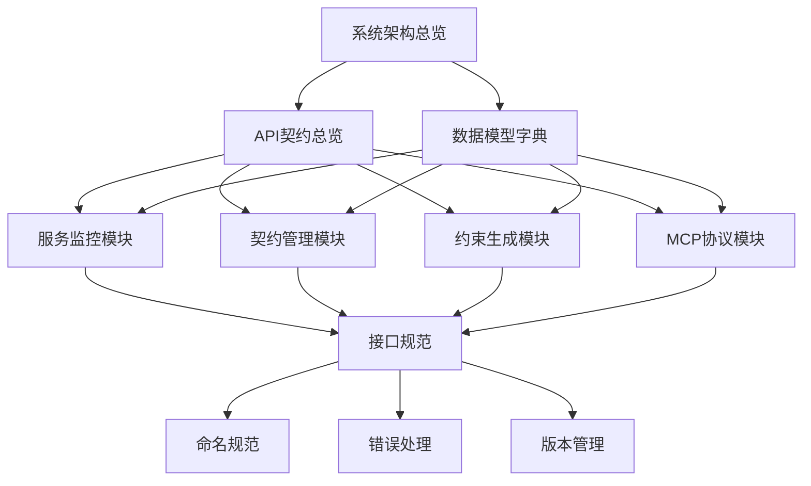

# DNASPEC统一契约文档体系

## 📖 文档导航 (金字塔结构)

### 🏗️ 第一层：核心概览
- **[系统架构总览](./architecture/overview.md)** - 系统整体架构和组件关系
- **[API契约总览](./api/contract-overview.md)** - 所有API接口的统一契约
- **[数据模型字典](./data-models/dictionary.md)** - 核心数据结构定义

### 🔧 第二层：任务导向文档
- **[服务监控模块](./modules/monitoring/README.md)** - 监控相关接口和数据
- **[契约管理模块](./modules/contract/README.md)** - 契约生成和验证
- **[约束生成模块](./modules/constraint/README.md)** - 动态约束生成
- **[MCP协议模块](./modules/mcp/README.md)** - MCP协议实现

### 📚 第三层：详细规范
- **[接口规范](./api/specifications.md)** - 详细的API接口定义
- **[命名规范](./standards/naming-conventions.md)** - 统一命名规范
- **[错误处理](./standards/error-handling.md)** - 错误码和处理机制
- **[版本管理](./standards/versioning.md)** - 版本兼容性管理

---

## 🎯 快速开始

### 1. 系统架构理解
首先阅读 [系统架构总览](./architecture/overview.md) 了解整体设计

### 2. API接口使用
参考 [API契约总览](./api/contract-overview.md) 了解可用接口

### 3. 具体模块开发
根据任务需求选择对应模块文档：
- 监控功能 → [服务监控模块](./modules/monitoring/README.md)
- 契约管理 → [契约管理模块](./modules/contract/README.md)

### 4. 开发规范遵循
遵循 [命名规范](./standards/naming-conventions.md) 和 [错误处理](./standards/error-handling.md)

---

## 🔗 文档引用关系

---

## 📋 文档更新日志

| 版本 | 日期 | 更新内容 | 作者 |
|------|------|----------|------|
| 2.0 | 2025-08-06 | 初始版本，建立统一契约文档体系 | DNASPEC团队 |

---

## 🚀 使用指南

### LLM友好特性
1. **金字塔结构**：每篇文档都采用"结论先行"原则
2. **明确引用**：所有相关文档都有清晰的链接引用
3. **任务聚焦**：按任务相关性组织，避免信息过载
4. **统一命名**：所有接口、参数、类名都遵循统一规范

### 文档阅读建议
1. **自上而下**：先读概览，再读具体模块
2. **按需查找**：通过引用链接快速定位相关信息
3. **交叉验证**：多个文档间相互引用，确保信息一致性

---

**文档维护**：DNASPEC架构团队  
**最后更新**：2025-08-06  
**版本**：2.0