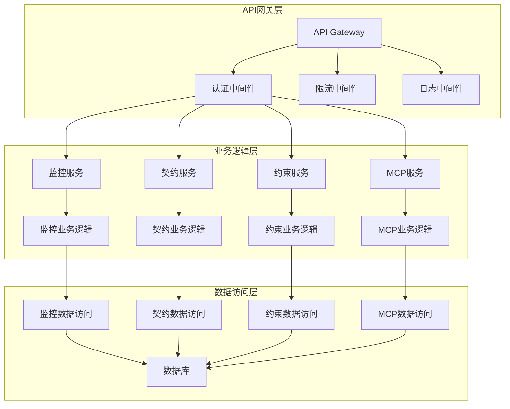
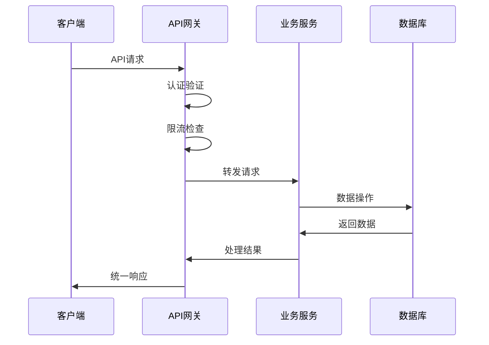

# DNASPEC API契约总览

## 📋 API概览

DNASPEC系统提供RESTful API和MCP协议两种接口方式，支持IDE集成、CLI工具和Web界面等多种客户端。

### 🎯 核心设计原则
- **统一响应格式**：所有API返回统一的数据结构
- **错误处理标准化**：统一的错误码和错误信息格式
- **版本兼容性**：API版本管理，确保向后兼容
- **任务导向**：API设计围绕具体业务任务

### 📊 API分类
| 类别 | 用途 | 示例 | 相关文档 |
|------|------|------|----------|
| **监控API** | 系统健康监控 | `/health`, `/metrics` | [监控模块](../modules/monitoring/README.md) |
| **契约API** | 契约管理 | `/contract`, `/validation` | [契约模块](../modules/contract/README.md) |
| **约束API** | 约束生成 | `/constraints/generate` | [约束模块](../modules/constraint/README.md) |
| **MCP API** | IDE集成 | `checkConstraints`, `getSystemStatus` | [MCP模块](../modules/mcp/README.md) |

## 🔗 统一响应格式

### 成功响应
```typescript
interface ApiResponse<T = any> {
  success: true;
  data: T;
  metadata: {
    timestamp: string;
    requestId: string;
    version: string;
  };
}
```

### 错误响应
```typescript
interface ApiError {
  success: false;
  error: {
    code: string;
    message: string;
    details?: any;
    timestamp: string;
    requestId: string;
  };
}
```

## 📋 API列表

### 1. 监控API (Monitoring API)

#### 健康检查
```typescript
// GET /health
interface HealthResponse {
  status: 'healthy' | 'degraded' | 'unhealthy';
  components: ComponentHealth[];
  uptime: number;
  timestamp: string;
}
```

#### 系统指标
```typescript
// GET /metrics
interface MetricsResponse {
  system: SystemMetrics;
  components: ComponentMetrics[];
  custom: CustomMetrics[];
}
```

### 2. 契约API (Contract API)

#### 获取契约
```typescript
// GET /contract
interface ContractResponse {
  version: string;
  endpoints: ApiEndpoint[];
  dataModels: DataModel[];
  compatibility: CompatibilityMatrix;
}
```

#### 验证契约
```typescript
// POST /contract/validate
interface ValidationResponse {
  isValid: boolean;
  errors: ValidationError[];
  timestamp: string;
}
```

### 3. 约束API (Constraint API)

#### 生成约束
```typescript
// POST /constraints/generate
interface ConstraintGenerationRequest {
  taskContext: TaskContextCapsule;
  templateId?: string;
  options: GenerationOptions;
}

interface ConstraintGenerationResponse {
  constraints: GeneratedConstraint[];
  conflicts: Conflict[];
  metadata: GenerationMetadata;
}
```

#### 检测冲突
```typescript
// POST /constraints/conflicts
interface ConflictDetectionResponse {
  hasConflicts: boolean;
  conflicts: Conflict[];
  suggestions: ResolutionSuggestion[];
}
```

### 4. MCP API (MCP Protocol)

#### 检查约束
```typescript
// MCP Method: checkConstraints
interface CheckConstraintsRequest {
  tccPath: string;
  specPath: string;
}

interface CheckConstraintsResponse {
  constraints: Constraint[];
  violations: Violation[];
  timestamp: string;
}
```

#### 获取系统状态
```typescript
// MCP Method: getSystemStatus
interface SystemStatusResponse {
  status: string;
  version: string;
  uptime: number;
  timestamp: string;
}
```

## 🏗️ API架构

### 分层架构


### 数据流


## 🔐 认证与授权

### 认证方式
```typescript
interface Authentication {
  // JWT Token认证
  jwt: {
    header: string;
    payload: JwtPayload;
    signature: string;
  };
  
  // API Key认证
  apiKey: {
    key: string;
    secret: string;
  };
  
  // OAuth2认证
  oauth2: {
    accessToken: string;
    tokenType: string;
    expiresIn: number;
  };
}
```

### 权限控制
```typescript
interface Permission {
  resource: string;
  action: 'read' | 'write' | 'delete' | 'admin';
  conditions?: Record<string, any>;
}

interface Role {
  name: string;
  permissions: Permission[];
}
```

## 📊 版本管理

### 版本策略
- **主版本号**：破坏性变更 (如: 1.0 → 2.0)
- **次版本号**：新功能添加 (如: 1.0 → 1.1)
- **修订号**：错误修复 (如: 1.0.0 → 1.0.1)

### 版本兼容性
```typescript
interface CompatibilityMatrix {
  current: string;
  supported: string[];
  deprecated: string[];
  breakingChanges: BreakingChange[];
}

interface BreakingChange {
  version: string;
  description: string;
  migrationPath: string;
  deprecatedDate: string;
  removalDate: string;
}
```

## 🚀 性能优化

### 缓存策略
```typescript
interface CacheStrategy {
  // 健康检查缓存
  healthCheck: {
    ttl: 30000; // 30秒
    key: 'health:check';
  };
  
  // 契约文档缓存
  contract: {
    ttl: 300000; // 5分钟
    key: 'contract:{version}';
  };
  
  // 系统指标缓存
  metrics: {
    ttl: 10000; // 10秒
    key: 'metrics:{component}';
  };
}
```

### 限流策略
```typescript
interface RateLimit {
  // 全局限流
  global: {
    requests: 1000;
    window: '1h';
  };
  
  // 用户限流
  user: {
    requests: 100;
    window: '1m';
  };
  
  // API限流
  api: {
    requests: 10;
    window: '1s';
  };
}
```

## 📋 错误处理

### 错误码规范
```typescript
enum ErrorCode {
  // 认证错误 (1000-1999)
  UNAUTHORIZED = '1001',
  FORBIDDEN = '1003',
  TOKEN_EXPIRED = '1004',
  
  // 参数错误 (2000-2999)
  INVALID_PARAMETER = '2001',
  MISSING_PARAMETER = '2002',
  VALIDATION_ERROR = '2003',
  
  // 业务错误 (3000-3999)
  CONSTRAINT_GENERATION_FAILED = '3001',
  CONTRACT_VALIDATION_FAILED = '3002',
  CONFLICT_DETECTION_FAILED = '3003',
  
  // 系统错误 (4000-4999)
  INTERNAL_ERROR = '4001',
  DATABASE_ERROR = '4002',
  EXTERNAL_SERVICE_ERROR = '4003',
  
  // MCP错误 (5000-5999)
  MCP_PARSE_ERROR = '5001',
  MCP_METHOD_NOT_FOUND = '5002',
  MCP_INVALID_PARAMS = '5003'
}
```

### 错误响应示例
```typescript
// 参数错误
{
  "success": false,
  "error": {
    "code": "2001",
    "message": "Invalid parameter",
    "details": {
      "field": "tccPath",
      "reason": "Path does not exist"
    },
    "timestamp": "2025-08-06T10:00:00Z",
    "requestId": "req_123456789"
  }
}

// 业务错误
{
  "success": false,
  "error": {
    "code": "3001",
    "message": "Constraint generation failed",
    "details": {
      "reason": "Template not found",
      "templateId": "SEC-001"
    },
    "timestamp": "2025-08-06T10:00:00Z",
    "requestId": "req_123456789"
  }
}
```

## 🔗 相关文档

### 核心文档
- [系统架构总览](../architecture/overview.md) - 系统整体架构
- [数据模型字典](../data-models/dictionary.md) - 数据结构定义
- [接口规范详情](../api/specifications.md) - 详细接口定义

### 模块文档
- [监控API详情](../modules/monitoring/README.md#api) - 监控相关API
- [契约API详情](../modules/contract/README.md#api) - 契约管理API
- [约束API详情](../modules/constraint/README.md#api) - 约束生成API
- [MCP API详情](../modules/mcp/README.md#api) - MCP协议API

### 规范文档
- [命名规范](../standards/naming-conventions.md) - 统一命名规范
- [错误处理规范](../standards/error-handling.md) - 错误处理机制
- [版本管理规范](../standards/versioning.md) - 版本兼容性管理

---

**文档维护**：DNASPEC架构团队  
**最后更新**：2025-08-06  
**版本**：2.0