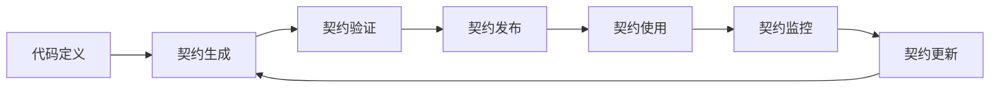

# 契约管理模块

## 📋 模块概览

契约管理模块负责DSGS系统的API契约生成、验证、版本管理和文档维护。确保前后端接口一致性和版本兼容性。

### 🎯 核心功能
- **自动契约生成**：从TypeScript类型定义和注释生成API契约
- **契约验证**：验证实现与契约的一致性
- **版本管理**：管理API版本演进和兼容性
- **文档生成**：自动生成可读的API文档

### 📊 契约管理流程


## 🔗 快速导航

### 📖 核心文档
- [契约生成API](#契约生成-api) - 契约生成接口
- [契约验证API](#契约验证-api) - 契约验证接口
- [版本管理API](#版本管理-api) - 版本管理接口
- [数据模型](#数据模型) - 契约相关数据结构

### 🔧 实现指南
- [契约生成实现](#契约生成实现) - 契约生成器实现
- [契约验证实现](#契约验证实现) - 契约验证器实现
- [版本管理实现](#版本管理实现) - 版本管理器实现
- [文档生成实现](#文档生成实现) - 文档生成器实现

### 📊 配置指南
- [契约配置](#契约配置) - 契约生成配置
- [验证配置](#验证配置) - 验证规则配置
- [版本配置](#版本配置) - 版本管理配置

## 🚀 API接口

### 契约生成 API

#### 生成契约
```typescript
// POST /api/contract/generate
interface GenerateContractRequest {
  sourcePaths: string[];              // 源代码路径
  outputPath?: string;                // 输出路径
  format: 'openapi' | 'json-schema' | 'markdown'; // 输出格式
  options: GenerationOptions;
}

interface GenerationOptions {
  includePrivate: boolean;            // 是否包含私有成员
  includeExamples: boolean;           // 是否包含示例
  validate: boolean;                 // 是否验证生成的契约
  version: string;                   // 契约版本
}

interface GenerateContractResponse {
  success: boolean;
  contract: ApiContract;
  warnings: string[];
  metadata: {
    generatedAt: string;
    sourceFiles: string[];
    generationTime: number;
  };
}
```

**示例请求**：
```bash
curl -X POST "http://localhost:3000/api/contract/generate" \
  -H "Content-Type: application/json" \
  -H "Authorization: Bearer ${TOKEN}" \
  -d '{
    "sourcePaths": ["./src/api", "./src/types"],
    "format": "openapi",
    "options": {
      "includePrivate": false,
      "includeExamples": true,
      "validate": true,
      "version": "2.0.0"
    }
  }'
```

### 契约验证 API

#### 验证契约
```typescript
// POST /api/contract/validate
interface ValidateContractRequest {
  contract: ApiContract;
  implementationPath?: string;        // 实现代码路径
  validationLevel: 'strict' | 'normal' | 'lenient';
  rules: ValidationRule[];
}

interface ValidateContractResponse {
  isValid: boolean;
  score: number;                     // 验证分数 (0-100)
  errors: ValidationError[];
  warnings: ValidationWarning[];
  suggestions: string[];
  statistics: {
    totalChecks: number;
    passedChecks: number;
    failedChecks: number;
    warningChecks: number;
  };
  metadata: {
    validatedAt: string;
    validationTime: number;
    validator: string;
  };
}
```

#### 验证实现
```typescript
// POST /api/contract/validate/implementation
interface ValidateImplementationRequest {
  contractVersion?: string;          // 契约版本
  implementationPath: string;         // 实现代码路径
  validationLevel: 'strict' | 'normal' | 'lenient';
}

interface ValidateImplementationResponse {
  isValid: boolean;
  compatibility: CompatibilityResult;
  violations: ContractViolation[];
  recommendations: Recommendation[];
  metadata: {
    validatedAt: string;
    validationTime: number;
  };
}
```

### 版本管理 API

#### 获取版本列表
```typescript
// GET /api/contract/versions
interface GetVersionsResponse {
  versions: ContractVersion[];
  currentVersion: string;
  deprecatedVersions: string[];
  compatibility: CompatibilityMatrix;
}

interface ContractVersion {
  version: string;
  createdAt: string;
  createdBy: string;
  description: string;
  isDeprecated: boolean;
  breakingChanges: BreakingChange[];
}
```

#### 创建新版本
```typescript
// POST /api/contract/versions
interface CreateVersionRequest {
  version: string;
  description: string;
  contract: ApiContract;
  isBreakingChange: boolean;
  migrationGuide?: string;
}

interface CreateVersionResponse {
  success: boolean;
  version: string;
  breakingChanges: BreakingChange[];
  migrationRequired: boolean;
  metadata: {
    createdAt: string;
    createdBy: string;
  };
}
```

#### 版本兼容性检查
```typescript
// GET /api/contract/versions/{from}/compatibility/{to}
interface CompatibilityResponse {
  isCompatible: boolean;
  compatibility: CompatibilityMatrix;
  breakingChanges: BreakingChange[];
  migrationPath: MigrationStep[];
  impact: ImpactAnalysis;
}
```

## 📊 数据模型

### 核心数据模型

#### API契约 (ApiContract)
```typescript
interface ApiContract {
  // 契约元数据
  metadata: ContractMetadata;
  
  // API端点
  endpoints: ApiEndpoint[];
  
  // 数据模型
  dataModels: DataModel[];
  
  // Webhook定义
  webhooks: WebhookDefinition[];
  
  // 事件定义
  events: EventDefinition[];
  
  // 安全定义
  security: SecurityDefinition[];
  
  // 服务器定义
  servers: ServerDefinition[];
  
  // 标签定义
  tags: TagDefinition[];
  
  // 版本兼容性
  compatibility: CompatibilityMatrix;
  
  // 示例集合
  examples: ExampleCollection;
}

interface ContractMetadata {
  version: string;                   // 契约版本
  title: string;                     // 契约标题
  description: string;               // 契约描述
  contact: ContactInfo;              // 联系信息
  license: LicenseInfo;              // 许可证信息
  lastUpdated: string;               // 最后更新时间
  generatedBy: string;               // 生成工具
  generationConfig: GenerationConfig; // 生成配置
}

interface ApiEndpoint {
  path: string;                      // API路径
  method: 'GET' | 'POST' | 'PUT' | 'DELETE' | 'PATCH';
  summary: string;                   // 端点摘要
  description: string;               // 端点描述
  parameters: Parameter[];           // 参数定义
  requestBody?: RequestBody;         // 请求体
  responses: ResponseDefinition[];    // 响应定义
  security: SecurityRequirement[];    // 安全要求
  tags: string[];                    // 标签
  deprecated?: boolean;              // 是否废弃
  examples: Example[];               // 示例
  externalDocs?: ExternalDocs;       // 外部文档
}
```

#### 数据模型 (DataModel)
```typescript
interface DataModel {
  name: string;                      // 模型名称
  type: 'object' | 'array' | 'string' | 'number' | 'boolean' | 'integer';
  description: string;               // 模型描述
  properties?: PropertyDefinition[]; // 属性定义
  required?: string[];               // 必需属性
  additionalProperties?: boolean | DataModel; // 额外属性
  items?: DataModel;                 // 数组项类型
  enum?: any[];                      // 枚举值
  format?: string;                   // 格式
  default?: any;                     // 默认值
  example?: any;                     // 示例
  deprecated?: boolean;              // 是否废弃
  externalDocs?: ExternalDocs;       // 外部文档
}

interface PropertyDefinition {
  name: string;                      // 属性名称
  type: 'object' | 'array' | 'string' | 'number' | 'boolean' | 'integer';
  description: string;               // 属性描述
  required: boolean;                 // 是否必需
  defaultValue?: any;                // 默认值
  validation?: ValidationRule[];      // 验证规则
  example?: any;                     // 示例
  deprecated?: boolean;              // 是否废弃
}
```

#### 验证结果 (ValidationResult)
```typescript
interface ValidationResult {
  isValid: boolean;                  // 是否有效
  score: number;                     // 验证分数 (0-100)
  errors: ValidationError[];          // 错误列表
  warnings: ValidationWarning[];      // 警告列表
  suggestions: string[];             // 建议列表
  statistics: ValidationStatistics;   // 统计信息
  metadata: ValidationMetadata;      // 元数据
}

interface ValidationError {
  id: string;                        // 错误ID
  type: ErrorType;                   // 错误类型
  severity: Severity;                // 严重程度
  message: string;                   // 错误消息
  location: ErrorLocation;           // 错误位置
  details?: any;                     // 详细信息
  suggestions: string[];             // 修复建议
  rule: string;                      // 违反的规则
}

interface ValidationWarning {
  id: string;                        // 警告ID
  type: WarningType;                 // 警告类型
  message: string;                   // 警告消息
  location: ErrorLocation;           // 警告位置
  details?: any;                     // 详细信息
  suggestions: string[];             // 改进建议
  rule: string;                      // 相关规则
}

interface ErrorLocation {
  file?: string;                     // 文件路径
  line?: number;                     // 行号
  column?: number;                   // 列号
  path?: string;                     // JSON路径
  component?: string;                // 组件名称
  endpoint?: string;                 // API端点
  method?: string;                   // HTTP方法
}
```

#### 版本兼容性 (CompatibilityMatrix)
```typescript
interface CompatibilityMatrix {
  current: string;                   // 当前版本
  supported: string[];               // 支持的版本
  deprecated: string[];              // 废弃的版本
  incompatible: string[];            // 不兼容的版本
  breakingChanges: BreakingChange[];  // 破坏性变更
  migrationPaths: MigrationPath[];   // 迁移路径
}

interface BreakingChange {
  id: string;                        // 变更ID
  type: BreakingChangeType;          // 变更类型
  description: string;               // 变更描述
  component: string;                 // 受影响的组件
  impact: ImpactAnalysis;             // 影响分析
  migrationRequired: boolean;        // 是否需要迁移
  migrationGuide?: string;           // 迁移指南
  deprecatedVersion: string;         // 废弃版本
  removalVersion: string;            // 移除版本
}

interface MigrationPath {
  from: string;                      // 源版本
  to: string;                        // 目标版本
  steps: MigrationStep[];            // 迁移步骤
  estimatedTime: number;             // 预估时间
  difficulty: 'easy' | 'medium' | 'hard'; // 难度
  breakingChanges: BreakingChange[]; // 破坏性变更
}
```

## 🔧 实现细节

### 契约生成实现

#### 契约生成器
```typescript
// src/core/contract/ContractGenerator.ts
export class ContractGenerator {
  private typeAnalyzer: TypeAnalyzer;
  private commentAnalyzer: CommentAnalyzer;
  private schemaAnalyzer: SchemaAnalyzer;
  private templateEngine: TemplateEngine;
  
  constructor() {
    this.typeAnalyzer = new TypeAnalyzer();
    this.commentAnalyzer = new CommentAnalyzer();
    this.schemaAnalyzer = new SchemaAnalyzer();
    this.templateEngine = new TemplateEngine();
  }
  
  async generateContract(config: GenerateContractRequest): Promise<GenerateContractResponse> {
    const startTime = Date.now();
    
    try {
      // 1. 分析源代码
      const analysis = await this.analyzeSourceCode(config.sourcePaths);
      
      // 2. 提取API端点
      const endpoints = await this.extractEndpoints(analysis);
      
      // 3. 提取数据模型
      const dataModels = await this.extractDataModels(analysis);
      
      // 4. 生成契约
      const contract: ApiContract = {
        metadata: await this.generateMetadata(config),
        endpoints,
        dataModels,
        webhooks: await this.extractWebhooks(analysis),
        events: await this.extractEvents(analysis),
        security: await this.extractSecurity(analysis),
        servers: await this.extractServers(analysis),
        tags: await this.extractTags(analysis),
        compatibility: await this.generateCompatibilityMatrix(),
        examples: await this.generateExamples(endpoints, dataModels)
      };
      
      // 5. 验证契约
      const validation = config.options.validate 
        ? await this.validateContract(contract)
        : null;
      
      // 6. 生成输出
      const output = await this.generateOutput(contract, config.format);
      
      return {
        success: true,
        contract,
        warnings: validation?.warnings || [],
        metadata: {
          generatedAt: new Date().toISOString(),
          sourceFiles: analysis.files,
          generationTime: Date.now() - startTime
        }
      };
      
    } catch (error) {
      return {
        success: false,
        contract: null as any,
        warnings: [],
        metadata: {
          generatedAt: new Date().toISOString(),
          sourceFiles: [],
          generationTime: Date.now() - startTime
        }
      };
    }
  }
  
  private async analyzeSourceCode(sourcePaths: string[]): Promise<SourceCodeAnalysis> {
    const analysis: SourceCodeAnalysis = {
      files: [],
      types: new Map(),
      interfaces: new Map(),
      classes: new Map(),
      functions: new Map(),
      comments: new Map()
    };
    
    for (const path of sourcePaths) {
      const files = await this.findSourceFiles(path);
      analysis.files.push(...files);
      
      for (const file of files) {
        const content = await fs.readFile(file, 'utf-8');
        const ast = this.typeAnalyzer.parseFile(content, file);
        
        // 分析类型定义
        const types = this.typeAnalyzer.extractTypes(ast);
        types.forEach(type => analysis.types.set(type.name, type));
        
        // 分析接口定义
        const interfaces = this.typeAnalyzer.extractInterfaces(ast);
        interfaces.forEach(iface => analysis.interfaces.set(iface.name, iface));
        
        // 分析类定义
        const classes = this.typeAnalyzer.extractClasses(ast);
        classes.forEach(cls => analysis.classes.set(cls.name, cls));
        
        // 分析函数定义
        const functions = this.typeAnalyzer.extractFunctions(ast);
        functions.forEach(fn => analysis.functions.set(fn.name, fn));
        
        // 分析注释
        const comments = this.commentAnalyzer.extractComments(content);
        comments.forEach(comment => analysis.comments.set(comment.location, comment));
      }
    }
    
    return analysis;
  }
  
  private async extractEndpoints(analysis: SourceCodeAnalysis): Promise<ApiEndpoint[]> {
    const endpoints: ApiEndpoint[] = [];
    
    // 从控制器类中提取端点
    for (const [className, classInfo] of analysis.classes) {
      if (this.isControllerClass(classInfo)) {
        const classEndpoints = await this.extractClassEndpoints(classInfo, analysis);
        endpoints.push(...classEndpoints);
      }
    }
    
    // 从路由定义中提取端点
    const routeEndpoints = await this.extractRouteEndpoints(analysis);
    endpoints.push(...routeEndpoints);
    
    return endpoints;
  }
  
  private async extractDataModels(analysis: SourceCodeAnalysis): Promise<DataModel[]> {
    const models: DataModel[] = [];
    
    // 从接口定义生成模型
    for (const [interfaceName, interfaceInfo] of analysis.interfaces) {
      if (this.isDataModelInterface(interfaceInfo)) {
        const model = await this.generateModelFromInterface(interfaceInfo, analysis);
        models.push(model);
      }
    }
    
    // 从类型别名生成模型
    for (const [typeName, typeInfo] of analysis.types) {
      if (this.isDataModelType(typeInfo)) {
        const model = await this.generateModelFromType(typeInfo, analysis);
        models.push(model);
      }
    }
    
    return models;
  }
}
```

#### 类型分析器
```typescript
// src/core/contract/TypeAnalyzer.ts
export class TypeAnalyzer {
  private ts: typeof ts;
  private program: ts.Program;
  
  constructor() {
    this.ts = require('typescript');
  }
  
  parseFile(content: string, fileName: string): ts.SourceFile {
    return this.ts.createSourceFile(fileName, content, this.ts.ScriptTarget.Latest);
  }
  
  extractTypes(sourceFile: ts.SourceFile): TypeInfo[] {
    const types: TypeInfo[] = [];
    
    const visit = (node: ts.Node) => {
      if (this.ts.isTypeAliasDeclaration(node)) {
        types.push({
          name: node.name.text,
          kind: 'type',
          type: this.extractTypeNode(node.type),
          location: this.getNodeLocation(node, sourceFile),
          jsDoc: this.getJsDoc(node, sourceFile)
        });
      }
      this.ts.forEachChild(node, visit);
    };
    
    visit(sourceFile);
    return types;
  }
  
  extractInterfaces(sourceFile: ts.SourceFile): InterfaceInfo[] {
    const interfaces: InterfaceInfo[] = [];
    
    const visit = (node: ts.Node) => {
      if (this.ts.isInterfaceDeclaration(node)) {
        interfaces.push({
          name: node.name.text,
          members: this.extractInterfaceMembers(node.members, sourceFile),
          location: this.getNodeLocation(node, sourceFile),
          jsDoc: this.getJsDoc(node, sourceFile),
          extends: this.extractHeritageClauses(node.heritageClauses)
        });
      }
      this.ts.forEachChild(node, visit);
    };
    
    visit(sourceFile);
    return interfaces;
  }
  
  extractClasses(sourceFile: ts.SourceFile): ClassInfo[] {
    const classes: ClassInfo[] = [];
    
    const visit = (node: ts.Node) => {
      if (this.ts.isClassDeclaration(node)) {
        classes.push({
          name: node.name?.text || 'Anonymous',
          members: this.extractClassMembers(node.members, sourceFile),
          location: this.getNodeLocation(node, sourceFile),
          jsDoc: this.getJsDoc(node, sourceFile),
          extends: this.extractHeritageClauses(node.heritageClauses),
          decorators: this.extractDecorators(node.decorators)
        });
      }
      this.ts.forEachChild(node, visit);
    };
    
    visit(sourceFile);
    return classes;
  }
  
  private extractTypeNode(node: ts.TypeNode): TypeInfo {
    if (this.ts.isStringLiteral(node)) {
      return { kind: 'literal', value: node.text };
    } else if (this.ts.isNumberLiteral(node)) {
      return { kind: 'literal', value: node.text };
    } else if (this.ts.isBooleanLiteral(node)) {
      return { kind: 'literal', value: node.kind === this.ts.SyntaxKind.TrueKeyword };
    } else if (this.ts.isArrayTypeNode(node)) {
      return {
        kind: 'array',
        elementType: this.extractTypeNode(node.elementType)
      };
    } else if (this.ts.isTypeReferenceNode(node)) {
      return {
        kind: 'reference',
        typeName: node.typeName.getText(),
        typeArguments: node.typeArguments?.map(arg => this.extractTypeNode(arg))
      };
    } else if (this.ts.isUnionTypeNode(node)) {
      return {
        kind: 'union',
        types: node.types.map(type => this.extractTypeNode(type))
      };
    } else if (this.ts.isIntersectionTypeNode(node)) {
      return {
        kind: 'intersection',
        types: node.types.map(type => this.extractTypeNode(type))
      };
    } else {
      return { kind: 'unknown', text: node.getText() };
    }
  }
}
```

### 契约验证实现

#### 契约验证器
```typescript
// src/core/contract/ContractValidator.ts
export class ContractValidator {
  private typeChecker: TypeChecker;
  private schemaValidator: SchemaValidator;
  private compatibilityChecker: CompatibilityChecker;
  
  constructor() {
    this.typeChecker = new TypeChecker();
    this.schemaValidator = new SchemaValidator();
    this.compatibilityChecker = new CompatibilityChecker();
  }
  
  async validateContract(contract: ApiContract, config: ValidateContractRequest): Promise<ValidationResult> {
    const startTime = Date.now();
    const errors: ValidationError[] = [];
    const warnings: ValidationWarning[] = [];
    
    try {
      // 1. 基本结构验证
      const structureErrors = await this.validateStructure(contract);
      errors.push(...structureErrors);
      
      // 2. 端点验证
      const endpointErrors = await this.validateEndpoints(contract.endpoints);
      errors.push(...endpointErrors);
      
      // 3. 数据模型验证
      const modelErrors = await this.validateDataModels(contract.dataModels);
      errors.push(...modelErrors);
      
      // 4. 引用完整性验证
      const referenceErrors = await this.validateReferences(contract);
      errors.push(...referenceErrors);
      
      // 5. 一致性验证
      const consistencyErrors = await this.validateConsistency(contract);
      errors.push(...consistencyErrors);
      
      // 6. 最佳实践验证
      const bestPracticeWarnings = await this.validateBestPractices(contract);
      warnings.push(...bestPracticeWarnings);
      
      // 7. 实现验证（如果提供了实现路径）
      let implementationViolations: ContractViolation[] = [];
      if (config.implementationPath) {
        implementationViolations = await this.validateImplementation(
          contract, 
          config.implementationPath
        );
        errors.push(...this.violationsToErrors(implementationViolations));
      }
      
      // 计算验证分数
      const score = this.calculateScore(errors, warnings);
      
      return {
        isValid: errors.length === 0,
        score,
        errors,
        warnings,
        suggestions: this.generateSuggestions(errors, warnings),
        statistics: this.calculateStatistics(errors, warnings),
        metadata: {
          validatedAt: new Date().toISOString(),
          validationTime: Date.now() - startTime,
          validator: 'ContractValidator',
          validationLevel: config.validationLevel
        }
      };
      
    } catch (error) {
      return {
        isValid: false,
        score: 0,
        errors: [{
          id: 'validation-error',
          type: 'system',
          severity: 'critical',
          message: `Validation failed: ${error.message}`,
          location: { component: 'ContractValidator' },
          suggestions: ['Check system logs for details']
        }],
        warnings: [],
        suggestions: [],
        statistics: {
          totalChecks: 0,
          passedChecks: 0,
          failedChecks: 1,
          warningChecks: 0
        },
        metadata: {
          validatedAt: new Date().toISOString(),
          validationTime: Date.now() - startTime,
          validator: 'ContractValidator',
          validationLevel: config.validationLevel
        }
      };
    }
  }
  
  private async validateStructure(contract: ApiContract): Promise<ValidationError[]> {
    const errors: ValidationError[] = [];
    
    // 验证必需字段
    if (!contract.metadata?.version) {
      errors.push({
        id: 'missing-version',
        type: 'structure',
        severity: 'error',
        message: 'Contract version is required',
        location: { component: 'metadata' },
        suggestions: ['Add version to contract metadata']
      });
    }
    
    if (!contract.endpoints || contract.endpoints.length === 0) {
      errors.push({
        id: 'missing-endpoints',
        type: 'structure',
        severity: 'error',
        message: 'Contract must have at least one endpoint',
        location: { component: 'endpoints' },
        suggestions: ['Add API endpoints to the contract']
      });
    }
    
    // 验证端点唯一性
    const endpointMap = new Map<string, ApiEndpoint>();
    for (const endpoint of contract.endpoints) {
      const key = `${endpoint.method}:${endpoint.path}`;
      if (endpointMap.has(key)) {
        errors.push({
          id: 'duplicate-endpoint',
          type: 'structure',
          severity: 'error',
          message: `Duplicate endpoint: ${endpoint.method} ${endpoint.path}`,
          location: { endpoint: endpoint.path, method: endpoint.method },
          suggestions: ['Remove duplicate endpoint or use different path/method']
        });
      }
      endpointMap.set(key, endpoint);
    }
    
    return errors;
  }
  
  private async validateEndpoints(endpoints: ApiEndpoint[]): Promise<ValidationError[]> {
    const errors: ValidationError[] = [];
    
    for (const endpoint of endpoints) {
      // 验证路径格式
      if (!endpoint.path || !endpoint.path.startsWith('/')) {
        errors.push({
          id: 'invalid-path',
          type: 'endpoint',
          severity: 'error',
          message: `Invalid path format: ${endpoint.path}`,
          location: { endpoint: endpoint.path, method: endpoint.method },
          suggestions: ['Path must start with /']
        });
      }
      
      // 验证HTTP方法
      const validMethods = ['GET', 'POST', 'PUT', 'DELETE', 'PATCH'];
      if (!validMethods.includes(endpoint.method)) {
        errors.push({
          id: 'invalid-method',
          type: 'endpoint',
          severity: 'error',
          message: `Invalid HTTP method: ${endpoint.method}`,
          location: { endpoint: endpoint.path, method: endpoint.method },
          suggestions: ['Use valid HTTP method: GET, POST, PUT, DELETE, PATCH']
        });
      }
      
      // 验证响应定义
      if (!endpoint.responses || endpoint.responses.length === 0) {
        errors.push({
          id: 'missing-responses',
          type: 'endpoint',
          severity: 'error',
          message: `Endpoint must have at least one response definition`,
          location: { endpoint: endpoint.path, method: endpoint.method },
          suggestions: ['Add response definitions for the endpoint']
        });
      }
      
      // 验证参数定义
      if (endpoint.parameters) {
        for (const param of endpoint.parameters) {
          if (!param.name || !param.in) {
            errors.push({
              id: 'invalid-parameter',
              type: 'endpoint',
              severity: 'error',
              message: `Parameter must have name and location`,
              location: { endpoint: endpoint.path, method: endpoint.method },
              suggestions: ['Add name and in properties to all parameters']
            });
          }
        }
      }
    }
    
    return errors;
  }
  
  private async validateDataModels(dataModels: DataModel[]): Promise<ValidationError[]> {
    const errors: ValidationError[] = [];
    
    for (const model of dataModels) {
      // 验证模型名称
      if (!model.name || !/^[A-Z][a-zA-Z0-9]*$/.test(model.name)) {
        errors.push({
          id: 'invalid-model-name',
          type: 'data-model',
          severity: 'error',
          message: `Invalid model name: ${model.name}`,
          location: { component: 'data-models', path: model.name },
          suggestions: ['Use PascalCase for model names']
        });
      }
      
      // 验证属性定义
      if (model.properties) {
        for (const prop of model.properties) {
          if (!prop.name || !prop.type) {
            errors.push({
              id: 'invalid-property',
              type: 'data-model',
              severity: 'error',
              message: `Property must have name and type`,
              location: { component: 'data-models', path: `${model.name}.${prop.name}` },
              suggestions: ['Add name and type to all properties']
            });
          }
        }
      }
      
      // 验证必需属性
      if (model.required && model.properties) {
        const propertyNames = model.properties.map(p => p.name);
        for (const required of model.required) {
          if (!propertyNames.includes(required)) {
            errors.push({
              id: 'invalid-required-property',
              type: 'data-model',
              severity: 'error',
              message: `Required property not found: ${required}`,
              location: { component: 'data-models', path: model.name },
              suggestions: [`Add property ${required} or remove from required list`]
            });
          }
        }
      }
    }
    
    return errors;
  }
}
```

## ⚙️ 配置

### 契约生成配置
```typescript
// src/config/contract-generation.config.ts
export interface ContractGenerationConfig {
  // 源代码配置
  source: {
    paths: string[];                 // 源代码路径
    includePatterns: string[];        // 包含文件模式
    excludePatterns: string[];        // 排除文件模式
  };
  
  // 生成配置
  generation: {
    format: 'openapi' | 'json-schema' | 'markdown'; // 输出格式
    includePrivate: boolean;          // 是否包含私有成员
    includeExamples: boolean;         // 是否包含示例
    includeDeprecated: boolean;       // 是否包含废弃成员
    inferTypes: boolean;             // 是否推断类型
    strictValidation: boolean;        // 是否严格验证
  };
  
  // 文档配置
  documentation: {
    generateDocs: boolean;            // 是否生成文档
    docTemplate: string;              // 文档模板
    includeJSDoc: boolean;            // 是否包含JSDoc注释
    generateExamples: boolean;         // 是否生成示例
  };
  
  // 输出配置
  output: {
    path: string;                     // 输出路径
    format: 'json' | 'yaml' | 'markdown'; // 输出格式
    prettyPrint: boolean;             // 是否美化输出
    indentSize: number;               // 缩进大小
  };
}

const defaultConfig: ContractGenerationConfig = {
  source: {
    paths: ['./src'],
    includePatterns: ['**/*.ts'],
    excludePatterns: ['**/*.spec.ts', '**/*.test.ts']
  },
  generation: {
    format: 'openapi',
    includePrivate: false,
    includeExamples: true,
    includeDeprecated: false,
    inferTypes: true,
    strictValidation: true
  },
  documentation: {
    generateDocs: true,
    docTemplate: 'default',
    includeJSDoc: true,
    generateExamples: true
  },
  output: {
    path: './dist/contract',
    format: 'yaml',
    prettyPrint: true,
    indentSize: 2
  }
};
```

### 验证配置
```typescript
// src/config/contract-validation.config.ts
export interface ContractValidationConfig {
  // 验证级别
  level: 'strict' | 'normal' | 'lenient';
  
  // 验证规则
  rules: {
    // 结构验证
    structure: {
      requireVersion: boolean;        // 是否需要版本
      requireDescription: boolean;     // 是否需要描述
      requireContact: boolean;         // 是否需要联系信息
      allowEmptyEndpoints: boolean;     // 是否允许空端点列表
    };
    
    // 端点验证
    endpoints: {
      requireSummary: boolean;         // 是否需要摘要
      requireDescription: boolean;     // 是否需要描述
      requireResponses: boolean;       // 是否需要响应定义
      allowPathParameters: boolean;    // 是否允许路径参数
      validatePathFormat: boolean;     // 是否验证路径格式
    };
    
    // 数据模型验证
    dataModels: {
      requireDescription: boolean;     // 是否需要描述
      validatePropertyNames: boolean;  // 是否验证属性名
      validateRequiredProperties: boolean; // 是否验证必需属性
      allowAdditionalProperties: boolean; // 是否允许额外属性
    };
    
    // 安全验证
    security: {
      requireSecurity: boolean;       // 是否需要安全定义
      validateAuthentication: boolean; // 是否验证认证
      validateAuthorization: boolean;   // 是否验证授权
    };
  };
  
  // 实现验证
  implementation: {
    enabled: boolean;                 // 是否启用实现验证
    path: string;                     // 实现代码路径
    strictMode: boolean;              // 是否严格模式
    allowBreakingChanges: boolean;    // 是否允许破坏性变更
  };
}

const defaultConfig: ContractValidationConfig = {
  level: 'normal',
  rules: {
    structure: {
      requireVersion: true,
      requireDescription: true,
      requireContact: false,
      allowEmptyEndpoints: false
    },
    endpoints: {
      requireSummary: true,
      requireDescription: true,
      requireResponses: true,
      allowPathParameters: true,
      validatePathFormat: true
    },
    dataModels: {
      requireDescription: true,
      validatePropertyNames: true,
      validateRequiredProperties: true,
      allowAdditionalProperties: false
    },
    security: {
      requireSecurity: false,
      validateAuthentication: true,
      validateAuthorization: true
    }
  },
  implementation: {
    enabled: true,
    path: './src',
    strictMode: false,
    allowBreakingChanges: false
  }
};
```

## 🧪 测试

### 单元测试
```typescript
// src/test/contract/ContractGenerator.spec.ts
describe('ContractGenerator', () => {
  let generator: ContractGenerator;
  let mockTypeAnalyzer: TypeAnalyzer;
  let mockCommentAnalyzer: CommentAnalyzer;
  
  beforeEach(() => {
    mockTypeAnalyzer = createMock<TypeAnalyzer>();
    mockCommentAnalyzer = createMock<CommentAnalyzer>();
    generator = new ContractGenerator();
  });
  
  it('should generate contract from source code', async () => {
    // 模拟源代码分析
    mockTypeAnalyzer.analyzeSourceCode.mockResolvedValue({
      files: ['test.ts'],
      types: new Map(),
      interfaces: new Map(),
      classes: new Map()
    });
    
    const request: GenerateContractRequest = {
      sourcePaths: ['./test'],
      format: 'openapi',
      options: {
        includePrivate: false,
        includeExamples: true,
        validate: true,
        version: '2.0.0'
      }
    };
    
    const result = await generator.generateContract(request);
    
    expect(result.success).toBe(true);
    expect(result.contract).toBeDefined();
    expect(result.contract.metadata.version).toBe('2.0.0');
  });
  
  it('should handle invalid source paths', async () => {
    const request: GenerateContractRequest = {
      sourcePaths: ['./nonexistent'],
      format: 'openapi',
      options: {
        includePrivate: false,
        includeExamples: true,
        validate: true,
        version: '2.0.0'
      }
    };
    
    const result = await generator.generateContract(request);
    
    expect(result.success).toBe(false);
    expect(result.metadata.sourceFiles).toHaveLength(0);
  });
});
```

### 集成测试
```typescript
// src/test/contract/ContractIntegration.spec.ts
describe('Contract Integration', () => {
  let app: Application;
  let contractService: ContractService;
  
  beforeAll(async () => {
    app = await createTestApp();
    contractService = app.get(ContractService);
  });
  
  it('should generate and validate contract', async () => {
    // 生成契约
    const generateResponse = await request(app.getHttpServer())
      .post('/api/contract/generate')
      .send({
        sourcePaths: ['./src/api'],
        format: 'openapi',
        options: {
          includePrivate: false,
          includeExamples: true,
          validate: true,
          version: '2.0.0'
        }
      });
    
    expect(generateResponse.status).toBe(200);
    expect(generateResponse.body.success).toBe(true);
    
    // 验证契约
    const validateResponse = await request(app.getHttpServer())
      .post('/api/contract/validate')
      .send({
        contract: generateResponse.body.contract,
        validationLevel: 'normal'
      });
    
    expect(validateResponse.status).toBe(200);
    expect(validateResponse.body.isValid).toBe(true);
  });
  
  it('should detect breaking changes', async () => {
    // 创建初始契约
    const initialContract = await createTestContract();
    
    // 创建包含破坏性变更的契约
    const modifiedContract = createModifiedContract(initialContract);
    
    const response = await request(app.getHttpServer())
      .post('/api/contract/versions')
      .send({
        version: '2.0.0',
        description: 'Modified contract',
        contract: modifiedContract,
        isBreakingChange: true
      });
    
    expect(response.status).toBe(200);
    expect(response.body.breakingChanges).toHaveLengthGreaterThan(0);
  });
});
```

## 🔗 相关文档

### 核心文档
- [系统架构总览](../architecture/overview.md) - 系统整体架构
- [API契约总览](../api/contract-overview.md) - API接口契约
- [数据模型字典](../data-models/dictionary.md) - 数据结构定义

### 相关模块
- [服务监控模块](../monitoring/README.md) - 监控相关接口和数据
- [约束生成模块](../constraint/README.md) - 动态约束生成
- [MCP协议模块](../mcp/README.md) - MCP协议实现

### 规范文档
- [命名规范](../standards/naming-conventions.md) - 统一命名规范
- [错误处理](../standards/error-handling.md) - 错误处理机制
- [版本管理](../standards/versioning.md) - 版本兼容性管理

---

**模块维护**：DSGS契约团队  
**最后更新**：2025-08-06  
**版本**：2.0