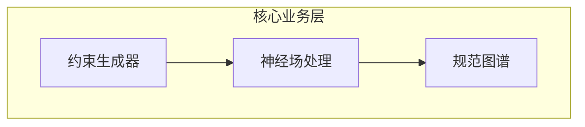
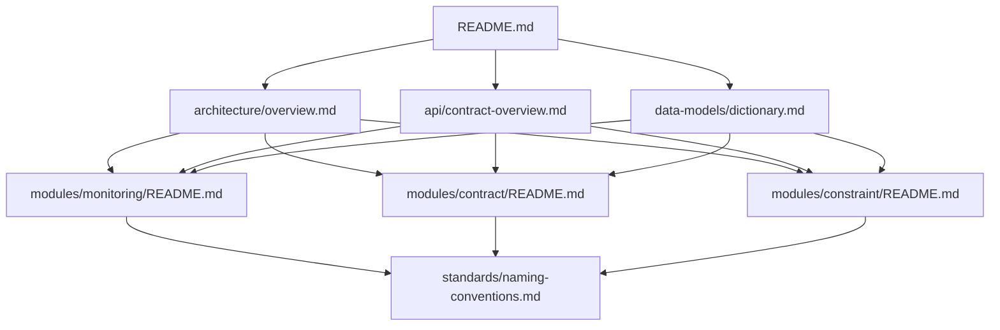

# DSGS统一契约文档体系 - 使用指南

## 🎯 文档设计原则

DSGS统一契约文档体系采用金字塔结构设计，专为LLM阅读优化：

### 📖 金字塔结构
1. **顶层概览**：结论先行，快速理解系统
2. **中层详细**：按任务分组，聚焦具体功能
3. **底层规范**：标准化定义，确保一致性

### 🔗 引用网络
- **明确引用**：所有相关文档都有清晰的链接
- **交叉验证**：多个文档间相互引用，确保信息一致性
- **快速导航**：通过引用链接快速定位相关信息

### 🎯 任务聚焦
- **按任务分组**：文档围绕具体业务任务组织
- **上下文相关**：约束上下文聚焦当前任务
- **相关性聚合**：相关信息按任务相关性分类

## 🚀 快速开始

### 1. 系统理解
**阅读路径**：
```
README.md → architecture/overview.md → api/contract-overview.md
```

**目标**：在5分钟内理解DSGS系统的整体架构和核心功能

### 2. 功能开发
**根据任务选择文档**：
- **监控功能** → `modules/monitoring/README.md`
- **契约管理** → `modules/contract/README.md`
- **约束生成** → `modules/constraint/README.md`
- **MCP集成** → `modules/mcp/README.md`

### 3. 规范遵循
**必读文档**：
- `standards/naming-conventions.md` - 统一命名规范
- `standards/error-handling.md` - 错误处理机制
- `standards/versioning.md` - 版本兼容性管理

## 📊 文档结构详解

### 🏗️ 第一层：核心概览
**特点**：高屋建瓴，快速理解

#### README.md - 文档导航
```markdown
## 📖 文档导航 (金字塔结构)
### 🏗️ 第一层：核心概览
- 系统架构总览
- API契约总览  
- 数据模型字典
### 🔧 第二层：任务导向文档
- 服务监控模块
- 契约管理模块
- ...
```

**设计理念**：
- **结论先行**：直接展示文档结构
- **快速定位**：通过分类快速找到所需文档
- **LLM友好**：清晰的层级结构便于理解和索引

#### architecture/overview.md - 系统架构总览
```markdown
## 🏗️ 核心架构
### 系统目标
DSGS (Dynamic Specification Growth System) 是一个AI驱动的动态规范生长系统

### 整体架构图

```

**设计理念**：
- **目标导向**：先说明系统目标，再展开技术实现
- **可视化**：使用图表直观展示架构关系
- **组件清晰**：明确各组件职责和相互关系

### 🔧 第二层：任务导向文档
**特点**：聚焦具体任务，提供完整实现指南

#### modules/monitoring/README.md - 服务监控模块
```markdown
## 📋 模块概览
服务监控模块负责DSGS系统的健康检查、性能指标收集、自动恢复和告警通知

### 🎯 核心功能
- **实时健康检查**：监控所有核心组件的健康状态
- **性能指标收集**：收集系统性能和业务指标
- **自动恢复机制**：故障时自动恢复服务
- **智能告警**：基于规则的告警和通知

### 📊 监控范围
| 组件 | 监控内容 | 告警阈值 |
|------|----------|----------|
| **MCP服务器** | 连接状态、消息处理延迟、错误率 | 延迟>1s，错误率>5% |
```

**设计理念**：
- **任务聚焦**：围绕监控任务组织内容
- **功能明确**：清晰列出核心功能
- **实用性强**：提供具体的监控范围和阈值

### 📚 第三层：详细规范
**特点**：标准化定义，确保一致性

#### standards/naming-conventions.md - 命名规范
```markdown
## 🎯 命名原则
DSGS系统采用统一的命名规范，确保代码、API、数据模型的一致性和可读性。

### 核心原则
- **一致性**：整个系统使用相同的命名风格
- **可读性**：名称应该清晰表达其用途
- **简洁性**：避免冗余和过长的名称
- **标准化**：遵循行业标准和最佳实践

### 命名风格
| 类型 | 风格 | 示例 | 用途 |
|------|------|------|------|
| **类名** | PascalCase | `TaskContextCapsule` | 类、接口、类型 |
| **方法名** | camelCase | `generateConstraints` | 方法、函数 |
| **变量名** | camelCase | `taskContext` | 变量、属性 |
```

**设计理念**：
- **原则先行**：先明确命名原则，再给出具体规范
- **表格化**：使用表格清晰展示不同类型的命名风格
- **示例丰富**：提供丰富的正反示例

## 🔗 引用网络设计

### 文档间的引用关系


### 引用设计原则
1. **双向引用**：重要概念在多个文档中相互引用
2. **上下文相关**：引用内容与当前文档主题相关
3. **避免循环**：设计引用关系时避免循环引用

### 引用示例
```markdown
## 🔗 相关文档

### 核心文档
- [系统架构总览](../architecture/overview.md) - 系统整体架构
- [API契约总览](../api/contract-overview.md) - API接口契约
- [数据模型字典](../data-models/dictionary.md) - 数据结构定义

### 相关模块
- [契约管理模块](../contract/README.md) - 契约生成和验证
- [约束生成模块](../constraint/README.md) - 动态约束生成
- [MCP协议模块](../mcp/README.md) - MCP协议实现

### 规范文档
- [命名规范](../standards/naming-conventions.md) - 统一命名规范
- [错误处理](../standards/error-handling.md) - 错误处理机制
- [版本管理](../standards/versioning.md) - 版本兼容性管理
```

## 🎯 任务聚焦设计

### 任务相关性聚合
```markdown
## 📋 模块概览
服务监控模块负责DSGS系统的健康检查、性能指标收集、自动恢复和告警通知

### 🎯 核心功能
- **实时健康检查**：监控所有核心组件的健康状态
- **性能指标收集**：收集系统性能和业务指标
- **自动恢复机制**：故障时自动恢复服务
- **智能告警**：基于规则的告警和通知

### 📊 监控范围
| 组件 | 监控内容 | 告警阈值 |
|------|----------|----------|
| **MCP服务器** | 连接状态、消息处理延迟、错误率 | 延迟>1s，错误率>5% |
| **约束生成器** | 生成时间、成功率、模板匹配 | 生成时间>100ms，成功率<95% |
```

### 上下文聚焦策略
1. **单一职责**：每个文档聚焦一个主要任务
2. **信息分层**：重要信息在前，详细信息在后
3. **按需引用**：通过引用链接获取相关信息

## 🤖 LLM友好特性

### 结构化数据
```markdown
### 📊 监控范围
| 组件 | 监控内容 | 告警阈值 |
|------|----------|----------|
| **MCP服务器** | 连接状态、消息处理延迟、错误率 | 延迟>1s，错误率>5% |
| **约束生成器** | 生成时间、成功率、模板匹配 | 生成时间>100ms，成功率<95% |
```

### 代码示例
```typescript
// ✅ 正确示例
class TaskContextCapsule {}
class ConstraintGenerator {}
class HealthCheckService {}

// ❌ 错误示例
class taskContextCapsule {}       // 首字母小写
class Constraint_Generator {}     // 使用下划线
class constraintgenerator {}      // 全部小写
```

### 配置示例
```yaml
# 监控配置
monitoring:
  healthCheck:
    interval: 30000    # 30秒
    timeout: 5000      # 5秒
    retries: 3
  metrics:
    enabled: true
    collectionInterval: 10000  # 10秒
    retentionDays: 30
```

## 📝 文档维护指南

### 内容更新原则
1. **同步更新**：相关文档需要同步更新
2. **引用验证**：更新后验证所有引用链接
3. **版本控制**：重要变更需要版本记录

### 质量检查清单
- [ ] 文档结构符合金字塔原则
- [ ] 所有引用链接有效
- [ ] 代码示例可执行
- [ ] 配置示例完整
- [ ] 表格数据准确
- [ ] 图示清晰易懂

### LLM优化建议
1. **使用结构化格式**：表格、列表、代码块
2. **提供完整示例**：包括正反示例
3. **明确上下文**：每个部分都有明确的上下文说明
4. **避免歧义**：使用明确的术语和定义

## 🚀 使用建议

### 开发者使用
1. **先读概览**：从README开始了解整体结构
2. **按需查找**：根据任务选择对应模块文档
3. **交叉参考**：通过引用链接获取相关信息
4. **遵循规范**：严格按照规范文档执行

### LLM使用
1. **结构化理解**：先理解文档的整体结构
2. **上下文关联**：注意文档间的引用关系
3. **任务导向**：根据具体任务查找相关文档
4. **验证信息**：通过多个文档交叉验证信息

---

**文档维护**：DSGS架构团队  
**最后更新**：2025-08-06  
**版本**：2.0