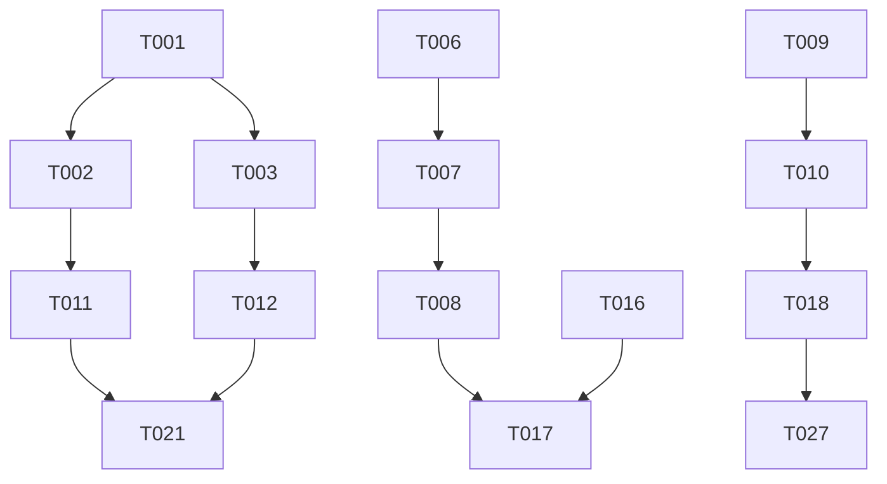

# DSGS服务监控与契约文档增强任务清单

## 📋 任务概览

基于DSGS系统架构增强需求，新增服务稳定性监控和完整契约文档功能。

### 🎯 核心目标
- **服务稳定性监控**：实时健康检查、性能指标收集、自动恢复机制
- **完整契约文档**：API接口规范、数据模型字典、版本兼容性管理

---

## 🔥 高优先级任务 (2周内完成)

### 服务监控模块

| 任务ID | 任务描述 | 预估工时 | 技术栈 | 验收标准 |
|--------|----------|----------|--------|----------|
| **T001** | 创建健康检查端点实现 | 4h | Node.js, Express | 响应<50ms，返回完整系统状态 |
| **T002** | 实现Prometheus指标收集器 | 6h | Prometheus, TypeScript | 暴露20+关键指标 |
| **T003** | 开发服务自动恢复机制 | 8h | Node.js, Docker | 故障恢复<30s，数据不丢失 |
| **T004** | 实现MCP服务器监控 | 4h | TypeScript, WebSocket | 连接状态、消息延迟监控 |
| **T005** | 约束生成器性能监控 | 4h | TypeScript | 生成时间、成功率监控 |

### 契约文档模块

| 任务ID | 任务描述 | 预估工时 | 技术栈 | 验收标准 |
|--------|----------|----------|--------|----------|
| **T006** | 设计契约文档生成器架构 | 4h | TypeScript, AST | 支持从代码生成文档 |
| **T007** | 实现TypeScript类型定义解析器 | 8h | TypeScript Compiler API | 解析准确率>95% |
| **T008** | 开发契约验证工具 | 6h | JSON Schema, TypeScript | 阻止不兼容变更 |
| **T009** | 创建API接口规范文档 | 4h | Markdown, OpenAPI | 覆盖100%公开接口 |
| **T010** | 建立数据模型字典 | 4h | JSON Schema, TypeScript | 包含所有数据结构 |

---

## ⚡ 中优先级任务 (3-4周内完成)

### 监控完善

| 任务ID | 任务描述 | 预估工时 | 技术栈 | 验收标准 |
|--------|----------|----------|--------|----------|
| **T011** | 配置Grafana监控仪表板 | 4h | Grafana, Prometheus | 可视化20+指标 |
| **T012** | 实现告警规则和通知机制 | 6h | AlertManager, Email/Slack | 5秒内告警 |
| **T013** | 神经场处理状态监控 | 4h | TypeScript | 冲突检测<500ms |
| **T014** | 数据库连接监控 | 2h | Node.js, PostgreSQL | 连接池状态监控 |
| **T015** | 编写监控单元测试 | 4h | Jest, TypeScript | 覆盖率>80% |

### 契约管理完善

| 任务ID | 任务描述 | 预估工时 | 技术栈 | 验收标准 |
|--------|----------|----------|--------|----------|
| **T016** | 实现版本兼容性检查 | 6h | TypeScript, SemVer | 破坏性变更检测 |
| **T017** | 集成契约验证到CI/CD流程 | 4h | GitHub Actions, Jenkins | 阻止不兼容合并 |
| **T018** | 契约文档Web界面 | 6h | React, TypeScript | 可视化查看和搜索 |
| **T019** | 契约变更历史追踪 | 4h | Node.js, Git | 完整变更记录 |
| **T020** | 契约文档自动发布 | 2h | GitHub Pages, Vercel | 自动部署文档 |

---

## 🔧 低优先级任务 (1-2个月内完成)

### 性能优化

| 任务ID | 任务描述 | 预估工时 | 技术栈 | 验收标准 |
|--------|----------|----------|--------|----------|
| **T021** | 性能基准测试和优化 | 8h | K6, Artillery | P99响应<100ms |
| **T022** | 监控数据存储优化 | 6h | PostgreSQL, TimescaleDB | 查询性能提升50% |
| **T023** | 契约验证缓存优化 | 4h | Redis, TypeScript | 验证速度提升80% |
| **T024** | 指标收集批处理优化 | 4h | TypeScript, Streams | 减少CPU使用30% |

### 扩展功能

| 任务ID | 任务描述 | 预估工时 | 技术栈 | 验收标准 |
|--------|----------|----------|--------|----------|
| **T025** | 多环境配置管理 | 4h | TypeScript, YAML | 支持dev/test/prod |
| **T026** | 监控数据导出功能 | 4h | CSV, JSON API | 支持多种格式 |
| **T027** | 契约文档国际化 | 6h | i18n, TypeScript | 支持中英文 |
| **T028** | 编写契约文档使用指南 | 2h | Markdown, Examples | 完整使用文档 |

---

## 📊 任务依赖关系

---

## 🎯 关键里程碑

### 里程碑1：核心监控功能 (第2周末)
- [ ] 健康检查端点上线
- [ ] 基础指标收集
- [ ] 自动恢复机制
- [ ] MCP服务器监控

### 里程碑2：契约文档基础 (第3周末)
- [ ] 契约生成器完成
- [ ] API接口文档
- [ ] 数据模型字典
- [ ] 契约验证工具

### 里程碑3：监控完善 (第4周末)
- [ ] Grafana仪表板
- [ ] 告警系统
- [ ] 性能监控
- [ ] 单元测试覆盖

### 里程碑4：契约管理完善 (第6周末)
- [ ] 版本管理
- [ ] CI/CD集成
- [ ] Web界面
- [ ] 自动发布

---

## 📈 质量标准

### 代码质量
- **测试覆盖率**：>80%
- **代码审查**：所有代码必须经过审查
- **性能要求**：P99响应时间<100ms
- **错误率**：<0.1%

### 文档质量
- **API文档**：100%接口覆盖
- **数据模型**：完整类型定义
- **使用指南**：详细示例和说明
- **变更记录**：完整版本历史

### 运维质量
- **可用性**：99.9%
- **监控覆盖**：100%关键组件
- **恢复时间**：<30秒
- **告警响应**：<5分钟

---

## 🚨 风险评估

### 技术风险
| 风险 | 可能性 | 影响 | 缓解措施 |
|------|--------|------|----------|
| 监控数据量过大 | 中 | 中 | 实现数据采样和保留策略 |
| 契约生成不准确 | 低 | 高 | 人工审核 + 自动化测试 |
| 服务恢复失败 | 低 | 高 | 多重恢复机制 + 数据备份 |

### 项目风险
| 风险 | 可能性 | 影响 | 缓解措施 |
|------|--------|------|----------|
| 开发时间超期 | 中 | 中 | 分阶段交付，优先核心功能 |
| 团队学习成本 | 中 | 低 | 提供培训文档和技术支持 |

---

## 📝 任务执行指南

### 开发流程
1. **任务分配**：根据技能和经验分配任务
2. **技术设计**：每个任务先进行技术设计评审
3. **编码实现**：按照编码规范进行开发
4. **单元测试**：确保代码质量和功能正确
5. **代码审查**：团队内部代码审查
6. **集成测试**：确保模块间协作正常
7. **部署上线**：按照部署计划发布

### 工具链
- **开发工具**：VS Code, TypeScript
- **版本控制**：Git, GitHub
- **测试工具**：Jest, Supertest
- **监控工具**：Prometheus, Grafana
- **CI/CD**：GitHub Actions, Jenkins

### 文档要求
- **设计文档**：详细的技术设计方案
- **API文档**：完整的接口定义和示例
- **用户手册**：功能使用指南
- **运维手册**：部署和维护指南

---

## 📞 联系方式

- **项目经理**：[待指定]
- **技术负责人**：[待指定]
- **开发团队**：[待指定]
- **运维团队**：[待指定]

---

**最后更新**：2025年8月6日
**下次更新**：每周一更新任务进度