# DNASPEC智能契约管理系统 - 系统设计

## 🏗️ 系统架构

### 整体架构
```
DNASPEC智能契约管理系统
├── 应用层 (Application Layer)
│   ├── CLI应用 (CLI Application)
│   ├── Web应用 (Web Application)
│   └── API服务 (API Service)
├── 业务层 (Business Layer)
│   ├── 源码分析服务 (Source Code Analysis Service)
│   ├── 契约生成服务 (Contract Generation Service)
│   ├── 契约验证服务 (Contract Validation Service)
│   ├── 版本管理服务 (Version Management Service)
│   └── 文档生成服务 (Documentation Service)
├── 集成层 (Integration Layer)
│   ├── DNASPEC约束生成器适配器 (Constraint Generator Adapter)
│   ├── DNASPEC神经场适配器 (Neural Field Adapter)
│   ├── DNASPEC监控适配器 (Monitoring Adapter)
│   └── CI/CD适配器 (CI/CD Adapter)
├── 数据层 (Data Layer)
│   ├── 契约存储 (Contract Storage)
│   ├── 版本存储 (Version Storage)
│   ├── 配置存储 (Configuration Storage)
│   └── 日志存储 (Log Storage)
└── 基础设施层 (Infrastructure Layer)
    ├── 文件系统 (File System)
    ├── 缓存系统 (Cache System)
    ├── 消息队列 (Message Queue)
    └── 监控系统 (Monitoring System)
```

### 核心组件设计

#### 1. 源码分析器 (SourceCodeAnalyzer)
```typescript
class SourceCodeAnalyzer {
  private parser: TypeScriptParser;
  private decoratorExtractor: DecoratorExtractor;
  private jsDocParser: JSDocParser;
  private routeAnalyzer: RouteAnalyzer;
  
  async analyze(sourcePaths: string[]): Promise<SourceAnalysis> {
    const files = await this.findSourceFiles(sourcePaths);
    const asts = await this.parseFiles(files);
    const decorators = await this.extractDecorators(asts);
    const jsDocs = await this.extractJSDoc(asts);
    const routes = await this.analyzeRoutes(asts);
    
    return {
      files,
      decorators,
      jsDocs,
      routes,
      asts
    };
  }
}
```

#### 2. 契约生成器 (ContractGenerator)
```typescript
class ContractGenerator {
  private sourceAnalyzer: SourceCodeAnalyzer;
  private modelGenerator: ModelGenerator;
  private pathGenerator: PathGenerator;
  private exampleGenerator: ExampleGenerator;
  
  async generate(config: GenerationConfig): Promise<GenerationResult> {
    const analysis = await this.sourceAnalyzer.analyze(config.sourcePaths);
    const models = await this.modelGenerator.generate(analysis);
    const paths = await this.pathGenerator.generate(analysis);
    const examples = await this.exampleGenerator.generate(analysis);
    
    const contract = this.assembleContract(models, paths, examples);
    
    return {
      success: true,
      contract,
      metadata: {
        generatedAt: new Date().toISOString(),
        sourceFiles: analysis.files.length,
        generationTime: Date.now() - startTime
      }
    };
  }
}
```

#### 3. 契约验证器 (ContractValidator)
```typescript
class ContractValidator {
  private structureValidator: StructureValidator;
  private typeValidator: TypeValidator;
  compatibilityValidator: CompatibilityValidator;
  businessValidator: BusinessValidator;
  
  async validate(config: ValidationConfig): Promise<ValidationResult> {
    const structureResult = await this.structureValidator.validate(config.contract);
    const typeResult = await this.typeValidator.validate(config.contract);
    const compatibilityResult = await this.compatibilityValidator.validate(config.contract);
    const businessResult = await this.businessValidator.validate(config.contract);
    
    const errors = [...structureResult.errors, ...typeResult.errors];
    const warnings = [...compatibilityResult.warnings, ...businessResult.warnings];
    
    return {
      isValid: errors.length === 0,
      score: this.calculateScore(errors, warnings),
      errors,
      warnings,
      statistics: this.calculateStatistics(errors, warnings)
    };
  }
}
```

## 🗄️ 数据库设计

### 契约表 (contracts)
```sql
CREATE TABLE contracts (
  id VARCHAR(36) PRIMARY KEY,
  version VARCHAR(20) NOT NULL,
  title VARCHAR(255) NOT NULL,
  description TEXT,
  content TEXT NOT NULL,
  format VARCHAR(20) NOT NULL,
  status VARCHAR(20) NOT NULL,
  created_at TIMESTAMP DEFAULT CURRENT_TIMESTAMP,
  updated_at TIMESTAMP DEFAULT CURRENT_TIMESTAMP,
  created_by VARCHAR(100),
  INDEX idx_version (version),
  INDEX idx_status (status),
  INDEX idx_created_at (created_at)
);
```

### 版本表 (contract_versions)
```sql
CREATE TABLE contract_versions (
  id VARCHAR(36) PRIMARY KEY,
  contract_id VARCHAR(36) NOT NULL,
  version VARCHAR(20) NOT NULL,
  content TEXT NOT NULL,
  changelog TEXT,
  is_current BOOLEAN DEFAULT FALSE,
  is_deprecated BOOLEAN DEFAULT FALSE,
  created_at TIMESTAMP DEFAULT CURRENT_TIMESTAMP,
  created_by VARCHAR(100),
  FOREIGN KEY (contract_id) REFERENCES contracts(id),
  INDEX idx_contract_version (contract_id, version),
  INDEX idx_current (is_current)
);
```

### 验证记录表 (validation_records)
```sql
CREATE TABLE validation_records (
  id VARCHAR(36) PRIMARY KEY,
  contract_id VARCHAR(36) NOT NULL,
  version VARCHAR(20) NOT NULL,
  score INTEGER NOT NULL,
  errors JSON,
  warnings JSON,
  validation_time INTEGER NOT NULL,
  created_at TIMESTAMP DEFAULT CURRENT_TIMESTAMP,
  FOREIGN KEY (contract_id) REFERENCES contracts(id),
  INDEX idx_contract_id (contract_id),
  INDEX idx_score (score),
  INDEX idx_created_at (created_at)
);
```

### 变更记录表 (change_history)
```sql
CREATE TABLE change_history (
  id VARCHAR(36) PRIMARY KEY,
  contract_id VARCHAR(36) NOT NULL,
  from_version VARCHAR(20) NOT NULL,
  to_version VARCHAR(20) NOT NULL,
  change_type VARCHAR(20) NOT NULL,
  description TEXT,
  impact TEXT,
  created_at TIMESTAMP DEFAULT CURRENT_TIMESTAMP,
  created_by VARCHAR(100),
  FOREIGN KEY (contract_id) REFERENCES contracts(id),
  INDEX idx_contract_id (contract_id),
  INDEX idx_created_at (created_at)
);
```

## 🔌 接口设计

### 1. 契约生成接口
```typescript
interface ContractGenerationService {
  /**
   * 生成契约
   */
  generateContract(request: GenerateContractRequest): Promise<GenerateContractResponse>;
  
  /**
   * 批量生成契约
   */
  generateContracts(request: BatchGenerateRequest): Promise<BatchGenerateResponse>;
  
  /**
   * 预览契约生成
   */
  previewGeneration(request: PreviewRequest): Promise<PreviewResponse>;
}
```

### 2. 契约验证接口
```typescript
interface ContractValidationService {
  /**
   * 验证契约
   */
  validateContract(request: ValidateContractRequest): Promise<ValidateContractResponse>;
  
  /**
   * 批量验证契约
   */
  validateContracts(request: BatchValidateRequest): Promise<BatchValidateResponse>;
  
  /**
   * 获取验证历史
   */
  getValidationHistory(request: HistoryRequest): Promise<HistoryResponse>;
}
```

### 3. 版本管理接口
```typescript
interface VersionManagementService {
  /**
   * 创建新版本
   */
  createVersion(request: CreateVersionRequest): Promise<CreateVersionResponse>;
  
  /**
   * 获取版本列表
   */
  getVersions(request: GetVersionsRequest): Promise<GetVersionsResponse>;
  
  /**
   * 比较版本差异
   */
  compareVersions(request: CompareVersionsRequest): Promise<CompareVersionsResponse>;
  
  /**
   * 回滚版本
   */
  rollbackVersion(request: RollbackRequest): Promise<RollbackResponse>;
}
```

### 4. 文档生成接口
```typescript
interface DocumentationService {
  /**
   * 生成Markdown文档
   */
  generateMarkdown(request: GenerateMarkdownRequest): Promise<GenerateDocumentationResponse>;
  
  /**
   * 生成HTML文档
   */
  generateHTML(request: GenerateHTMLRequest): Promise<GenerateDocumentationResponse>;
  
  /**
   * 生成交互式文档
   */
  generateInteractiveDocs(request: GenerateInteractiveRequest): Promise<GenerateDocumentationResponse>;
}
```

### 5. 集成接口
```typescript
interface IntegrationService {
  /**
   * 与DNASPEC约束生成器集成
   */
  integrateWithConstraintGenerator(request: IntegrationRequest): Promise<IntegrationResponse>;
  
  /**
   * 与DNASPEC神经场集成
   */
  integrateWithNeuralField(request: IntegrationRequest): Promise<IntegrationResponse>;
  
  /**
   * 与DNASPEC监控集成
   */
  integrateWithMonitoring(request: IntegrationRequest): Promise<IntegrationResponse>;
}
```

## 🔄 工作流程设计

### 1. 契约生成流程

```mermaid
graph TD
    A[开始] --> B[读取配置]
    B --> C[分析源码]
    C --> D[提取装饰器]
    D --> E[解析JSDoc]
    E --> F[分析路由]
    F --> G[生成数据模型]
    G --> H[生成API路径]
    H --> I[生成示例]
    I --> J[组装契约]
    J --> K[验证契约]
    K --> L[保存契约]
    L --> M[生成文档]
    M --> N[结束]
```


### 2. 契约验证流程

```mermaid
graph TD
    A[开始] --> B[加载契约]
    B --> C[结构验证]
    C --> D[类型验证]
    D --> E[路径验证]
    E --> F[兼容性验证]
    F --> G[业务规则验证]
    G --> H[计算分数]
    H --> I[生成报告]
    I --> J[保存记录]
    J --> K[发送通知]
    K --> L[结束]
```


### 3. 版本管理流程

```mermaid
graph TD
    A[开始] --> B[创建新版本]
    B --> C[分析变更]
    C --> D[检查兼容性]
    D --> E[生成变更日志]
    E --> F[保存版本]
    F --> G[更新当前版本]
    G --> H[生成文档]
    H --> I[发送通知]
    I --> J[结束]
```


## 🔧 详细设计

### 1. 源码分析器详细设计

#### TypeScript解析器
```typescript
class TypeScriptParser {
  private program: ts.Program;
  
  constructor(sourcePaths: string[]) {
    this.program = ts.createProgram(sourcePaths, {});
  }
  
  parseFiles(): ts.SourceFile[] {
    return this.program.getSourceFiles();
  }
  
  getAST(filePath: string): ts.SourceFile {
    return this.program.getSourceFile(filePath);
  }
}
```

#### 装饰器提取器
```typescript
class DecoratorExtractor {
  extractDecorators(sourceFile: ts.SourceFile): DecoratorInfo[] {
    const decorators: DecoratorInfo[] = [];
    
    const visit = (node: ts.Node) => {
      if (ts.isClassDeclaration(node)) {
        const classDecorators = this.extractClassDecorators(node);
        decorators.push(...classDecorators);
      }
      
      if (ts.isMethodDeclaration(node)) {
        const methodDecorators = this.extractMethodDecorators(node);
        decorators.push(...methodDecorators);
      }
      
      ts.forEachChild(node, visit);
    };
    
    ts.forEachChild(sourceFile, visit);
    return decorators;
  }
  
  private extractClassDecorators(node: ts.ClassDeclaration): DecoratorInfo[] {
    return node.decorators?.map(dec => this.parseDecorator(dec)) || [];
  }
  
  private extractMethodDecorators(node: ts.MethodDeclaration): DecoratorInfo[] {
    return node.decorators?.map(dec => this.parseDecorator(dec)) || [];
  }
  
  private parseDecorator(decorator: ts.Decorator): DecoratorInfo {
    const expression = decorator.expression;
    
    if (ts.isCallExpression(expression)) {
      return {
        name: expression.expression.getText(),
        arguments: expression.arguments.map(arg => arg.getText()),
        location: decorator.getStart()
      };
    }
    
    return {
      name: expression.getText(),
      arguments: [],
      location: decorator.getStart()
    };
  }
}
```

#### JSDoc解析器
```typescript
class JSDocParser {
  extractJSDoc(sourceFile: ts.SourceFile): JSDocInfo[] {
    const jsDocs: JSDocInfo[] = [];
    
    const visit = (node: ts.Node) => {
      const jsDoc = this.getJSDoc(node);
      if (jsDoc) {
        jsDocs.push(jsDoc);
      }
      
      ts.forEachChild(node, visit);
    };
    
    ts.forEachChild(sourceFile, visit);
    return jsDocs;
  }
  
  private getJSDoc(node: ts.Node): JSDocInfo | null {
    const jsDocTags = ts.getJSDocTags(node);
    
    if (jsDocTags.length === 0) {
      return null;
    }
    
    return {
      description: this.getDescription(node),
      tags: jsDocsTags.map(tag => this.parseTag(tag)),
      location: node.getStart()
    };
  }
  
  private parseTag(tag: ts.JSDocTag): JSDocTag {
    return {
      tag: tag.tagName.text,
      name: this.getTagName(tag),
      description: this.getTagDescription(tag),
      type: this.getTagType(tag)
    };
  }
}
```

### 2. 契约生成器详细设计

#### 模型生成器
```typescript
class ModelGenerator {
  generateModels(analysis: SourceAnalysis): ModelInfo[] {
    const models: ModelInfo[] = [];
    const interfaces = this.extractInterfaces(analysis);
    
    for (const iface of interfaces) {
      const model = this.generateModelFromInterface(iface);
      models.push(model);
    }
    
    return models;
  }
  
  private extractInterfaces(analysis: SourceAnalysis): ts.InterfaceDeclaration[] {
    return analysis.asts
      .filter(ast => ts.isInterfaceDeclaration(ast))
      .map(ast => ast as ts.InterfaceDeclaration);
  }
  
  private generateModelFromInterface(iface: ts.InterfaceDeclaration): ModelInfo {
    const properties = this.extractProperties(iface);
    const methods = this.extractMethods(iface);
    
    return {
      name: iface.name.text,
      type: 'object',
      description: this.getDescription(iface),
      properties,
      methods,
      required: this.getRequiredProperties(properties)
    };
  }
  
  private extractProperties(iface: ts.InterfaceDeclaration): PropertyInfo[] {
    return iface.members
      .filter(member => ts.isPropertySignature(member))
      .map(member => this.generateProperty(member as ts.PropertySignature));
  }
  
  private generateProperty(prop: ts.PropertySignature): PropertyInfo {
    return {
      name: prop.name.text,
      type: this.getType(prop.type),
      description: this.getDescription(prop),
      required: !prop.questionToken,
      defaultValue: this.getDefaultValue(prop)
    };
  }
}
```

#### 路径生成器
```typescript
class PathGenerator {
  generatePaths(analysis: SourceAnalysis): PathInfo[] {
    const paths: PathInfo[] = [];
    const routes = this.extractRoutes(analysis);
    
    for (const route of routes) {
      const path = this.generatePathFromRoute(route);
      paths.push(path);
    }
    
    return paths;
  }
  
  private extractRoutes(analysis: SourceAnalysis): RouteInfo[] {
    const routes: RouteInfo[] = [];
    
    for (const decorator of analysis.decorators) {
      if (this.isRouteDecorator(decorator)) {
        const route = this.parseRouteDecorator(decorator);
        routes.push(route);
      }
    }
    
    return routes;
  }
  
  private isRouteDecorator(decorator: DecoratorInfo): boolean {
    return ['Get', 'Post', 'Put', 'Delete', 'Patch'].includes(decorator.name);
  }
  
  private generatePathFromRoute(route: RouteInfo): PathInfo {
    const method = route.name.toLowerCase();
    const path = this.extractPath(route);
    const parameters = this.extractParameters(route);
    const responses = this.generateResponses(route);
    
    return {
      path,
      method,
      summary: this.getSummary(route),
      description: this.getDescription(route),
      parameters,
      responses,
      tags: this.getTags(route)
    };
  }
}
```

### 3. 契约验证器详细设计

#### 结构验证器
```typescript
class StructureValidator {
  validate(contract: ApiContract): ValidationResult {
    const errors: ValidationError[] = [];
    
    // 验证必需字段
    if (!contract.openapi) {
      errors.push(this.createError('missing-openapi', 'Missing OpenAPI version'));
    }
    
    if (!contract.info) {
      errors.push(this.createError('missing-info', 'Missing API info'));
    }
    
    if (!contract.paths) {
      errors.push(this.createError('missing-paths', 'Missing API paths'));
    }
    
    return {
      isValid: errors.length === 0,
      errors,
      warnings: []
    };
  }
  
  private createError(id: string, message: string): ValidationError {
    return {
      id,
      type: 'structure',
      severity: 'error',
      message,
      location: { component: 'structure' },
      suggestions: ['Add the missing field'],
      rule: 'structure-validation'
    };
  }
}
```

#### 类型验证器
```typescript
class TypeValidator {
  validate(contract: ApiContract): ValidationResult {
    const errors: ValidationError[] = [];
    const warnings: ValidationWarning[] = [];
    
    // 验证数据模型
    if (contract.components?.schemas) {
      for (const [name, schema] of Object.entries(contract.components.schemas)) {
        const modelErrors = this.validateModel(name, schema);
        errors.push(...modelErrors);
      }
    }
    
    // 验证路径参数
    if (contract.paths) {
      for (const [path, pathItem] of Object.entries(contract.paths)) {
        const pathErrors = this.validatePath(path, pathItem);
        errors.push(...pathErrors);
      }
    }
    
    return {
      isValid: errors.length === 0,
      errors,
      warnings,
      score: this.calculateScore(errors, warnings)
    };
  }
  
  private validateModel(name: string, schema: any): ValidationError[] {
    const errors: ValidationError[] = [];
    
    if (schema.type === 'object' && schema.properties) {
      for (const [propName, propSchema] of Object.entries(schema.properties)) {
        if (!propSchema.type) {
          errors.push(this.createError(`missing-type-${propName}`, `Property ${propName} missing type`));
        }
      }
    }
    
    return errors;
  }
  
  private validatePath(path: string, pathItem: any): ValidationError[] {
    const errors: ValidationError[] = [];
    
    for (const [method, operation] of Object.entries(pathItem)) {
      if (operation.parameters) {
        for (const param of operation.parameters) {
          if (param.in === 'path' && !param.required) {
            errors.push(this.createError(`path-param-required-${param.name}`, `Path parameter ${param.name} must be required`));
          }
        }
      }
    }
    
    return errors;
  }
}
```

## 🔒 安全设计

### 1. 认证和授权
```typescript
class AuthService {
  private jwtService: JWTService;
  private rbacService: RBACService;
  
  async authenticate(token: string): Promise<UserInfo> {
    const payload = await this.jwtService.verify(token);
    return await this.userService.findById(payload.userId);
  }
  
  async authorize(user: UserInfo, resource: string, action: string): Promise<boolean> {
    return await this.rbacService.checkPermission(user, resource, action);
  }
}
```

### 2. 数据加密
```typescript
class EncryptionService {
  private algorithm = 'aes-256-gcm';
  
  async encrypt(data: string): Promise<EncryptedData> {
    const key = await this.getKey();
    const iv = crypto.randomBytes(16);
    const cipher = crypto.createCipher(this.algorithm, key);
    
    let encrypted = cipher.update(data, 'utf8', 'hex');
    encrypted += cipher.final('hex');
    
    const authTag = cipher.getAuthTag();
    
    return {
      encrypted,
      iv: iv.toString('hex'),
      authTag: authTag.toString('hex')
    };
  }
  
  async decrypt(encryptedData: EncryptedData): Promise<string> {
    const key = await this.getKey();
    const decipher = crypto.createDecipher(this.algorithm, key);
    
    let decrypted = decipher.update(encryptedData.encrypted, 'hex', 'utf8');
    decrypted += decipher.final('utf8');
    
    return decrypted;
  }
}
```

### 3. 审计日志
```typescript
class AuditService {
  async log(action: AuditAction): Promise<void> {
    const auditLog = {
      id: generateUUID(),
      userId: action.userId,
      action: action.action,
      resource: action.resource,
      timestamp: new Date(),
      details: action.details,
      ipAddress: action.ipAddress,
      userAgent: action.userAgent
    };
    
    await this.auditRepository.save(auditLog);
  }
}
```

## 📊 性能优化

### 1. 缓存策略
```typescript
class CacheService {
  private cache: Map<string, CacheItem>;
  private ttl: number;
  
  constructor(ttl: number = 300000) { // 5 minutes
    this.cache = new Map();
    this.ttl = ttl;
  }
  
  async get<T>(key: string): Promise<T | null> {
    const item = this.cache.get(key);
    
    if (!item) {
      return null;
    }
    
    if (Date.now() > item.expiry) {
      this.cache.delete(key);
      return null;
    }
    
    return item.value as T;
  }
  
  async set<T>(key: string, value: T): Promise<void> {
    const item: CacheItem = {
      value,
      expiry: Date.now() + this.ttl
    };
    
    this.cache.set(key, item);
  }
  
  async invalidate(pattern: string): Promise<void> {
    for (const key of this.cache.keys()) {
      if (key.includes(pattern)) {
        this.cache.delete(key);
      }
    }
  }
}
```

### 2. 异步处理
```typescript
class AsyncProcessor {
  private queue: AsyncQueue;
  private workers: Worker[];
  
  constructor(workerCount: number = 4) {
    this.queue = new AsyncQueue();
    this.workers = Array(workerCount).fill(null).map(() => new Worker());
  }
  
  async process<T>(task: AsyncTask<T>): Promise<T> {
    return new Promise((resolve, reject) => {
      this.queue.push(async () => {
        const worker = this.getAvailableWorker();
        
        worker.on('message', (result: T) => {
          this.releaseWorker(worker);
          resolve(result);
        });
        
        worker.on('error', (error: Error) => {
          this.releaseWorker(worker);
          reject(error);
        });
        
        worker.postMessage(task);
      });
    });
  }
  
  private getAvailableWorker(): Worker {
    return this.workers.find(worker => !worker.busy) || this.workers[0];
  }
  
  private releaseWorker(worker: Worker): void {
    worker.busy = false;
  }
}
```

### 3. 连接池
```typescript
class ConnectionPool {
  private pool: Connection[];
  private maxPoolSize: number;
  
  constructor(maxPoolSize: number = 10) {
    this.pool = [];
    this.maxPoolSize = maxPoolSize;
  }
  
  async getConnection(): Promise<Connection> {
    const connection = this.pool.find(conn => !conn.busy);
    
    if (connection) {
      connection.busy = true;
      return connection;
    }
    
    if (this.pool.length < this.maxPoolSize) {
      const newConnection = await this.createConnection();
      newConnection.busy = true;
      this.pool.push(newConnection);
      return newConnection;
    }
    
    // 等待连接可用
    return new Promise((resolve) => {
      const checkInterval = setInterval(() => {
        const availableConnection = this.pool.find(conn => !conn.busy);
        if (availableConnection) {
          clearInterval(checkInterval);
          availableConnection.busy = true;
          resolve(availableConnection);
        }
      }, 100);
    });
  }
  
  async releaseConnection(connection: Connection): Promise<void> {
    connection.busy = false;
  }
}
```

---

**文档版本**: v1.0  
**创建日期**: 2025-08-06  
**最后更新**: 2025-08-06  
**负责人**: DNASPEC架构团队  
**状态**: 设计阶段