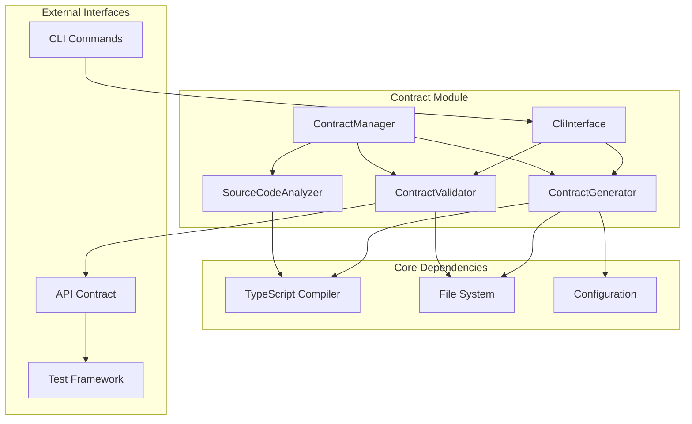

# Contract Module TDD重构 - 设计文档

## 🏗️ 架构设计

### 整体架构



### 核心组件设计

#### 1. ContractGenerator（契约生成器）
**职责**：从TypeScript源代码生成API契约

```typescript
class ContractGenerator {
  private analyzer: SourceCodeAnalyzer;
  private config: GenerationConfig;
  
  async generate(request: GenerateContractRequest): Promise<GenerateContractResponse> {
    // 1. 分析源代码
    // 2. 提取类型定义
    // 3. 生成契约结构
    // 4. 验证契约完整性
  }
}
```

#### 2. ContractValidator（契约验证器）
**职责**：验证契约的正确性和一致性

```typescript
class ContractValidator {
  private rules: ValidationRule[];
  private config: ValidationConfig;
  
  async validate(request: ValidateContractRequest): Promise<ValidationResult> {
    // 1. 解析契约结构
    // 2. 应用验证规则
    // 3. 生成验证报告
  }
}
```

#### 3. ContractManager（契约管理器）
**职责**：统一管理契约生成和验证流程

```typescript
class ContractManager {
  private generator: ContractGenerator;
  private validator: ContractValidator;
  
  async generateAndValidate(request: GenerateContractRequest): Promise<ContractOperationResult> {
    // 1. 生成契约
    // 2. 验证契约
    // 3. 返回结果
  }
}
```

## 📊 数据模型设计

### 核心接口

#### 1. GenerateContractRequest
```typescript
interface GenerateContractRequest {
  sourcePaths: string[];
  outputPath?: string;
  format: 'openapi' | 'json-schema' | 'markdown';
  options: GenerationOptions;
}
```

#### 2. ValidationResult
```typescript
interface ValidationResult {
  isValid: boolean;
  score: number;
  errors: ValidationError[];
  warnings: ValidationWarning[];
  suggestions: string[];
  statistics: ValidationStatistics;
  metadata: ValidationMetadata;
}
```

#### 3. ApiContract
```typescript
interface ApiContract {
  metadata: ContractMetadata;
  endpoints: ApiEndpoint[];
  dataModels: DataModel[];
  webhooks: WebhookDefinition[];
  events: EventDefinition[];
  security: SecurityDefinition[];
  servers: ServerDefinition[];
  tags: TagDefinition[];
  compatibility: CompatibilityMatrix;
  examples: ExampleCollection;
}
```

## 🔧 TDD设计策略

### 测试金字塔

```
         E2E Tests (10%)
        /               \
   Integration Tests (30%)
  /                       \
Unit Tests (60%)
```

### 测试策略

#### 1. 单元测试
- **目标**：测试每个组件的独立功能
- **覆盖范围**：所有公共方法和核心逻辑
- **工具**：Jest + ts-jest
- **示例**：
```typescript
describe('ContractGenerator', () => {
  it('should generate contract from TypeScript source', async () => {
    // Arrange
    const generator = new ContractGenerator();
    const request: GenerateContractRequest = {
      sourcePaths: ['./test/fixtures/sample.ts'],
      format: 'openapi',
      options: { includePrivate: false, includeExamples: true, validate: true, version: '1.0.0' }
    };
    
    // Act
    const result = await generator.generate(request);
    
    // Assert
    expect(result.success).toBe(true);
    expect(result.contract).toBeDefined();
    expect(result.contract.endpoints).toHaveLength(1);
  });
});
```

#### 2. 集成测试
- **目标**：测试组件间的交互
- **覆盖范围**：契约生成和验证流程
- **工具**：Jest + 内存文件系统
- **示例**：
```typescript
describe('Contract Integration', () => {
  it('should generate and validate contract', async () => {
    // Arrange
    const manager = new ContractManager();
    
    // Act
    const result = await manager.generateAndValidate(request);
    
    // Assert
    expect(result.success).toBe(true);
    expect(result.validationResult.isValid).toBe(true);
  });
});
```

#### 3. 端到端测试
- **目标**：测试完整的CLI工作流
- **覆盖范围**：从命令行到文件输出
- **工具**：Jest + child_process
- **示例**：
```typescript
describe('CLI E2E', () => {
  it('should generate contract via CLI', async () => {
    // Act
    const result = await execAsync('npm run contract:generate');
    
    // Assert
    expect(result.stdout).toContain('Contract generated successfully');
    expect(fs.existsSync('./output/contract.json')).toBe(true);
  });
});
```

## 🔄 重构策略

### 阶段1：编译错误修复
1. **优先级**：高
2. **目标**：解决所有TypeScript编译错误
3. **方法**：
   - 修复类型定义不匹配
   - 统一接口规范
   - 更新导入路径

### 阶段2：测试框架建立
1. **优先级**：高
2. **目标**：建立完整的测试框架
3. **方法**：
   - 创建测试工具类
   - 编写测试用例
   - 设置测试覆盖率

### 阶段3：功能重构
1. **优先级**：中
2. **目标**：重构核心功能
3. **方法**：
   - 应用SOLID原则
   - 提高代码复用性
   - 优化性能

### 阶段4：集成优化
1. **优先级**：中
2. **目标**：优化组件集成
3. **方法**：
   - 统一错误处理
   - 优化配置管理
   - 完善日志系统

## 🛠️ 技术选型

### 核心技术栈
- **TypeScript**：主要开发语言
- **Jest**：测试框架
- **ts-jest**：TypeScript测试支持
- **Commander.js**：CLI框架
- **YAML**：配置文件格式

### 辅助工具
- **ESLint**：代码质量检查
- **Prettier**：代码格式化
- **Husky**：Git hooks
- **fs-extra**：文件系统操作

## 📋 配置设计

### 测试配置
```json
{
  "jest": {
    "preset": "ts-jest",
    "testEnvironment": "node",
    "collectCoverage": true,
    "coverageDirectory": "coverage",
    "coverageThreshold": {
      "global": {
        "branches": 80,
        "functions": 80,
        "lines": 90,
        "statements": 90
      }
    }
  }
}
```

### 构建配置
```json
{
  "compilerOptions": {
    "target": "ES2022",
    "module": "commonjs",
    "strict": true,
    "esModuleInterop": true,
    "skipLibCheck": true,
    "forceConsistentCasingInFileNames": true,
    "outDir": "./dist",
    "rootDir": "./src"
  }
}
```

## 🚀 性能设计

### 性能目标
- **契约生成时间**：< 5秒（1000个类型定义）
- **验证响应时间**：< 2秒
- **内存使用**：< 100MB
- **测试执行时间**：< 30秒

### 优化策略
1. **缓存机制**：缓存解析结果
2. **并行处理**：多线程处理文件
3. **增量编译**：只处理变更文件
4. **内存优化**：流式处理大文件

## 🔐 安全设计

### 安全考虑
1. **文件系统安全**：限制访问路径
2. **输入验证**：验证所有输入参数
3. **错误信息**：不泄露敏感信息
4. **权限控制**：基于角色的访问

### 安全措施
```typescript
class SecurityValidator {
  validatePath(filePath: string): boolean {
    // 验证文件路径安全性
    return path.normalize(filePath).startsWith(process.cwd());
  }
  
  sanitizeInput(input: string): string {
    // 清理输入数据
    return input.replace(/[<>\"']/g, '');
  }
}
```

## 📊 监控设计

### 监控指标
- **编译成功率**：实时监控编译状态
- **测试通过率**：跟踪测试结果
- **性能指标**：响应时间和资源使用
- **错误率**：监控错误发生频率

### 日志策略
```typescript
class Logger {
  info(message: string, meta?: any): void {
    console.log(JSON.stringify({
      level: 'info',
      message,
      timestamp: new Date().toISOString(),
      meta
    }));
  }
  
  error(message: string, error?: Error): void {
    console.error(JSON.stringify({
      level: 'error',
      message,
      timestamp: new Date().toISOString(),
      error: error?.stack
    }));
  }
}
```

---

**设计文档版本**：1.0  
**创建日期**：2025-08-11  
**最后更新**：2025-08-11  
**作者**：DNASPEC团队  
**状态**：待审核