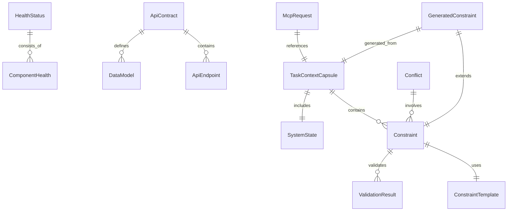

# DNASPEC数据模型字典

## 📚 数据模型概览

DNASPEC系统的数据模型采用分层设计，确保类型安全和业务逻辑清晰。所有模型都遵循统一的命名规范和设计原则。

### 🎯 设计原则
- **类型安全**：使用TypeScript确保编译时类型检查
- **业务导向**：模型设计围绕具体业务场景
- **可扩展性**：支持版本控制和向后兼容
- **标准化**：统一的命名和结构规范

### 📊 模型分类
| 类别 | 用途 | 示例 | 相关API |
|------|------|------|---------|
| **核心模型** | 系统基础数据 | `TaskContextCapsule`, `Constraint` | 所有API |
| **监控模型** | 监控相关数据 | `HealthStatus`, `Metrics` | 监控API |
| **契约模型** | 契约管理数据 | `ApiContract`, `ValidationResult` | 契约API |
| **约束模型** | 约束生成数据 | `GeneratedConstraint`, `Conflict` | 约束API |
| **MCP模型** | MCP协议数据 | `McpRequest`, `McpResponse` | MCP API |

## 🔧 核心数据模型

### 1. 任务上下文胶囊 (TaskContextCapsule)
**用途**：封装任务执行所需的上下文信息

```typescript
interface TaskContextCapsule {
  // 基础信息
  taskId: string;                    // 任务唯一标识
  taskType: TaskType;                // 任务类型
  goal: string;                      // 任务目标描述
  priority: Priority;                // 任务优先级
  
  // 上下文信息
  context: {
    // 相关规范片段
    specificationFragments: SpecificationFragment[];
    
    // 活跃约束
    activeConstraints: ConstraintReference[];
    
    // 系统状态快照
    systemState: SystemState;
    
    // 依赖关系
    dependencies: Dependency[];
  };
  
  // 元数据
  metadata: {
    createdAt: string;
    updatedAt: string;
    version: string;
    author: string;
  };
}

enum TaskType {
  SECURITY_AUDIT = 'security_audit',
  PERFORMANCE_OPTIMIZATION = 'performance_optimization',
  CODE_REVIEW = 'code_review',
  TESTING = 'testing',
  DEPLOYMENT = 'deployment'
}

enum Priority {
  LOW = 'low',
  MEDIUM = 'medium',
  HIGH = 'high',
  CRITICAL = 'critical'
}
```

**相关API**：
- `POST /constraints/generate`
- `MCP: checkConstraints`

### 2. 约束 (Constraint)
**用途**：定义代码约束的规范

```typescript
interface Constraint {
  // 基础信息
  id: string;                        // 约束唯一标识
  name: string;                      // 约束名称
  description: string;               // 约束描述
  category: ConstraintCategory;      // 约束类别
  severity: Severity;                // 严重程度
  
  // 约束定义
  definition: {
    type: ConstraintType;             // 约束类型
    target: ConstraintTarget;        // 约束目标
    condition: ConstraintCondition;   // 约束条件
    template?: ConstraintTemplate;   // 关联模板
  };
  
  // 验证信息
  validation: {
    enabled: boolean;                 // 是否启用验证
    autoFix: boolean;                 // 是否自动修复
    customRules?: ValidationRule[];   // 自定义验证规则
  };
  
  // 元数据
  metadata: {
    createdAt: string;
    updatedAt: string;
    version: string;
    source: 'system' | 'user' | 'template';
  };
}

enum ConstraintCategory {
  SECURITY = 'security',
  PERFORMANCE = 'performance',
  ARCHITECTURE = 'architecture',
  CODE_QUALITY = 'code_quality',
  BUSINESS_LOGIC = 'business_logic'
}

enum Severity {
  LOW = 'low',
  MEDIUM = 'medium',
  HIGH = 'high',
  CRITICAL = 'critical'
}
```

**相关API**：
- `POST /constraints/generate`
- `POST /constraints/validate`
- `MCP: checkConstraints`

### 3. 系统状态 (SystemState)
**用途**：系统运行状态的快照

```typescript
interface SystemState {
  // 系统基本信息
  version: string;                   // 系统版本
  uptime: number;                     // 运行时间
  environment: Environment;          // 运行环境
  
  // 资源使用情况
  resources: {
    cpu: CpuUsage;                   // CPU使用情况
    memory: MemoryUsage;              // 内存使用情况
    disk: DiskUsage;                  // 磁盘使用情况
    network: NetworkUsage;           // 网络使用情况
  };
  
  // 组件状态
  components: ComponentStatus[];
  
  // 业务指标
  metrics: {
    requestCount: number;             // 请求总数
    errorRate: number;                // 错误率
    responseTime: number;             // 平均响应时间
    activeConnections: number;        // 活跃连接数
  };
  
  // 时间戳
  timestamp: string;
}

enum Environment {
  DEVELOPMENT = 'development',
  TESTING = 'testing',
  STAGING = 'staging',
  PRODUCTION = 'production'
}
```

**相关API**：
- `GET /health`
- `GET /metrics`
- `MCP: getSystemStatus`

## 🔧 监控数据模型

### 1. 健康状态 (HealthStatus)
**用途**：系统和组件健康状态

```typescript
interface HealthStatus {
  // 整体状态
  status: 'healthy' | 'degraded' | 'unhealthy';
  timestamp: string;
  version: string;
  uptime: number;
  
  // 组件状态
  components: ComponentHealth[];
  
  // 系统指标
  metrics: SystemMetrics;
  
  // 问题和建议
  issues: HealthIssue[];
  recommendations: Recommendation[];
}

interface ComponentHealth {
  name: string;                      // 组件名称
  status: 'healthy' | 'degraded' | 'unhealthy';
  details: string;                   // 详细信息
  lastCheck: string;                 // 最后检查时间
  metrics?: ComponentMetrics;        // 组件指标
  dependencies?: string[];           // 依赖组件
}

interface HealthIssue {
  id: string;                        // 问题ID
  type: IssueType;                   // 问题类型
  severity: Severity;                // 严重程度
  message: string;                   // 问题描述
  component?: string;                // 相关组件
  timestamp: string;                 // 发生时间
  resolved: boolean;                 // 是否已解决
}
```

**相关API**：
- `GET /health`
- `GET /health/components/{name}`

### 2. 指标数据 (Metrics)
**用途**：系统性能指标

```typescript
interface Metrics {
  // 系统指标
  system: SystemMetrics;
  
  // 组件指标
  components: ComponentMetrics[];
  
  // 业务指标
  business: BusinessMetrics[];
  
  // 自定义指标
  custom: CustomMetric[];
}

interface SystemMetrics {
  cpu: {
    usage: number;                   // CPU使用率
    cores: number;                   // CPU核心数
    loadAverage: number[];           // 负载平均值
  };
  
  memory: {
    total: number;                   // 总内存
    used: number;                    // 已使用内存
    free: number;                    // 空闲内存
    usage: number;                   // 内存使用率
  };
  
  disk: {
    total: number;                   // 总磁盘空间
    used: number;                    // 已使用空间
    free: number;                    // 空闲空间
    usage: number;                   // 磁盘使用率
  };
  
  network: {
    bytesIn: number;                 // 入站字节数
    bytesOut: number;                // 出站字节数
    packetsIn: number;               // 入站包数
    packetsOut: number;              // 出站包数
  };
}
```

**相关API**：
- `GET /metrics`
- `GET /metrics/system`
- `GET /metrics/components/{name}`

## 🔧 契约数据模型

### 1. API契约 (ApiContract)
**用途**：API接口契约定义

```typescript
interface ApiContract {
  // 契约元数据
  metadata: ContractMetadata;
  
  // API端点
  endpoints: ApiEndpoint[];
  
  // 数据模型
  dataModels: DataModel[];
  
  // Webhook定义
  webhooks: WebhookDefinition[];
  
  // 事件定义
  events: EventDefinition[];
  
  // 版本兼容性
  compatibility: CompatibilityMatrix;
  
  // 示例集合
  examples: ExampleCollection;
}

interface ContractMetadata {
  version: string;                   // 契约版本
  title: string;                     // 契约标题
  description: string;               // 契约描述
  contact: ContactInfo;              // 联系信息
  license: LicenseInfo;              // 许可证信息
  lastUpdated: string;               // 最后更新时间
}

interface ApiEndpoint {
  path: string;                      // API路径
  method: 'GET' | 'POST' | 'PUT' | 'DELETE' | 'PATCH';
  summary: string;                   // 端点摘要
  description: string;               // 端点描述
  parameters: Parameter[];           // 参数定义
  requestBody?: RequestBody;         // 请求体
  responses: ResponseDefinition[];    // 响应定义
  security: SecurityRequirement[];    // 安全要求
  tags: string[];                    // 标签
}
```

**相关API**：
- `GET /contract`
- `POST /contract/validate`
- `POST /contract/publish`

### 2. 验证结果 (ValidationResult)
**用途**：契约验证结果

```typescript
interface ValidationResult {
  // 验证结果
  isValid: boolean;                  // 是否有效
  score: number;                     // 验证分数 (0-100)
  
  // 错误信息
  errors: ValidationError[];
  warnings: ValidationWarning[];
  
  // 统计信息
  statistics: {
    totalChecks: number;             // 总检查数
    passedChecks: number;            // 通过检查数
    failedChecks: number;            // 失败检查数
    warningChecks: number;           // 警告检查数
  };
  
  // 时间戳
  timestamp: string;
  duration: number;                  // 验证耗时
}

interface ValidationError {
  id: string;                        // 错误ID
  type: ErrorType;                   // 错误类型
  severity: Severity;                // 严重程度
  message: string;                   // 错误消息
  location: ErrorLocation;           // 错误位置
  details?: any;                     // 详细信息
  suggestions: string[];             // 修复建议
}

interface ValidationWarning {
  id: string;                        // 警告ID
  type: WarningType;                 // 警告类型
  message: string;                   // 警告消息
  location: ErrorLocation;           // 警告位置
  details?: any;                     // 详细信息
}
```

**相关API**：
- `POST /contract/validate`
- `GET /contract/validation/history`

## 🔧 约束生成数据模型

### 1. 生成的约束 (GeneratedConstraint)
**用途**：动态生成的约束

```typescript
interface GeneratedConstraint {
  // 基础信息
  id: string;                        // 约束ID
  templateId?: string;               // 模板ID
  taskId: string;                    // 任务ID
  
  // 约束内容
  constraint: Constraint;            // 约束定义
  
  // 生成信息
  generation: {
    strategy: GenerationStrategy;     // 生成策略
    confidence: number;              // 置信度 (0-1)
    context: GenerationContext;       // 生成上下文
    alternatives: GeneratedConstraint[]; // 替代方案
  };
  
  // 验证结果
  validation?: ConstraintValidation;  // 验证结果
  
  // 元数据
  metadata: {
    createdAt: string;
    generatedBy: 'system' | 'user' | 'ai';
    version: string;
  };
}

interface GenerationContext {
  // 任务上下文
  taskContext: TaskContextCapsule;
  
  // 相关规范
  relevantSpecifications: Specification[];
  
  // 历史数据
  historicalData: HistoricalConstraint[];
  
  // 环境信息
  environment: {
    systemState: SystemState;
    activeConstraints: Constraint[];
  };
}
```

**相关API**：
- `POST /constraints/generate`
- `POST /constraints/validate`

### 2. 约束冲突 (Conflict)
**用途**：约束冲突检测

```typescript
interface Conflict {
  // 冲突信息
  id: string;                        // 冲突ID
  type: ConflictType;                // 冲突类型
  severity: Severity;                // 严重程度
  
  // 冲突方
  parties: {
    constraint1: Constraint;          // 约束1
    constraint2: Constraint;          // 约束2
  };
  
  // 冲突详情
  details: {
    description: string;             // 冲突描述
    reason: string;                   // 冲突原因
    impact: string;                  // 影响分析
  };
  
  // 解决方案
  resolutions: ResolutionSuggestion[];
  
  // 元数据
  metadata: {
    detectedAt: string;
    detectedBy: 'system' | 'user';
    status: 'active' | 'resolved' | 'ignored';
  };
}

interface ResolutionSuggestion {
  id: string;                        // 建议ID
  type: ResolutionType;              // 解决类型
  description: string;               // 建议描述
  steps: string[];                   // 解决步骤
  impact: ImpactAnalysis;            // 影响分析
  confidence: number;                // 建议置信度
}
```

**相关API**：
- `POST /constraints/conflicts`
- `POST /constraints/conflicts/resolve`

## 🔧 MCP协议数据模型

### 1. MCP请求 (McpRequest)
**用途**：MCP协议请求

```typescript
interface McpRequest {
  method: string;                     // 方法名
  params: Record<string, any>;        // 参数
  id: string | number;               // 请求ID
  jsonrpc?: string;                  // JSON-RPC版本
}

interface McpResponse {
  result?: any;                      // 结果
  error?: McpError;                  // 错误信息
  id: string | number;               // 请求ID
  jsonrpc?: string;                  // JSON-RPC版本
}

interface McpError {
  code: number;                      // 错误码
  message: string;                   // 错误消息
  data?: any;                        // 错误数据
}
```

**相关API**：
- `MCP: checkConstraints`
- `MCP: getSystemStatus`
- `MCP: getEvolutionStage`

## 🔗 模型关系图



## 🔗 相关文档

### 核心文档
- [系统架构总览](../architecture/overview.md) - 系统整体架构
- [API契约总览](../api/contract-overview.md) - API接口契约
- [命名规范](../standards/naming-conventions.md) - 命名规范

### 模块文档
- [监控数据模型](../modules/monitoring/README.md#data-models) - 监控相关模型
- [契约数据模型](../modules/contract/README.md#data-models) - 契约相关模型
- [约束数据模型](../modules/constraint/README.md#data-models) - 约束相关模型
- [MCP数据模型](../modules/mcp/README.md#data-models) - MCP相关模型

### 规范文档
- [接口规范](../api/specifications.md) - 详细接口定义
- [错误处理](../standards/error-handling.md) - 错误处理机制
- [版本管理](../standards/versioning.md) - 版本兼容性管理

---

**文档维护**：DNASPEC架构团队  
**最后更新**：2025-08-06  
**版本**：2.0