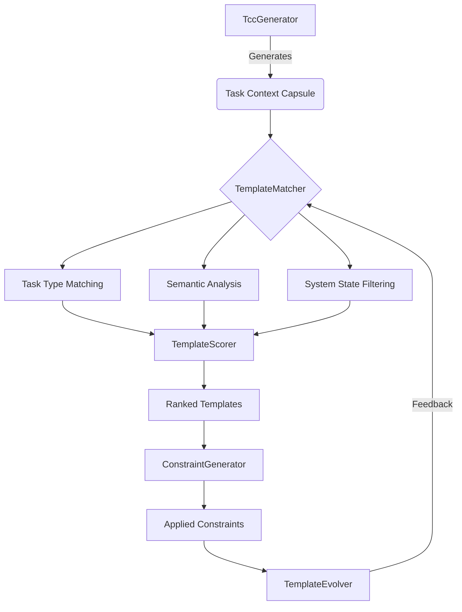

# Dynamic Template Generation Enhancement Design

## 1. Overview
This document outlines the design for enhancing the Dynamic Specification Growth System's (DSGS) template generation capabilities to improve intelligence, adaptability, and context awareness. The enhancement will enable DSGS to generate more relevant and effective constraints by leveraging multi-dimensional matching, semantic analysis, and feedback-driven evolution.

## 2. Goals
- Improve template relevance by 40% through multi-dimensional matching
- Reduce false positive constraint violations by 30%
- Enable dynamic template creation based on task patterns
- Implement feedback loop for continuous template improvement
- Maintain backward compatibility with existing templates

## 3. Architecture

### 3.1 Enhanced Template Matching System
```
dsgs/
├── src/
│   ├── core/
│   │   ├── constraint/
│   │   │   ├── TemplateMatcher.ts        # Enhanced matching logic
│   │   │   ├── TemplateScorer.ts         # Relevance scoring
│   │   │   ├── TemplateEvolver.ts        # Feedback-driven evolution
│   │   │   ├── SemanticAnalyzer.ts       # Goal semantics analysis
│   │   │   └── templates/                # Template storage
│   │   └── specification/
│   │       └── TccEnricher.ts            # Enhanced TCC context
```

### 3.2 Component Interactions


## 4. Detailed Design

### 4.1 Multi-dimensional Template Matching
The enhanced matching system will evaluate templates based on four dimensions:

1. **Task Type Matching**: Current approach with improved categorization
2. **Semantic Analysis**: NLP processing of task goal descriptions
3. **System State Context**: Runtime environment and load conditions
4. **Historical Effectiveness**: Past performance of templates

### 4.2 Template Scoring Algorithm
Each template will receive a relevance score (0-1) calculated as:

```
Relevance = w1 * TypeMatch + w2 * SemanticScore + w3 * ContextFit + w4 * HistoricalEffectiveness
```

Where weights are initially set as:
- w1 (TypeMatch): 0.3
- w2 (SemanticScore): 0.3
- w3 (ContextFit): 0.2
- w4 (HistoricalEffectiveness): 0.2

### 4.3 Semantic Analysis
The SemanticAnalyzer will use lightweight NLP techniques to extract key concepts from task goals:

```typescript
interface SemanticFeatures {
  domains: string[];        // e.g., ["security", "authentication"]
  actions: string[];        // e.g., ["validate", "encrypt"]
  entities: string[];       // e.g., ["password", "token"]
  constraints: string[];    // e.g., "must", "should", "required"
}
```

### 4.4 Template Evolution
The TemplateEvolver will track template effectiveness metrics:

```typescript
interface TemplateMetrics {
  id: string;
  applicationCount: number;
  violationCount: number;
  resolutionRate: number;
  falsePositiveRate: number;
  userFeedbackScore: number;
  lastUpdated: string;
}
```

## 5. API Changes

### 5.1 New Interfaces
```typescript
// Enhanced template interface
interface EnhancedConstraintTemplate extends ConstraintTemplate {
  semanticPatterns?: string[];
  systemStateRequirements?: {
    minLoad?: 'LOW' | 'MED' | 'HIGH';
    requiredDependencies?: string[];
  };
  historicalEffectiveness?: number;
}

// Template matching options
interface TemplateMatchingOptions {
  taskType: string;
  goal: string;
  systemState: SystemState;
  includeHistoricalData?: boolean;
}
```

### 5.2 Modified Functions
```typescript
// Enhanced template matching function
async function matchTemplates(
  options: TemplateMatchingOptions
): Promise<TemplateMatchResult[]>;

// Template evolution interface
async function updateTemplateEffectiveness(
  templateId: string,
  outcome: 'VIOLATION_RESOLVED' | 'FALSE_POSITIVE' | 'NOT_APPLICABLE'
): Promise<void>;
```

## 6. Performance Requirements
- Template matching must complete within 50ms (95th percentile)
- Memory usage must not exceed 50MB for template system
- CPU utilization must remain below 5% during IDE integration
- Template evolution updates must not block constraint generation

## 7. Testing Strategy
- 90%+ code coverage for template matching logic
- Integration tests with realistic task scenarios
- Performance tests with 100+ templates
- A/B testing framework for template effectiveness comparison
- Regression tests to ensure backward compatibility

## 8. Migration Path
1. Deploy enhanced matching system alongside current system
2. Run A/B testing for 2 weeks to compare effectiveness
3. Gradually shift traffic to enhanced system
4. Deprecate old matching system after 1 month
5. Remove old system after 3 months

## 9. Risks and Mitigations
- **Risk**: Increased complexity may impact performance
  - *Mitigation*: Implement circuit breaker pattern and fallback to simple matching
- **Risk**: Semantic analysis may produce inaccurate results
  - *Mitigation*: Use conservative confidence thresholds and allow user override
- **Risk**: Template evolution may converge on suboptimal solutions
  - *Mitigation*: Implement diversity preservation and periodic re-evaluation
