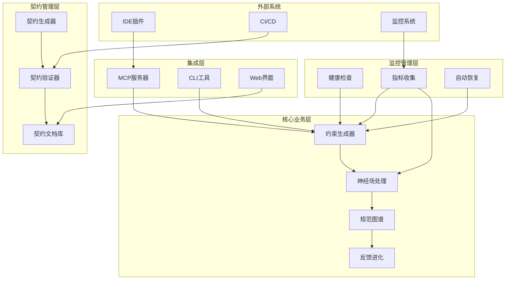
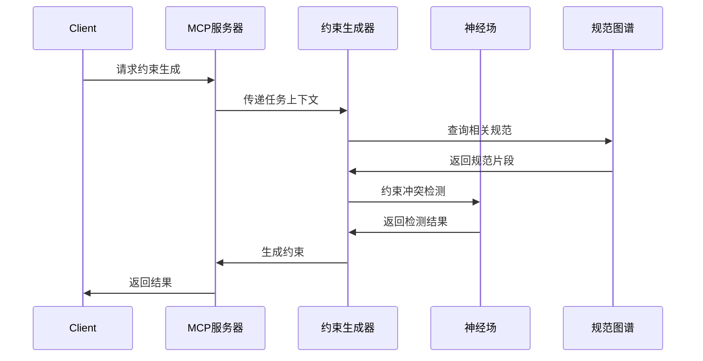
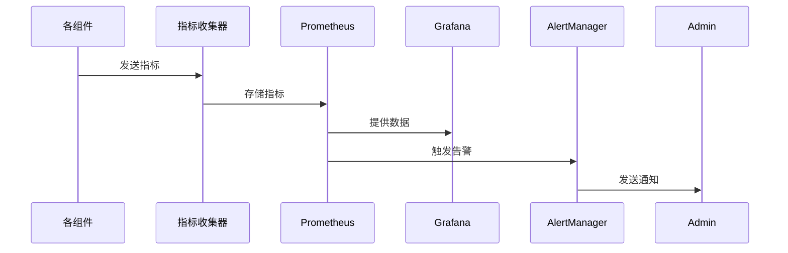

# DSGS系统架构总览

## 🏗️ 核心架构

### 系统目标
DSGS (Dynamic Specification Growth System) 是一个AI驱动的动态规范生长系统，旨在：
- **动态约束生成**：按需、局部生成规范，避免静态规范爆炸
- **树状演化一致性**：支持项目目录树状扩展，保持全局功能协同
- **自适应进化**：通过反馈闭环实现约束自我优化

### 整体架构图


## 🔧 核心组件

### 1. 约束生成器 (ConstraintGenerator)
**职责**：基于任务上下文动态生成约束
**关键特性**：
- 模板匹配和实例化
- 自然语言转约束
- 上下文感知生成

**相关文档**：
- [约束生成模块详情](../modules/constraint/README.md)
- [约束生成API](../api/specifications.md#constraint-generator)

### 2. 神经场处理 (NeuralField)
**职责**：处理约束冲突检测和吸引子收敛
**关键特性**：
- 约束冲突检测
- 吸引子动态收敛
- 增量图计算

**相关文档**：
- [神经场处理详情](../modules/neural-field/README.md)
- [神经场API](../api/specifications.md#neural-field)

### 3. 规范图谱 (SpecificationGraph)
**职责**：维护规范之间的关系和依赖
**关键特性**：
- 图数据库存储
- 增量更新
- 关系推理

**相关文档**：
- [规范图谱API](../api/specifications.md#specification-graph)
- [数据模型字典](../data-models/dictionary.md#specification-graph)

### 4. 监控管理 (Monitoring)
**职责**：系统健康监控和自动恢复
**关键特性**：
- 实时健康检查
- 性能指标收集
- 自动故障恢复

**相关文档**：
- [服务监控模块](../modules/monitoring/README.md)
- [监控API](../api/specifications.md#monitoring)

### 5. 契约管理 (ContractManagement)
**职责**：API契约生成和验证
**关键特性**：
- 自动契约生成
- 契约验证
- 版本管理

**相关文档**：
- [契约管理模块](../modules/contract/README.md)
- [契约API](../api/specifications.md#contract)

## 📊 数据流架构

### 主数据流


### 监控数据流


## 🔗 技术栈

### 后端技术栈
- **运行时**: Node.js 18+
- **框架**: Express.js
- **语言**: TypeScript
- **数据库**: PostgreSQL + Redis
- **图数据库**: Neo4j

### 监控技术栈
- **指标收集**: Prometheus
- **可视化**: Grafana
- **告警**: AlertManager
- **日志**: ELK Stack

### 契约管理技术栈
- **代码解析**: TypeScript Compiler API
- **契约格式**: OpenAPI 3.0
- **验证**: JSON Schema
- **文档生成**: TypeDoc

## 📈 性能指标

### 系统性能目标
| 指标 | 目标值 | 测试方法 |
|------|--------|----------|
| 约束生成响应时间 | <100ms (P99) | JMeter压力测试 |
| 健康检查响应时间 | <50ms | 单元测试 |
| 规范图谱查询延迟 | <500ms | Neo4j Profiler |
| 系统可用性 | >99.9% | 监控系统统计 |

### 可扩展性指标
- **支持项目规模**: 1000+ 模块
- **并发处理能力**: 1000+ QPS
- **数据存储容量**: 10GB+ 规范数据

## 🔐 安全架构

### 安全层次
1. **认证层**: JWT Token认证
2. **授权层**: 基于角色的访问控制
3. **数据层**: 敏感数据加密
4. **网络层**: HTTPS + API限流

### 安全措施
- **输入验证**: 所有输入参数验证
- **SQL注入防护**: 参数化查询
- **XSS防护**: 输出编码
- **CSRF防护**: Token验证

## 🚀 部署架构

### 容器化部署
```yaml
# docker-compose.yml
version: '3.8'
services:
  dsgs-core:
    image: dsgs/core:2.0
    ports:
      - "3000:3000"
    environment:
      - NODE_ENV=production
      - DATABASE_URL=postgresql://...
    depends_on:
      - postgres
      - redis
  
  monitoring:
    image: dsgs/monitoring:2.0
    ports:
      - "9090:9090"
    depends_on:
      - dsgs-core
```

### Kubernetes部署
```yaml
apiVersion: apps/v1
kind: Deployment
metadata:
  name: dsgs-core
spec:
  replicas: 3
  selector:
    matchLabels:
      app: dsgs-core
  template:
    metadata:
      labels:
        app: dsgs-core
    spec:
      containers:
      - name: core
        image: dsgs/core:2.0
        resources:
          requests:
            memory: "512Mi"
            cpu: "500m"
          limits:
            memory: "1Gi"
            cpu: "1000m"
        livenessProbe:
          httpGet:
            path: /health
            port: 3000
```

## 📚 相关文档

### 核心文档
- [API契约总览](../api/contract-overview.md) - 所有API接口的统一契约
- [数据模型字典](../data-models/dictionary.md) - 核心数据结构定义
- [命名规范](../standards/naming-conventions.md) - 统一命名规范

### 模块文档
- [服务监控模块](../modules/monitoring/README.md) - 监控相关接口和数据
- [契约管理模块](../modules/contract/README.md) - 契约生成和验证
- [约束生成模块](../modules/constraint/README.md) - 动态约束生成
- [MCP协议模块](../modules/mcp/README.md) - MCP协议实现

### 规范文档
- [接口规范](../api/specifications.md) - 详细的API接口定义
- [错误处理](../standards/error-handling.md) - 错误码和处理机制
- [版本管理](../standards/versioning.md) - 版本兼容性管理

---

**文档维护**：DSGS架构团队  
**最后更新**：2025-08-06  
**版本**：2.0