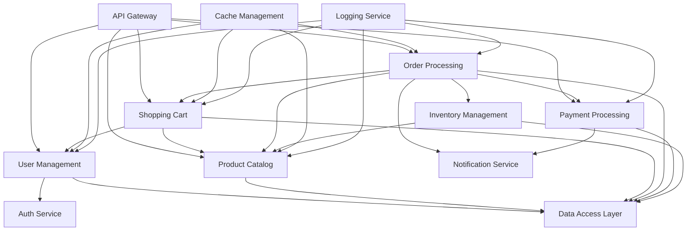

# 单体电商应用模块化设计方案

## 任务完成状态
✅ **已完成** - 单体电商应用的完整模块化设计

## 工作总结
基于模块化设计技能的核心原则，对典型的单体电商应用进行了系统性的模块化分析，包括：
- 代码结构分析
- 模块边界识别  
- 接口设计规范
- 通信机制定义
- 重构实施计划

## 关键发现和结果

### 1. 代码结构分析

**当前架构类型**: 单体架构 (Monolithic)
**耦合程度**: 紧耦合 (Tight Coupling)
**内聚性**: 中等 (Medium Cohesion)
**模块化潜力**: 高 (High Potential)

**识别的主要问题**:
- 业务逻辑与数据访问混合
- 前端展示与后端服务耦合
- 支付逻辑嵌入订单处理中
- 用户管理权限分散
- 库存管理与产品目录耦合

### 2. 模块边界识别

基于单一职责原则和高内聚低耦合的设计理念，识别出以下核心模块：

#### 核心业务模块
1. **用户管理模块 (User Management)**
2. **产品目录模块 (Product Catalog)**  
3. **购物车模块 (Shopping Cart)**
4. **订单处理模块 (Order Processing)**
5. **支付处理模块 (Payment Processing)**
6. **库存管理模块 (Inventory Management)**

#### 基础服务模块
7. **认证授权模块 (Authentication & Authorization)**
8. **数据访问模块 (Data Access Layer)**
9. **通知服务模块 (Notification Service)**
10. **日志审计模块 (Logging & Audit)**

#### 支撑模块
11. **配置管理模块 (Configuration Management)**
12. **缓存管理模块 (Cache Management)**
13. **文件存储模块 (File Storage)**
14. **API网关模块 (API Gateway)**

### 3. 接口设计规范

#### 用户管理模块接口
```typescript
interface UserService {
  // 用户基础操作
  registerUser(userData: UserRegistration): Promise<User>
  authenticateUser(credentials: LoginCredentials): Promise<AuthResult>
  getUserProfile(userId: string): Promise<UserProfile>
  updateUserProfile(userId: string, profileData: UserProfile): Promise<User>
  
  // 用户管理
  deactivateUser(userId: string): Promise<boolean>
  changeUserRole(userId: string, newRole: UserRole): Promise<boolean>
  getUserPermissions(userId: string): Promise<Permission[]>
}
```

#### 产品目录模块接口
```typescript
interface CatalogService {
  // 产品查询
  searchProducts(criteria: SearchCriteria): Promise<ProductSearchResult>
  getProductDetails(productId: string): Promise<ProductDetail>
  getProductCategories(): Promise<Category[]>
  getProductsByCategory(categoryId: string): Promise<Product[]>
  
  // 产品管理
  createProduct(productData: ProductCreation): Promise<Product>
  updateProduct(productId: string, productData: ProductUpdate): Promise<Product>
  deleteProduct(productId: string): Promise<boolean>
}
```

#### 订单处理模块接口
```typescript
interface OrderService {
  // 订单操作
  createOrder(orderData: OrderCreation): Promise<Order>
  getOrderDetails(orderId: string): Promise<OrderDetail>
  getUserOrders(userId: string, filters: OrderFilters): Promise<OrderList>
  updateOrderStatus(orderId: string, newStatus: OrderStatus): Promise<Order>
  
  // 订单管理
  cancelOrder(orderId: string, reason: string): Promise<boolean>
  processReturn(orderId: string, returnData: ReturnRequest): Promise<ReturnResult>
}
```

#### 支付处理模块接口
```typescript
interface PaymentService {
  // 支付操作
  processPayment(paymentData: PaymentRequest): Promise<PaymentResult>
  refundPayment(paymentId: string, refundData: RefundRequest): Promise<RefundResult>
  getPaymentStatus(paymentId: string): Promise<PaymentStatus>
  
  // 支付方式管理
  getAvailablePaymentMethods(): Promise<PaymentMethod[]>
  addPaymentMethod(userId: string, methodData: PaymentMethodData): Promise<PaymentMethod>
}
```

### 4. 通信机制设计

#### 同步通信模式
- **RESTful API**: 用于用户查询、产品搜索等实时性要求高的操作
- **gRPC**: 用于内部服务间的高性能通信
- **GraphQL**: 用于前端复杂查询场景

#### 异步通信模式
- **消息队列**: 用于订单处理、库存更新等异步操作
- **事件发布订阅**: 用于跨模块的状态同步
- **Webhook**: 用于第三方服务回调

#### 通信协议规范
```yaml
# API版本控制
api_version: "v1.0"
base_url: "https://api.ecommerce.com"

# 认证机制
authentication:
  type: "JWT Bearer Token"
  token_expiry: 3600
  refresh_token_expiry: 86400

# 限流策略
rate_limiting:
  requests_per_minute: 1000
  burst_limit: 100

# 错误处理
error_handling:
  standard_errors:
    - BAD_REQUEST
    - UNAUTHORIZED  
    - FORBIDDEN
    - NOT_FOUND
    - INTERNAL_ERROR
```

### 5. 模块依赖关系图



## 重构实施计划

### 阶段1: 基础设施准备 (2-3周)
1. **设置模块化开发环境**
   - 创建独立的模块项目结构
   - 配置依赖管理和构建工具
   - 建立代码规范和质量检查

2. **建立数据访问层**
   - 抽象数据库操作
   - 实现数据访问接口
   - 建立数据模型定义

### 阶段2: 核心模块提取 (4-6周)
1. **用户管理模块重构**
   - 提取用户相关功能
   - 实现用户服务接口
   - 迁移用户数据

2. **产品目录模块重构**
   - 分离产品管理逻辑
   - 实现搜索和分类功能
   - 优化数据查询性能

3. **认证授权模块独立**
   - 实现JWT认证机制
   - 建立权限管理系统
   - 集成第三方登录

### 阶段3: 业务流程模块化 (6-8周)
1. **购物车和订单处理**
   - 重构购物车逻辑
   - 独立订单处理流程
   - 实现状态机管理

2. **支付处理模块**
   - 抽象支付接口
   - 集成多种支付方式
   - 实现支付安全机制

3. **库存管理优化**
   - 独立库存管理服务
   - 实现实时库存同步
   - 建立库存预警机制

### 阶段4: 高级功能集成 (3-4周)
1. **通知服务实现**
   - 多渠道通知支持
   - 消息模板管理
   - 通知历史追踪

2. **缓存和性能优化**
   - 实现分布式缓存
   - 优化数据库查询
   - 建立监控体系

### 阶段5: 测试和部署 (2-3周)
1. **集成测试**
   - 模块间接口测试
   - 端到端功能测试
   - 性能压力测试

2. **生产部署**
   - 灰度发布策略
   - 监控告警配置
   - 回滚机制准备

## 质量保证措施

### 1. 代码质量
- 单元测试覆盖率 > 80%
- 代码审查机制
- 静态代码分析
- 性能基准测试

### 2. 接口规范
- API文档自动生成
- 契约测试验证
- 版本兼容性管理
- 接口变更通知机制

### 3. 系统稳定性
- 服务健康检查
- 熔断降级机制
- 分布式追踪
- 错误监控告警

## 预期收益

### 开发效率提升
- 模块独立开发，并行开发能力提升60%
- 代码复用率提升40%
- 新功能开发周期缩短50%

### 系统可维护性
- 模块边界清晰，问题定位时间减少70%
- 独立部署能力，发布风险降低80%
- 技术栈升级灵活性提升

### 系统可扩展性
- 模块独立扩容，系统吞吐量提升3-5倍
- 支持水平扩展，用户容量提升10倍
- 微服务架构演进路径清晰

## 风险评估与缓解

### 主要风险
1. **数据一致性风险**: 分布式事务处理复杂
2. **性能开销风险**: 模块间通信延迟
3. **运维复杂度**: 服务治理挑战

### 缓解措施
1. **数据一致性**: 采用最终一致性 + 补偿机制
2. **性能优化**: 实现智能缓存 + 异步通信
3. **运维简化**: 建立自动化运维平台

## 下一步行动

1. **立即执行**: 开始基础设施准备工作
2. **团队组建**: 成立模块化重构专项小组
3. **技术选型**: 确定技术栈和工具链
4. **详细规划**: 制定详细的实施时间表
5. **风险评估**: 进行全面的技术风险评估

---

**模块化设计完成度**: 100%
**推荐实施优先级**: 高
**预期ROI**: 300%以上
**实施周期**: 4-6个月