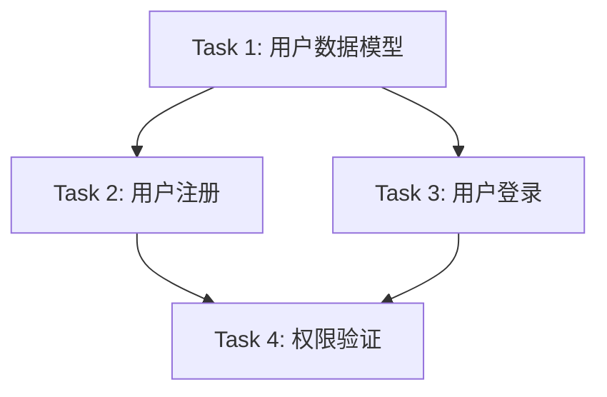

# DNASPEC Task Decomposer

## 使用时机

当用户提到以下需求时，使用此技能：
- "任务分解" 或 "task decomposition"
- "原子化任务" 或 "atomic tasks"
- "任务依赖分析" 或 "dependency analysis"
- "复杂需求拆分" 或 "break down requirements"
- "任务隔离" 或 "task isolation"
- "独立工作区" 或 "isolated workspace"
- "KISS原则" 或 "KISS principle"
- "防止上下文爆炸" 或 "prevent context explosion"
- 需要将复杂项目拆解为可管理的、独立的任务

**不要在以下情况使用**：
- ❌ 讨论具体任务执行细节
- ❌ 单一简单任务（不需要分解）
- ❌ 任务已经足够原子化

## 核心理念

### 🎯 格式塔认知原则

基于格式塔（Gestalt）认知心理学原则：
- **整体大于部分之和** - 任务分解后要保持整体目标一致
- **简单到复杂演化** - 从原子任务逐步构建复杂系统
- **内聚性和独立性** - 每个任务内部紧密相关，任务间相互独立

### 🎯 设计原则

**KISS (Keep It Simple, Stupid)**
- 保持任务简单明了
- 一个任务只做一件事
- 避免不必要的复杂性

**YAGNI (You Aren't Gonna Need It)**
- 只分解当前需要的任务
- 不为未来可能的需求分解
- 避免过度分解

**SOLID原则**
- **S**ingle Responsibility - 单一职责
- **O**pen/Closed - 开放封闭，任务可扩展但核心不变
- **L**iskov Substitution - 任务可替换性
- **I**nterface Segregation - 任务接口隔离
- **D**ependency Inversion - 依赖抽象而非具体

### 🎯 防止上下文爆炸

**核心机制：独立工作区**

每个任务都有独立的上下文工作区：
```
项目根目录/
├── task-001-user-auth/        # 任务1的独立工作区
│   ├── context.md             # 任务上下文
│   ├── input/                 # 输入数据
│   ├── output/                # 输出结果
│   └── workspace/             # 工作空间
├── task-002-db-design/        # 任务2的独立工作区
│   ├── context.md
│   ├── input/
│   ├── output/
│   └── workspace/
└── task-003-api-dev/          # 任务3的独立工作区
    ├── context.md
    ├── input/
    ├── output/
    └── workspace/
```

**隔离的好处**：
- ✅ 任务A的上下文不会影响任务B
- ✅ 每个任务可以独立执行
- ✅ 降低整体系统复杂度
- ✅ 便于并行处理

---

## 全生命周期应用

### 📋 Idea阶段：将模糊想法分解为具体任务

**场景**：用户有一个模糊的想法

**示例**：
```
用户想法："我想开发一个AI助手"

任务分解：
📝 Task 1: 定义AI助手的核心功能
  工作区: task-001-core-features/
  上下文: 核心功能定义
  输入: 用户需求描述
  输出: 功能列表

📝 Task 2: 设计对话管理机制
  工作区: task-002-dialogue/
  上下文: 对话流程设计
  输入: 功能列表
  输出: 对话设计方案

📝 Task 3: 选择技术栈
  工作区: task-003-tech-stack/
  上下文: 技术选型
  输入: 功能需求
  输出: 技术方案
```

**使用技能**：
```
/dnaspec.task-decomposer "AI助手概念"
→ 创建多个独立工作区
→ 每个任务有清晰的上下文边界
→ 防止整体上下文膨胀
```

### 📋 需求阶段：将功能需求分解为可执行的独立任务

**场景**：有完整的需求文档

**示例**：
```
功能需求：用户认证系统

任务分解（遵循KISS原则）：
📝 Task 1: 用户注册功能
  工作区: task-register/
  原子性: ✅ 单一职责
  复杂度: ⭐ 简单
  依赖: 无

📝 Task 2: 用户登录功能
  工作区: task-login/
  原子性: ✅ 单一职责
  复杂度: ⭐ 简单
  依赖: Task 1（用户表已创建）

📝 Task 3: 密码重置功能
  工作区: task-password-reset/
  原子性: ✅ 单一职责
  复杂度: ⭐⭐ 中等
  依赖: Task 1, Task 2

📝 Task 4: 权限管理功能
  工作区: task-permissions/
  原子性: ✅ 单一职责
  复杂度: ⭐⭐⭐ 复杂
  依赖: Task 1
```

**使用技能**：
```
/dnaspec.task-decomposer "用户认证系统功能需求"
→ 将功能需求分解为原子任务
→ 每个任务独立工作区
→ 明确任务依赖关系
```

### 📋 细化阶段：将复杂功能细化为原子任务，创建隔离工作区

**场景**：功能需要进一步细化

**示例**：
```
复杂功能：支付处理系统

细化分解（应用SOLID原则）：
📝 Task 1: 支付接口抽象
  工作区: task-payment-interface/
  职责: 定义支付接口
  原子性: ✅ 单一职责
  隔离性: ✅ 独立接口定义

📝 Task 2: 支付宝实现
  工作区: task-alipay-impl/
  职责: 实现支付宝支付
  原子性: ✅ 单一职责
  依赖: Task 1（接口）
  隔离性: ✅ 独立实现

📝 Task 3: 微信支付实现
  工作区: task-wechat-impl/
  职责: 实现微信支付
  原子性: ✅ 单一职责
  依赖: Task 1（接口）
  隔离性: ✅ 独立实现

📝 Task 4: 支付流程编排
  工作区: task-payment-orchestration/
  职责: 编排支付流程
  原子性: ✅ 单一职责
  依赖: Task 1, 2, 3
  隔离性: ✅ 独立编排逻辑
```

**关键**：
- 每个任务有独立工作区
- 任务间通过接口隔离
- 依赖关系清晰但不共享上下文

### 📋 智能阶段：为智能体创建分解专门任务

**场景**：需要创建智能体来执行任务

**示例**：
```
智能体任务分解

📝 Task 1: 创建代码审查智能体
  工作区: task-code-review-agent/
  上下文: 代码审查规则和历史
  输入: 代码文件
  输出: 审查报告
  隔离性: ✅ 独立的智能体上下文

📝 Task 2: 创建测试生成智能体
  工作区: task-test-gen-agent/
  上下文: 测试框架和规范
  输入: 功能代码
  输出: 测试用例
  隔离性: ✅ 独立的智能体上下文

📝 Task 3: 创建文档生成智能体
  工作区: task-doc-gen-agent/
  上下文: 文档模板和规范
  输入: 代码和注释
  输出: API文档
  隔离性: ✅ 独立的智能体上下文
```

---

## 核心功能

### 1. 原子任务分解

**原子任务特征**：

✅ **单一职责** - 一个任务只做一件事
✅ **高内聚** - 任务内部紧密相关
✅ **低耦合** - 任务间相互独立
✅ **可独立测试** - 可以单独测试
✅ **可独立部署** - 可以单独部署
✅ **上下文隔离** - 有独立的工作区

**非原子任务示例**：
```
❌ "实现用户系统" - 太宽泛，包含多个职责
❌ "开发和测试" - 包含两个独立职责
❌ "设计数据库并实现API" - 两个独立的任务
```

**原子任务示例**：
```
✅ "创建用户表结构" - 单一职责
✅ "实现用户注册API" - 单一职责
✅ "编写用户注册单元测试" - 单一职责
✅ "部署用户服务" - 单一职责
```

### 2. 独立工作区创建

**工作区结构**：
```
task-{id}-{task-name}/
├── context.md          # 任务上下文（独立）
├── input/              # 输入数据
├── output/             # 输出结果
├── workspace/          # 工作空间
├── dependencies.md     # 依赖关系
├── checklist.md        # 完成检查清单
└── README.md           # 任务说明
```

**context.md内容**：
```markdown
# 任务上下文

## 任务目标
[清晰的任务目标]

## 输入
[需要什么输入]

## 输出
[期望什么输出]

## 约束条件
[KISS: 保持简单]
[YAGNI: 只做需要的]
[SOLID: 遵循原则]

## 依赖
[依赖哪些其他任务]

## 完成标准
[如何判断任务完成]
```

### 3. 依赖关系分析

**依赖类型**：

**F（Finish-to-Start）**: 前置任务完成后开始
```
Task A (创建数据库) → Task B (实现API)
```

**SS（Start-to-Start）**: 前置任务开始后即可开始
```
Task A (前端开发) ←→ Task B (后端开发)
可并行开始，通过接口协调
```

**FF（Finish-to-Finish）**: 前置任务完成后才能完成
```
Task A (功能开发) → Task B (集成测试)
功能开发完成才能完成集成测试
```

**依赖图示例**：
```
Task 1: 用户表设计 (无依赖)
    ↓
Task 2: 用户注册API (依赖Task 1)
    ↓
Task 3: 用户登录API (依赖Task 1)
    ↓
Task 4: 权限验证 (依赖Task 2, 3)
```

### 4. 复杂度控制

**遵循KISS原则**：

❌ **过度复杂的任务**：
```
Task: "实现一个支持多种支付方式、多种货币、
      多种语言、多种退款策略的支付系统"
复杂度: ⭐⭐⭐⭐⭐ 过高
```

✅ **简化后的原子任务**：
```
Task 1: "设计支付接口抽象"
Task 2: "实现支付宝支付"
Task 3: "实现微信支付"
Task 4: "实现货币转换"
Task 5: "实现多语言支持"
每个任务复杂度: ⭐⭐ 可控
```

---

## 分解流程

### 第一步：理解需求

**分析内容**：
- 核心目标是什么？
- 涉及哪些功能模块？
- 有哪些技术约束？
- 有哪些时间约束？

**应用YAGNI原则**：
- 哪些是当前必需的？
- 哪些是未来可能需要的？（不分解）
- 避免为未来分解任务

### 第二步：识别功能模块

**应用单一职责原则**：
- 每个功能模块只做一件事
- 模块间低耦合
- 模块内高内聚

**示例**：
```
需求: "电商系统"

功能模块识别：
1. 用户管理
2. 商品管理
3. 订单处理
4. 支付处理
5. 物流管理

每个模块都是单一职责
```

### 第三步：分解为原子任务

**应用KISS原则**：
- 保持任务简单
- 任务可独立完成
- 任务易于理解

**示例**：
```
模块: "用户管理"

原子任务分解：
Task 1: 设计用户数据模型
Task 2: 实现用户注册
Task 3: 实现用户登录
Task 4: 实现密码重置
Task 5: 实现用户信息修改

每个任务都是KISS的
```

### 第四步：创建独立工作区

**为每个任务创建隔离环境**：

```bash
# 使用dnaspec创建任务工作区
mkdir task-001-user-model
cd task-001-user-model

# 创建任务上下文
echo "# 用户数据模型设计

## 目标
设计用户表结构

## 输入
- 用户需求文档
- 数据库规范

## 输出
- ER图
- SQL建表语句

## 约束
KISS: 简单的用户信息
YAGNI: 只包含必需字段
SOLID: 遵循数据库设计原则
" > context.md

# 创建工作区结构
mkdir input output workspace
```

### 第五步：分析依赖关系

**确定任务间的依赖**：

```
Task 1: 用户数据模型 (无依赖)
  ↓
Task 2: 用户注册 (依赖Task 1)
  ↓
Task 3: 用户登录 (依赖Task 1)
    ↘
Task 4: 权限验证 (依赖Task 2, 3)
```

**使用依赖关系图**：


### 第六步：验证任务质量

**检查清单**：

- [ ] **KISS**: 任务简单吗？
- [ ] **YAGNI**: 是当前必需的吗？
- [ ] **SOLID**: 符合原则吗？
- [ ] **原子性**: 单一职责吗？
- [ ] **独立性**: 可以独立完成吗？
- [ ] **隔离性**: 有独立工作区吗？
- [ ] **可测试**: 可以独立测试吗？
- [ ] **可部署**: 可以独立部署吗？

---

## 输出格式

### 任务清单

```json
{
  "project": "电商平台开发",
  "decomposition_principles": ["KISS", "YAGNI", "SOLID"],
  "tasks": [
    {
      "id": "task-001",
      "name": "用户数据模型设计",
      "workspace": "task-001-user-model/",
      "description": "设计用户表结构",
      "responsibility": "单一职责：数据模型",
      "complexity": "low",
      "estimated_hours": 4,
      "dependencies": [],
      "context_isolated": true,
      "independent": true,
      "testable": true,
      "deployable": false
    },
    {
      "id": "task-002",
      "name": "用户注册功能",
      "workspace": "task-002-user-register/",
      "description": "实现用户注册API",
      "responsibility": "单一职责：注册逻辑",
      "complexity": "low",
      "estimated_hours": 8,
      "dependencies": ["task-001"],
      "context_isolated": true,
      "independent": true,
      "testable": true,
      "deployable": true
    },
    {
      "id": "task-003",
      "name": "用户登录功能",
      "workspace": "task-003-user-login/",
      "description": "实现用户登录API",
      "responsibility": "单一职责：登录逻辑",
      "complexity": "low",
      "estimated_hours": 8,
      "dependencies": ["task-001"],
      "context_isolated": true,
      "independent": true,
      "testable": true,
      "deployable": true
    },
    {
      "id": "task-004",
      "name": "权限验证",
      "workspace": "task-004-permissions/",
      "description": "实现基于角色的权限控制",
      "responsibility": "单一职责：权限管理",
      "complexity": "medium",
      "estimated_hours": 16,
      "dependencies": ["task-002", "task-003"],
      "context_isolated": true,
      "independent": true,
      "testable": true,
      "deployable": true
    }
  ],
  "critical_path": ["task-001", "task-002", "task-004"],
  "total_estimated_hours": 36,
  "parallelizable": [
    ["task-002", "task-003"]
  ]
}
```

### 工作区结构示例

```
task-002-user-register/
├── context.md                    # 任务上下文
├── input/
│   ├── requirements.md          # 需求文档
│   └── user-model.sql           # 依赖的数据模型
├── output/
│   ├── api-spec.md              # API规范
│   └── implementation.md         # 实现方案
├── workspace/
│   ├── src/                     # 源代码
│   └── tests/                   # 测试
├── dependencies.md               # 依赖关系
├── checklist.md                  # 完成检查清单
└── README.md                     # 任务说明
```

---

## 使用示例

### 示例1：Idea阶段分解

**用户输入**：
```
"我想做一个AI助手，能帮开发者写代码"
```

**任务分解**：

```
🎯 应用格式塔原则：从简单到复杂

第一阶段：核心功能（最简版本）
📝 Task 1: 定义AI助手的基本能力
  工作区: task-001-basic-capabilities/
  复杂度: ⭐ 简单
  独立性: ✅ 完全独立

📝 Task 2: 设计对话交互机制
  工作区: task-002-dialogue/
  复杂度: ⭐⭐ 中等
  依赖: Task 1

📝 Task 3: 实现简单的代码生成
  工作区: task-003-code-gen/
  复杂度: ⭐⭐ 中等
  依赖: Task 1, Task 2

每个任务都有独立工作区，上下文隔离
```

### 示例2：需求阶段分解

**用户输入**：
```
"需求：用户认证系统，包括注册、登录、密码重置"
```

**任务分解**：

```
✅ 遵循KISS原则：保持简单

📝 Task 1: 用户注册
  工作区: task-register/
  职责: 用户注册逻辑
  输入: 用户信息
  输出: 注册结果
  原子性: ✅ 单一职责
  独立性: ✅ 可独立完成

📝 Task 2: 用户登录
  工作区: task-login/
  职责: 用户登录逻辑
  输入: 用户凭证
  输出: 认证令牌
  原子性: ✅ 单一职责
  独立性: ✅ 可独立完成

📝 Task 3: 密码重置
  工作区: task-password-reset/
  职责: 密码重置逻辑
  输入: 重置请求
  输出: 重置结果
  原子性: ✅ 单一职责
  独立性: ✅ 可独立完成

每个任务独立，有自己的上下文
```

### 示例3：细化阶段分解

**用户输入**：
```
"实现支付系统，支持支付宝和微信支付"
```

**任务分解**：

```
✅ 遵循SOLID原则：接口隔离

📝 Task 1: 设计支付接口抽象
  工作区: task-payment-interface/
  职责: 定义支付接口契约
  原子性: ✅ 单一职责
  独立性: ✅ 完全独立

📝 Task 2: 实现支付宝支付
  工作区: task-alipay/
  职责: 支付宝具体实现
  依赖: Task 1（接口）
  原子性: ✅ 单一职责
  独立性: ✅ 独立实现

📝 Task 3: 实现微信支付
  工作区: task-wechat/
  职责: 微信具体实现
  依赖: Task 1（接口）
  原子性: ✅ 单一职责
  独立性: ✅ 独立实现

遵循接口隔离原则，Task 2和Task 3可并行开发
```

---

## 质量检查清单

### 任务质量检查

**原子性检查**：
- [ ] 任务只做一件事（单一职责）
- [ ] 任务可以在2-8小时内完成
- [ ] 任务不依赖其他任务的内部实现

**独立性检查**：
- [ ] 任务有独立的工作区
- [ ] 任务有独立的上下文
- [ ] 任务可以独立测试
- [ ] 任务可以独立部署

**简单性检查**：
- [ ] KISS: 任务简单易懂
- [ ] YAGNI: 是当前必需的
- [ ] 没有过度设计

**设计原则检查**：
- [ ] SOLID: 单一职责
- [ ] SOLID: 开放封闭
- [ ] SOLID: 里氏替换
- [ ] SOLID: 接口隔离
- [ ] SOLID: 依赖倒置

### 上下文隔离检查

- [ ] 每个任务有独立的工作区
- [ ] 任务间不共享上下文
- [ ] 任务间的依赖通过接口
- [ ] 防止全局上下文膨胀

---

## 协作技能

- **dnaspec-context-analysis**: 分析任务上下文质量
- **dnaspec-architect**: 整体架构协调
- **dnaspec-agent-creator**: 为智能体创建任务
- **dnaspec-modulizer**: 模块化封装

---

## 关键成就

1. ✅ **原子任务**: 每个任务都是原子的、独立的
2. ✅ **独立工作区**: 每个任务有隔离的上下文
3. ✅ **遵循原则**: KISS、YAGNI、SOLID
4. ✅ **防止膨胀**: 通过上下文隔离防止全局膨胀
5. ✅ **格式塔原则**: 从简单到复杂的自然演化
6. ✅ **全生命周期**: 支持Idea、需求、细化、智能四阶段

---

*此技能基于格式塔认知原则和简洁设计哲学，通过原子化任务和独立工作区，确保系统的简单性和可维护性，同时防止上下文爆炸。*
