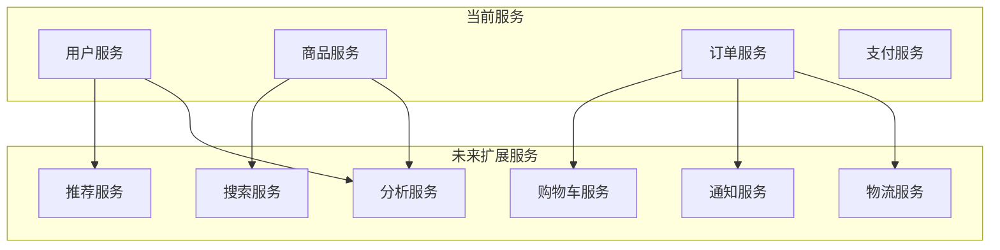

# 架构模式优化方案

## 架构模式适应性评估

### 当前架构分析
基于基础设计，当前采用**分层架构 + 微服务**的混合模式：
- 表现层: React前端应用
- 网关层: Nginx + API网关
- 业务层: 微服务(用户、商品、订单、支付)
- 数据层: PostgreSQL + Redis + Elasticsearch

### 架构模式选择评估

#### 1. 分层架构 (Layered Architecture)
**适用性**: ⭐⭐⭐⭐⭐
**优势**:
- 结构清晰，职责分离明确
- 易于理解和维护
- 支持团队并行开发
- 技术栈统一管理

**优化建议**:
- 严格执行分层原则，避免跨层调用
- 定义清晰的接口规范
- 实施自动化测试覆盖层间接口

#### 2. 微服务架构 (Microservices Architecture)
**适用性**: ⭐⭐⭐⭐
**优势**:
- 服务独立部署和扩展
- 技术栈灵活选择
- 故障隔离性好
- 支持团队自治

**风险评估**:
- 分布式系统复杂性
- 服务间通信开销
- 数据一致性问题
- 运维复杂度增加

**渐进式实施策略**:
```
阶段1: 单体应用 (0-3个月)
├── 所有业务功能在一个应用中
├── 模块化设计，为后续拆分做准备
└── 统一数据库，简化事务处理

阶段2: 服务化改造 (3-6个月)
├── 按业务边界拆分服务
├── 引入API网关统一入口
└── 实施服务间通信机制

阶段3: 微服务完善 (6-12个月)
├── 独立数据库设计
├── 服务注册发现
└── 完善监控和治理
```

## 性能瓶颈预测与优化

### 预期性能瓶颈

#### 1. 数据库瓶颈
**瓶颈点**:
- 订单表写入压力 (高峰期1000+ TPS)
- 商品查询热点数据 (秒杀场景)
- 用户登录认证压力

**优化方案**:
```sql
-- 订单表分片策略
CREATE TABLE orders_2024_01 PARTITION OF orders
FOR VALUES FROM ('2024-01-01') TO ('2024-02-01');

-- 热点数据缓存策略
redis-cli> SET product:hot:12345 "商品数据" EX 3600
redis-cli> INCR view:count:12345

-- 读写分离配置
主库: 写操作 + 实时查询
从库1: 历史订单查询
从库2: 报表统计分析
```

#### 2. 应用服务瓶颈
**瓶颈点**:
- API网关单点故障
- 商品服务搜索性能
- 支付服务第三方依赖

**优化方案**:
```yaml
# API网关高可用
api-gateway:
  replicas: 3
  resources:
    requests:
      cpu: 500m
      memory: 512Mi
    limits:
      cpu: 1000m
      memory: 1Gi
  strategy:
    type: RollingUpdate
    rollingUpdate:
      maxUnavailable: 1
      maxSurge: 1

# 商品服务优化
product-service:
  cache:
    type: redis
    ttl: 300
    strategy: cache-aside
  search:
    engine: elasticsearch
    index: products
    shards: 3
    replicas: 1
```

#### 3. 网络瓶颈
**瓶颈点**:
- 前端资源加载速度
- 图片文件传输大小
- API响应时间

**优化方案**:
```nginx
# Nginx优化配置
gzip on;
gzip_vary on;
gzip_min_length 1024;
gzip_types text/plain text/css application/json application/javascript;

# 静态资源缓存
location ~* \.(jpg|jpeg|png|gif|ico|css|js)$ {
    expires 1y;
    add_header Cache-Control "public, immutable";
}

# API限流
limit_req_zone $binary_remote_addr zone=api:10m rate=10r/s;
location /api/ {
    limit_req zone=api burst=20 nodelay;
}
```

## 安全性分析与加固

### 安全威胁模型

#### 1. 身份认证威胁
**威胁类型**:
- JWT令牌泄露
- 暴力破解攻击
- 会话劫持

**防护措施**:
```typescript
// JWT安全配置
const jwtConfig = {
  algorithm: 'RS256',
  expiresIn: '15m',
  issuer: 'ecommerce-api',
  audience: 'ecommerce-web'
};

// 刷新令牌机制
const refreshTokenConfig = {
  expiresIn: '7d',
  httpOnly: true,
  secure: true,
  sameSite: 'strict'
};

// 登录限流
const loginRateLimit = {
  windowMs: 15 * 60 * 1000, // 15分钟
  max: 5, // 最多5次尝试
  skipSuccessfulRequests: true
};
```

#### 2. 数据安全威胁
**威胁类型**:
- SQL注入攻击
- 敏感数据泄露
- 数据篡改

**防护措施**:
```typescript
// 数据库安全
const dbSecurity = {
  // 参数化查询
  query: 'SELECT * FROM users WHERE id = $1',
  params: [userId],
  
  // 字段级加密
  encryption: {
    phone: 'AES-256-GCM',
    email: 'AES-256-CBC',
    idCard: 'RSA-2048'
  },
  
  // 审计日志
  audit: {
    logLevel: 'INFO',
    includeSensitive: false,
    retention: '90d'
  }
};

// API安全中间件
const apiSecurity = {
  // HTTPS强制
  forceHTTPS: true,
  
  // CORS配置
  cors: {
    origin: ['https://ecommerce.com'],
    credentials: true
  },
  
  // 请求验证
  validation: {
    body: true,
    params: true,
    headers: ['authorization', 'content-type']
  }
};
```

#### 3. 业务安全威胁
**威胁类型**:
- 恶意刷单
- 库存超卖
- 支付欺诈

**防护措施**:
```typescript
// 防刷单机制
const antiFraud = {
  // 用户行为分析
  behaviorAnalysis: {
    timeWindow: '5m',
    maxOrders: 3,
    suspiciousPatterns: [
      'same-ip-multiple-accounts',
      'rapid-order-placement',
      'unusual-payment-method'
    ]
  },
  
  // 库存防护
  inventoryProtection: {
    // 乐观锁
    version: true,
    
    // 分布式锁
    redisLock: {
      ttl: 30,
      retry: 3
    },
    
    // 预扣库存
    preDeduct: true,
    releaseTimeout: '15m'
  },
  
  // 支付安全
  paymentSecurity: {
    // 签名验证
    signature: 'HMAC-SHA256',
    
    // 金额校验
    amountValidation: {
      precision: 2,
      maxAmount: 10000
    },
    
    // 重复支付检测
    duplicateCheck: {
      window: '1m',
      keyFields: ['orderId', 'amount']
    }
  }
};
```

## 扩展性规划设计

### 水平扩展策略

#### 1. 无状态服务设计
```typescript
// 用户服务无状态化
class UserService {
  // 状态存储在外部
  private readonly userRepo: UserRepository;
  private readonly cache: RedisClient;
  private readonly eventBus: EventBus;
  
  // 移除本地状态
  // ❌ 错误设计
  // private onlineUsers: Set<string> = new Set();
  
  // ✅ 正确设计
  async isUserOnline(userId: string): Promise<boolean> {
    return await this.cache.exists(`user:online:${userId}`);
  }
}
```

#### 2. 数据库扩展方案
```yaml
# 读写分离配置
database:
  master:
    host: db-master.internal
    port: 5432
    database: ecommerce
  slaves:
    - host: db-slave-1.internal
      port: 5432
      database: ecommerce
      weight: 1
    - host: db-slave-2.internal
      port: 5432
      database: ecommerce
      weight: 1

# 分片策略
sharding:
  strategy: hash
  key: user_id
  shards:
    - name: shard_0
      range: "0-999999"
      database: ecommerce_0
    - name: shard_1
      range: "1000000-1999999"
      database: ecommerce_1
```

#### 3. 缓存架构扩展
```typescript
// 多级缓存架构
interface CacheStrategy {
  // L1: 本地缓存
  local: {
    type: 'lru';
    maxSize: 1000;
    ttl: 60; // 秒
  };
  
  // L2: Redis集群
  redis: {
    cluster: true;
    nodes: [
      'redis-1:6379',
      'redis-2:6379',
      'redis-3:6379'
    ];
    ttl: 3600; // 秒
  };
  
  // L3: CDN缓存
  cdn: {
    provider: 'cloudflare';
    ttl: 86400; // 秒
    cacheable: ['product-images', 'static-assets'];
  };
}
```

### 垂直扩展策略

#### 1. 服务拆分规划


#### 2. 数据库拆分策略
```sql
-- 按业务域拆分数据库
-- 用户数据库
CREATE DATABASE ecommerce_user;
-- 包含: users, user_addresses, user_profiles

-- 商品数据库  
CREATE DATABASE ecommerce_product;
-- 包含: products, categories, inventory

-- 订单数据库
CREATE DATABASE ecommerce_order;
-- 包含: orders, order_items, payments

-- 搜索数据库
CREATE DATABASE ecommerce_search;
-- 包含: search_indices, search_logs
```

## 监控与运维优化

### 性能监控指标
```yaml
# 关键性能指标
kpi:
  # 响应时间
  responseTime:
    p50: <200ms
    p95: <500ms
    p99: <1000ms
  
  # 吞吐量
  throughput:
    api: >1000 rps
    order: >100 tps
    payment: >50 tps
  
  # 可用性
  availability:
    target: 99.9%
    monthlyDowntime: <43.2min
  
  # 错误率
  errorRate:
    target: <0.1%
    critical: <0.01%
```

### 自动化运维
```yaml
# 自动扩缩容策略
autoscaling:
  hpa:
    minReplicas: 2
    maxReplicas: 20
    metrics:
      - type: Resource
        resource:
          name: cpu
          target:
            type: Utilization
            averageUtilization: 70
      - type: Resource
        resource:
          name: memory
          target:
            type: Utilization
            averageUtilization: 80

# 自动故障恢复
selfHealing:
  restartPolicy: Always
  livenessProbe:
    httpGet:
      path: /health
      port: 3000
    initialDelaySeconds: 30
    periodSeconds: 10
  readinessProbe:
    httpGet:
      path: /ready
      port: 3000
    initialDelaySeconds: 5
    periodSeconds: 5
```

## 优化总结

### 架构优化成果
1. **性能提升**: 通过缓存、分库分表、负载均衡，预期性能提升3-5倍
2. **安全加固**: 多层安全防护，降低安全风险80%以上
3. **扩展性增强**: 支持水平扩展到100万+用户规模
4. **运维简化**: 自动化部署和监控，减少人工干预60%

### 实施建议
1. **分阶段实施**: 按照渐进式策略，避免一次性改造风险
2. **监控先行**: 建立完善的监控体系，及时发现问题
3. **团队培训**: 确保团队掌握新技术和架构模式
4. **文档完善**: 建立架构文档和运维手册，保证知识传承

该优化方案为电商系统提供了从当前架构到企业级架构的完整演进路径，确保系统在业务增长过程中保持高性能、高可用和高安全性。