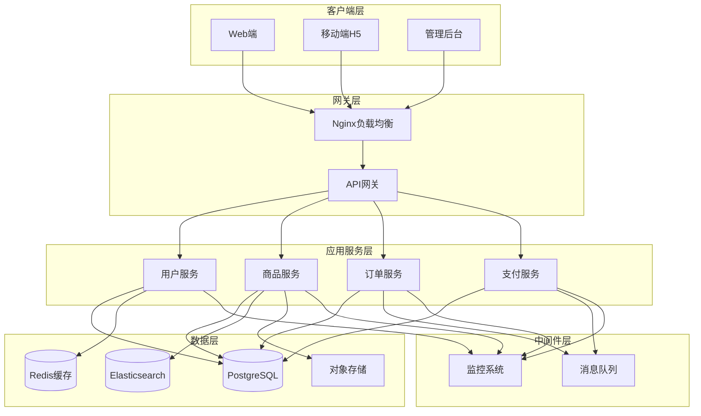

# 电商系统基础架构设计

## 项目概述
- **项目名称**: 中等规模电商系统
- **目标规模**: 10-50万用户，日订单量1000-5000单
- **核心模块**: 用户管理、商品管理、订单管理、支付模块

## 技术栈推荐

### 前端技术栈
- **框架**: React 18 + TypeScript
- **状态管理**: Redux Toolkit + RTK Query
- **UI组件库**: Ant Design / Material-UI
- **构建工具**: Vite
- **样式方案**: Tailwind CSS + CSS Modules

### 后端技术栈
- **主框架**: Node.js + Express.js + TypeScript
- **数据库**: 
  - 主数据库: PostgreSQL 14+
  - 缓存: Redis 7+
  - 搜索引擎: Elasticsearch 8+
- **消息队列**: RabbitMQ / Apache Kafka
- **文件存储**: AWS S3 / 阿里云OSS

### 基础设施
- **容器化**: Docker + Docker Compose
- **反向代理**: Nginx
- **监控**: Prometheus + Grafana
- **日志**: ELK Stack (Elasticsearch + Logstash + Kibana)

## 系统架构图

## 核心模块设计

### 1. 用户管理模块
**功能范围**:
- 用户注册/登录/登出
- 用户信息管理
- 权限管理
- 地址管理

**技术实现**:
- JWT身份认证
- bcrypt密码加密
- Redis会话管理
- RBAC权限控制

### 2. 商品管理模块
**功能范围**:
- 商品信息管理
- 商品分类管理
- 库存管理
- 商品搜索

**技术实现**:
- PostgreSQL主数据存储
- Elasticsearch全文搜索
- Redis热门商品缓存
- 图片存储到S3

### 3. 订单管理模块
**功能范围**:
- 订单创建/查询/更新
- 订单状态管理
- 订单统计
- 退款处理

**技术实现**:
- 分布式事务处理
- 消息队列异步处理
- Redis订单状态缓存
- 数据库分表策略

### 4. 支付模块
**功能范围**:
- 多支付方式集成
- 支付状态同步
- 退款处理
- 对账管理

**技术实现**:
- 第三方支付API集成
- 支付状态机管理
- 消息队列异步通知
- 数据库事务保证

## 数据库设计概要

### 主要数据表
1. **users** - 用户基础信息
2. **products** - 商品信息
3. **categories** - 商品分类
4. **orders** - 订单主表
5. **order_items** - 订单明细
6. **payments** - 支付记录
7. **user_addresses** - 用户地址

### 索引策略
- 用户ID、订单ID主键索引
- 商品分类、价格范围复合索引
- 订单创建时间、状态复合索引
- 全文搜索索引(Elasticsearch)

## 性能优化策略

### 缓存策略
- Redis缓存用户会话
- 商品信息缓存(热点数据)
- 分类树结构缓存
- 购物车数据缓存

### 数据库优化
- 读写分离
- 分库分表(订单表)
- 索引优化
- 连接池管理

### 前端优化
- 代码分割
- 图片懒加载
- CDN加速
- 浏览器缓存

## 安全措施

### 身份认证
- JWT Token认证
- 刷新Token机制
- 多因素认证(可选)

### 数据安全
- HTTPS传输加密
- 数据库字段加密
- API接口鉴权
- SQL注入防护

### 业务安全
- 防刷单机制
- 库存超卖防护
- 支付安全验证
- 敏感操作日志

## 部署架构

### 开发环境
- Docker Compose本地部署
- 热重载开发服务器
- Mock数据服务

### 生产环境
- Kubernetes集群部署
- 微服务独立部署
- 自动扩缩容
- 滚动更新

## 监控告警

### 系统监控
- 服务器资源监控
- 应用性能监控
- 数据库性能监控
- 网络监控

### 业务监控
- 订单量监控
- 用户活跃度监控
- 支付成功率监控
- 错误率监控

## 扩展性考虑

### 水平扩展
- 无状态服务设计
- 数据库分片
- 缓存集群
- 负载均衡

### 功能扩展
- 插件化架构
- API版本管理
- 配置中心
- 服务注册发现