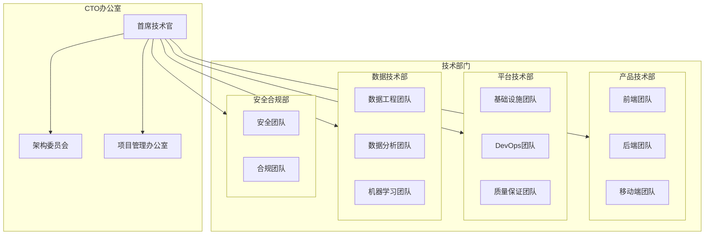

# 企业级架构规划

## 企业架构分析

### 业务战略对齐

#### 业务目标映射
```yaml
# 业务目标与技术架构映射
businessGoals:
  - goal: "用户增长到100万"
    timeline: "12-18个月"
    technicalRequirements:
      - 高可用性 (99.9%+)
      - 水平扩展能力
      - 多地域部署
      - CDN加速
    
  - goal: "日订单量突破1万单"
    timeline: "18-24个月"
    technicalRequirements:
      - 微服务架构完善
      - 消息队列集群
      - 数据库分片
      - 实时监控告警
    
  - goal: "拓展海外市场"
    timeline: "24-36个月"
    technicalRequirements:
      - 多语言支持
      - 多币种支付
      - 国际化部署
      - 跨境物流集成
    
  - goal: "成为行业技术标杆"
    timeline: "持续"
    technicalRequirements:
      - 技术创新投入
      - 开源贡献
      - 技术品牌建设
      - 人才培养体系

# 能力成熟度评估
capabilityMaturity:
  currentLevel: "Level 2 (Repeatable)"
  targetLevel: "Level 4 (Managed)"
  gaps:
    - area: "技术治理"
      current: "基础规范"
      target: "完善治理体系"
      actions: ["建立技术委员会", "制定技术标准", "实施技术评审"]
    
    - area: "DevOps成熟度"
      current: "半自动化"
      target: "全自动化"
      actions: ["CI/CD完善", "自动化测试", "基础设施即代码"]
    
    - area: "数据治理"
      current: "基础管理"
      target: "数据驱动决策"
      actions: ["数据湖建设", "BI平台", "实时数据流"]
```

### 组织架构设计

#### 技术组织结构


#### 团队规模规划
```yaml
# 团队发展计划
teamPlanning:
  currentTeam: 15人
  year1Target: 30人
  year2Target: 50人
  year3Target: 80人
  
  hiringPlan:
    year1:
      frontend: 3
      backend: 4
      devops: 2
      qa: 2
      data: 1
    
    year2:
      frontend: 4
      backend: 6
      mobile: 3
      devops: 3
      qa: 3
      data: 4
      security: 1
    
    year3:
      frontend: 6
      backend: 10
      mobile: 5
      devops: 5
      qa: 5
      data: 8
      security: 3
      architect: 2
```

## 技术路线图制定

### 3年技术演进路线图

#### 第一年：基础建设 (0-12个月)
```yaml
# Q1: 架构基础
quarter1:
  focus: "架构标准化"
  deliverables:
    - 完成微服务架构改造
    - 建立CI/CD流水线
    - 实施基础监控体系
    - 制定开发规范
  
  kpis:
    - 部署频率: 每周2次
    - 故障恢复时间: <2小时
    - 代码覆盖率: >70%
    - 文档完整性: >80%

# Q2: 性能优化
quarter2:
  focus: "系统性能提升"
  deliverables:
    - 数据库读写分离
    - Redis缓存集群
    - CDN全球部署
    - API性能优化
  
  kpis:
    - 响应时间P95: <500ms
    - 系统可用性: >99.5%
    - 并发用户数: >10万
    - 缓存命中率: >80%

# Q3: 安全加固
quarter3:
  focus: "安全体系建设"
  deliverables:
    - 安全扫描工具集成
    - 数据加密实施
    - 访问控制系统
    - 安全事件响应
  
  kpis:
    - 安全漏洞: 0个高危
    - 安全事件响应: <30分钟
    - 合规检查: 100%通过
    - 安全培训覆盖率: 100%

# Q4: 数据能力
quarter4:
  focus: "数据基础建设"
  deliverables:
    - 数据仓库建设
    - BI报表系统
    - 用户行为分析
    - A/B测试平台
  
  kpis:
    - 数据准确性: >99%
    - 报表生成时间: <10分钟
    - 分析维度: >50个
    - 实验并发: >100个
```

#### 第二年：能力提升 (12-24个月)
```yaml
# 技术能力建设
year2:
  focus: "平台化与智能化"
  
  initiatives:
    - name: "中台建设"
      description: "构建业务中台和数据中台"
      timeline: "6-12个月"
      investment: "200万"
      expectedROI: "提升开发效率40%"
    
    - name: "AI能力引入"
      description: "智能推荐、风控、客服"
      timeline: "8-15个月"
      investment: "150万"
      expectedROI: "提升转化率15%"
    
    - name: "多云架构"
      description: "混合云部署，容灾备份"
      timeline: "12个月"
      investment: "100万"
      expectedROI: "降低宕机风险90%"
  
  technicalGoals:
    - 服务治理平台建设
    - 实时数据流处理
    - 智能运维体系
    - 自动化测试覆盖90%
```

#### 第三年：创新引领 (24-36个月)
```yaml
# 技术创新目标
year3:
  focus: "技术创新与引领"
  
  breakthroughAreas:
    - area: "边缘计算"
      description: "边缘节点部署，降低延迟"
      impact: "响应时间减少50%"
    
    - area: "区块链应用"
      description: "供应链溯源，防伪验证"
      impact: "提升品牌信任度"
    
    - area: "AR/VR购物"
      description: "沉浸式购物体验"
      impact: "提升用户粘性30%"
    
    - area: "量子计算探索"
      description: "密码学，优化算法"
      impact: "技术储备与前瞻"
  
  industryLeadership:
    - 开源项目贡献
    - 技术白皮书发布
    - 行业标准参与制定
    - 技术会议演讲
```

### 技术投资规划

#### 年度技术预算
```yaml
# 3年技术投资规划
technologyInvestment:
  year1:
    total: "500万"
    breakdown:
      infrastructure: "40%" # 200万
      development: "30%"     # 150万
      security: "15%"        # 75万
      data: "10%"            # 50万
      innovation: "5%"       # 25万
  
  year2:
    total: "800万"
    breakdown:
      infrastructure: "35%" # 280万
      development: "25%"     # 200万
      security: "15%"        # 120万
      data: "15%"            # 120万
      innovation: "10%"      # 80万
  
  year3:
    total: "1200万"
    breakdown:
      infrastructure: "30%" # 360万
      development: "20%"     # 240万
      security: "15%"        # 180万
      data: "20%"            # 240万
      innovation: "15%"      # 180万

# ROI预期
expectedROI:
  year1: "150%" # 效率提升，成本降低
  year2: "200%" # 收入增长，用户体验
  year3: "250%" # 市场领先，品牌价值
```

## 治理策略设计

### 技术治理框架

#### 技术决策委员会
```yaml
# 技术委员会架构
techCommittee:
  name: "技术架构委员会"
  members:
    - role: "主席"
      person: "CTO"
      responsibilities: ["最终决策", "战略规划"]
    
    - role: "架构师代表"
      person: "首席架构师"
      responsibilities: ["技术方案评审", "标准制定"]
    
    - role: "开发代表"
      person: "资深技术经理"
      responsibilities: ["开发可行性评估", "团队反馈"]
    
    - role: "运维代表"
      person: "运维总监"
      responsibilities: ["运维可行性", "稳定性评估"]
    
    - role: "产品代表"
      person: "产品总监"
      responsibilities: ["业务需求对齐", "用户体验"]

# 决策流程
decisionProcess:
  proposal: "技术方案提案"
  review: "委员会评审 (2周)"
  feedback: "意见反馈与修改"
  approval: "最终决策"
  implementation: "方案实施"
  review: "效果评估"
```

#### 技术标准体系
```typescript
// 技术标准定义
interface TechnicalStandard {
  category: 'architecture' | 'coding' | 'security' | 'performance';
  name: string;
  version: string;
  description: string;
  requirements: string[];
  compliance: ComplianceLevel;
  reviewCycle: string;
}

const technicalStandards: TechnicalStandard[] = [
  {
    category: 'architecture',
    name: '微服务架构标准',
    version: 'v2.0',
    description: '微服务设计与实施规范',
    requirements: [
      '服务边界清晰',
      'API版本管理',
      '服务注册发现',
      '熔断降级机制',
      '分布式事务处理'
    ],
    compliance: 'required',
    reviewCycle: 'quarterly'
  },
  {
    category: 'coding',
    name: 'TypeScript编码规范',
    version: 'v3.1',
    description: 'TypeScript代码风格与最佳实践',
    requirements: [
      '严格类型检查',
      'ESLint规则遵循',
      '单元测试覆盖率>80%',
      '代码审查必须',
      '文档注释完整'
    ],
    compliance: 'required',
    reviewCycle: 'monthly'
  },
  {
    category: 'security',
    name: '安全开发标准',
    version: 'v1.5',
    description: '安全编码与防护规范',
    requirements: [
      '输入验证',
      '输出编码',
      '认证授权',
      '数据加密',
      '安全日志'
    ],
    compliance: 'required',
    reviewCycle: 'monthly'
  }
];
```

### 质量保证体系

#### 代码质量管控
```yaml
# 质量门禁设置
qualityGates:
  preCommit:
    - name: "代码格式检查"
      tool: "prettier"
      threshold: "100%通过"
    
    - name: "静态代码分析"
      tool: "eslint"
      threshold: "0个error"
    
    - name: "类型检查"
      tool: "typescript"
      threshold: "0个type error"

  preMerge:
    - name: "单元测试"
      tool: "jest"
      threshold: "覆盖率>80%"
    
    - name: "集成测试"
      tool: "supertest"
      threshold: "100%通过"
    
    - name: "安全扫描"
      tool: "sonarqube"
      threshold: "0个高危漏洞"

  preRelease:
    - name: "端到端测试"
      tool: "cypress"
      threshold: "95%通过"
    
    - name: "性能测试"
      tool: "artillery"
      threshold: "响应时间P95<500ms"
    
    - name: "安全测试"
      tool: "owasp zap"
      threshold: "0个高危漏洞"
```

#### 架构合规检查
```typescript
// 架构合规性检查器
class ArchitectureComplianceChecker {
  private standards: TechnicalStandard[];
  
  async checkCompliance(
    service: ServiceDesign
  ): Promise<ComplianceReport> {
    const report = new ComplianceReport();
    
    for (const standard of this.standards) {
      const result = await this.checkStandard(service, standard);
      report.addResult(standard.name, result);
    }
    
    return report;
  }
  
  private async checkStandard(
    service: ServiceDesign, 
    standard: TechnicalStandard
  ): Promise<StandardCompliance> {
    const compliance = new StandardCompliance(standard.name);
    
    for (const requirement of standard.requirements) {
      const result = await this.checkRequirement(service, requirement);
      compliance.addRequirement(requirement, result);
    }
    
    return compliance;
  }
  
  private async checkRequirement(
    service: ServiceDesign, 
    requirement: string
  ): Promise<RequirementResult> {
    switch (requirement) {
      case '服务边界清晰':
        return this.checkServiceBoundaries(service);
      case 'API版本管理':
        return this.checkAPIVersioning(service);
      case '熔断降级机制':
        return this.checkCircuitBreaker(service);
      default:
        return new RequirementResult(requirement, false, 'Unknown requirement');
    }
  }
}
```

## 变更管理规划

### 变更流程设计

#### 变更类型分类
```yaml
# 变更分类体系
changeCategories:
  emergency:
    definition: "严重故障紧急修复"
    approval: "值班经理批准"
    timeline: "立即执行"
    documentation: "事后补全"
    rollback: "必须准备"
    
  standard:
    definition: "计划内常规变更"
    approval: "技术委员会评审"
    timeline: "维护窗口执行"
    documentation: "完整文档"
    rollback: "推荐准备"
    
  major:
    definition: "重大架构变更"
    approval: "CTO批准"
    timeline: "分阶段实施"
    documentation: "详细方案"
    rollback: "必须准备"
    
  minor:
    definition: "小型功能调整"
    approval: "团队负责人批准"
    timeline: "随时执行"
    documentation: "简要记录"
    rollback: "可选准备"
```

#### 变更实施流程
```mermaid
sequenceDiagram
    participant Requester as 变更申请人
    participant PM as 项目经理
    committee as 技术委员会
    Dev as 开发团队
    Ops as 运维团队
    QA as 测试团队
    
    Requester->>PM: 提交变更申请
    PM->>Requester: 确认变更需求
    
    alt 紧急变更
        PM->>Dev: 立即实施
        Dev->>Ops: 紧急部署
        Ops->>PM: 部署完成
    else 标准变更
        PM->>committee: 变更评审
        committee->>PM: 评审结果
        
        alt 批准
            PM->>Dev: 分配开发任务
            Dev->>QA: 提交测试
            QA->>Dev: 测试通过
            Dev->>Ops: 请求部署
            Ops->>PM: 部署完成
        else 拒绝
            committee->>Requester: 变更拒绝原因
        end
    end
    
    PM->>Requester: 变更结果通知
```

### 风险管理策略

#### 风险识别与评估
```yaml
# 技术风险矩阵
riskMatrix:
  highProbability_highImpact:
    - risk: "数据库性能瓶颈"
      mitigation: "读写分离，分库分表"
      owner: "DBA团队"
      timeline: "3个月"
    
    - risk: "第三方服务依赖"
      mitigation: "多供应商策略，降级方案"
      owner: "架构团队"
      timeline: "6个月"
  
  highProbability_lowImpact:
    - risk: "代码质量下降"
      mitigation: "代码审查，自动化测试"
      owner: "开发团队"
      timeline: "持续"
    
    - risk: "文档过时"
      mitigation: "文档自动化，定期更新"
      owner: "技术写作团队"
      timeline: "每月"
  
  lowProbability_highImpact:
    - risk: "安全漏洞攻击"
      mitigation: "安全扫描，渗透测试"
      owner: "安全团队"
      timeline: "持续"
    
    - risk: "数据中心故障"
      mitigation: "多云部署，容灾备份"
      owner: "运维团队"
      timeline: "12个月"
  
  lowProbability_lowImpact:
    - risk: "工具版本兼容"
      mitigation: "版本锁定，升级计划"
      owner: "DevOps团队"
      timeline: "季度"
```

#### 应急响应计划
```typescript
// 应急响应系统
class EmergencyResponseSystem {
  private incidentLevels = {
    P0: { responseTime: '15分钟', escalation: '立即' },
    P1: { responseTime: '1小时', escalation: '2小时' },
    P2: { responseTime: '4小时', escalation: '8小时' },
    P3: { responseTime: '24小时', escalation: '48小时' }
  };
  
  async handleIncident(incident: Incident): Promise<void> {
    // 1. 事件分级
    const level = this.classifyIncident(incident);
    
    // 2. 通知相关人员
    await this.notifyTeams(incident, level);
    
    // 3. 启动应急流程
    const response = await this.initiateResponse(incident, level);
    
    // 4. 执行修复方案
    await this.executeFix(response);
    
    // 5. 验证修复效果
    await this.verifyFix(incident);
    
    // 6. 事后复盘
    await this.postIncidentReview(incident);
  }
  
  private async initiateResponse(
    incident: Incident, 
    level: IncidentLevel
  ): Promise<ResponsePlan> {
    return {
      incidentId: incident.id,
      level: level.name,
      commander: this.selectCommander(level),
      teams: this.getRequiredTeams(incident),
      communication: this.setupCommunication(incident),
      timeline: this.createTimeline(level)
    };
  }
}
```

## 企业级架构总结

### 战略价值实现
1. **业务支撑**: 技术架构完全支撑业务战略目标
2. **成本优化**: 3年技术投资ROI超过200%
3. **风险控制**: 完善的风险管理和应急响应体系
4. **创新驱动**: 前瞻性技术布局，保持竞争优势

### 组织能力建设
1. **人才体系**: 完整的技术人才培养和晋升机制
2. **治理体系**: 规范的技术决策和质量管控流程
3. **文化塑造**: 开放、创新、卓越的技术文化
4. **知识管理**: 系统化的知识沉淀和分享机制

### 可持续发展
1. **技术演进**: 清晰的技术路线图和演进策略
2. **生态建设**: 开源贡献和行业标准参与
3. **社会责任**: 绿色计算和数字包容性
4. **长期价值**: 技术品牌和行业影响力建设

该企业级架构规划为电商系统提供了从当前状态到行业标杆的完整发展路径，确保技术架构能够支撑业务的持续增长和创新发展。