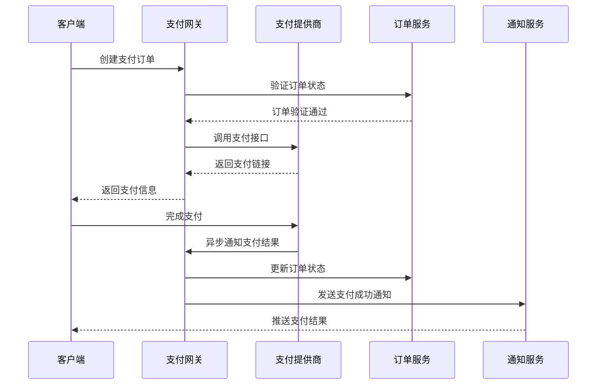

# 系统集成方案设计

## 第三方服务集成架构

### 支付服务集成

#### 支付渠道选择
```typescript
interface PaymentProvider {
  name: string;
  supportedMethods: PaymentMethod[];
  fees: FeeStructure;
  features: string[];
}

const paymentProviders: PaymentProvider[] = [
  {
    name: '支付宝',
    supportedMethods: ['alipay', 'alipay_scan'],
    fees: { rate: 0.006, minFee: 0.1 },
    features: ['instant_payment', 'refund', 'installment']
  },
  {
    name: '微信支付',
    supportedMethods: ['wechat_pay', 'wechat_scan'],
    fees: { rate: 0.006, minFee: 0.1 },
    features: ['instant_payment', 'refund', 'red_packet']
  },
  {
    name: '银联支付',
    supportedMethods: ['unionpay', 'unionpay_scan'],
    fees: { rate: 0.0055, minFee: 2.0 },
    features: ['instant_payment', 'refund', 'batch_payment']
  }
];
```

#### 支付网关设计


#### 支付服务实现
```typescript
class PaymentGateway {
  private providers: Map<string, PaymentProvider> = new Map();
  private eventBus: EventBus;
  
  constructor(eventBus: EventBus) {
    this.eventBus = eventBus;
    this.initializeProviders();
  }
  
  async createPayment(request: PaymentRequest): Promise<PaymentResponse> {
    // 1. 参数验证
    this.validateRequest(request);
    
    // 2. 选择支付提供商
    const provider = this.selectProvider(request.method);
    
    // 3. 创建支付记录
    const payment = await this.createPaymentRecord(request);
    
    // 4. 调用第三方接口
    try {
      const result = await provider.createPayment({
        orderId: payment.id,
        amount: request.amount,
        subject: request.subject,
        notifyUrl: this.getNotifyUrl(provider.name)
      });
      
      // 5. 更新支付记录
      await this.updatePaymentRecord(payment.id, {
        providerOrderId: result.orderId,
        paymentUrl: result.paymentUrl,
        status: 'pending'
      });
      
      return {
        paymentId: payment.id,
        paymentUrl: result.paymentUrl,
        expiresAt: result.expiresAt
      };
    } catch (error) {
      // 6. 错误处理
      await this.handlePaymentError(payment.id, error);
      throw error;
    }
  }
  
  async handleNotification(provider: string, notification: any): Promise<void> {
    // 1. 验证通知签名
    if (!this.verifyNotification(provider, notification)) {
      throw new Error('Invalid notification signature');
    }
    
    // 2. 查找支付记录
    const payment = await this.findPaymentByProviderOrder(
      provider, 
      notification.orderId
    );
    
    if (!payment) {
      throw new Error('Payment record not found');
    }
    
    // 3. 更新支付状态
    const oldStatus = payment.status;
    await this.updatePaymentStatus(payment.id, notification.status);
    
    // 4. 发布事件
    this.eventBus.publish('payment.status.changed', {
      paymentId: payment.id,
      oldStatus,
      newStatus: notification.status,
      provider,
      timestamp: new Date()
    });
  }
}
```

### 物流服务集成

#### 物流服务商选择
```typescript
interface LogisticsProvider {
  name: string;
  supportedRegions: string[];
  services: LogisticsService[];
  tracking: TrackingCapability;
}

const logisticsProviders: LogisticsProvider[] = [
  {
    name: '顺丰速运',
    supportedRegions: ['CN', 'HK', 'TW', 'MO'],
    services: [
      { type: 'standard', deliveryTime: '1-2天' },
      { type: 'express', deliveryTime: '当日达' },
      { type: 'economy', deliveryTime: '2-3天' }
    ],
    tracking: { realTime: true, api: true, webhook: true }
  },
  {
    name: '中通快递',
    supportedRegions: ['CN'],
    services: [
      { type: 'standard', deliveryTime: '2-3天' },
      { type: 'economy', deliveryTime: '3-5天' }
    ],
    tracking: { realTime: false, api: true, webhook: false }
  }
];
```

#### 物流集成架构
```typescript
class LogisticsService {
  private providers: Map<string, LogisticsProvider> = new Map();
  private trackingCache: RedisClient;
  
  async createShipment(order: Order, address: Address): Promise<Shipment> {
    // 1. 选择最优物流商
    const provider = await this.selectOptimalProvider(order, address);
    
    // 2. 创建运单
    const shipment = await provider.createShipment({
      orderId: order.id,
      sender: this.getSenderInfo(),
      receiver: address,
      items: order.items,
      service: order.deliveryMethod
    });
    
    // 3. 保存运单信息
    await this.saveShipment(shipment);
    
    // 4. 启动轨迹跟踪
    this.startTracking(shipment);
    
    return shipment;
  }
  
  async trackShipment(shipmentId: string): Promise<TrackingInfo[]> {
    // 1. 检查缓存
    const cached = await this.trackingCache.get(`track:${shipmentId}`);
    if (cached) {
      return JSON.parse(cached);
    }
    
    // 2. 调用物流商API
    const shipment = await this.findShipment(shipmentId);
    const provider = this.providers.get(shipment.provider);
    
    const tracking = await provider.trackShipment(shipment.providerShipmentId);
    
    // 3. 缓存结果
    await this.trackingCache.setex(
      `track:${shipmentId}`, 
      300, // 5分钟缓存
      JSON.stringify(tracking)
    );
    
    return tracking;
  }
  
  private async selectOptimalProvider(
    order: Order, 
    address: Address
  ): Promise<LogisticsProvider> {
    const candidates = this.providers.filter(p => 
      p.supportedRegions.includes(address.country)
    );
    
    // 评估指标
    const scores = await Promise.all(candidates.map(async provider => {
      const cost = await provider.calculateCost(order, address);
      const time = provider.getDeliveryTime(address);
      const reliability = provider.getReliability();
      
      return {
        provider,
        score: this.calculateScore(cost, time, reliability)
      };
    }));
    
    return scores.sort((a, b) => b.score - a.score)[0].provider;
  }
}
```

### 短信/邮件服务集成

#### 通知服务架构
```typescript
interface NotificationChannel {
  type: 'sms' | 'email' | 'push';
  provider: string;
  config: any;
}

class NotificationService {
  private channels: Map<string, NotificationChannel> = new Map();
  private templates: TemplateEngine;
  private rateLimiter: RateLimiter;
  
  async sendNotification(request: NotificationRequest): Promise<void> {
    // 1. 频率限制检查
    await this.rateLimiter.checkLimit(
      request.userId, 
      request.type, 
      request.channel
    );
    
    // 2. 内容渲染
    const content = await this.templates.render(
      request.template, 
      request.data
    );
    
    // 3. 发送通知
    const results = await Promise.allSettled(
      request.channels.map(channel => 
        this.sendViaChannel(channel, request.recipient, content)
      )
    );
    
    // 4. 记录发送结果
    await this.logNotificationResults(request, results);
  }
  
  private async sendViaChannel(
    channel: string, 
    recipient: string, 
    content: any
  ): Promise<void> {
    const config = this.channels.get(channel);
    if (!config) {
      throw new Error(`Channel ${channel} not configured`);
    }
    
    switch (config.type) {
      case 'sms':
        await this.sendSMS(config.provider, recipient, content);
        break;
      case 'email':
        await this.sendEmail(config.provider, recipient, content);
        break;
      case 'push':
        await this.sendPush(config.provider, recipient, content);
        break;
    }
  }
}
```

## API设计规范

### RESTful API设计

#### API版本管理
```typescript
// API版本策略
const apiVersioning = {
  // URL路径版本控制
  pathVersioning: '/api/v1/users',
  
  // Header版本控制
  headerVersioning: {
    header: 'API-Version',
    supported: ['v1', 'v2']
  },
  
  // 查询参数版本控制
  queryVersioning: '/api/users?version=v1'
};

// 版本兼容性处理
class APIVersionHandler {
  async handleRequest(request: Request): Promise<Response> {
    const version = this.detectVersion(request);
    const handler = this.getHandler(version, request.path);
    
    if (!handler) {
      throw new ApiError(404, 'API version not supported');
    }
    
    return await handler(request);
  }
}
```

#### API响应格式标准
```typescript
interface APIResponse<T = any> {
  success: boolean;
  code: number;
  message: string;
  data?: T;
  pagination?: PaginationInfo;
  timestamp: string;
  requestId: string;
}

// 成功响应
const successResponse = <T>(data: T, meta?: any): APIResponse<T> => ({
  success: true,
  code: 200,
  message: 'Success',
  data,
  pagination: meta?.pagination,
  timestamp: new Date().toISOString(),
  requestId: generateRequestId()
});

// 错误响应
const errorResponse = (error: ApiError): APIResponse => ({
  success: false,
  code: error.statusCode,
  message: error.message,
  timestamp: new Date().toISOString(),
  requestId: generateRequestId()
});
```

### GraphQL API设计

#### Schema设计
```graphql
# 用户类型
type User {
  id: ID!
  username: String!
  email: String!
  profile: UserProfile
  addresses: [Address!]!
  orders(first: Int, after: String): OrderConnection!
}

# 商品类型
type Product {
  id: ID!
  name: String!
  description: String
  price: Decimal!
  category: Category!
  images: [ProductImage!]!
  variants: [ProductVariant!]!
  reviews(first: Int, after: String): ReviewConnection!
}

# 订单类型
type Order {
  id: ID!
  user: User!
  items: [OrderItem!]!
  totalAmount: Decimal!
  status: OrderStatus!
  payment: Payment
  shipment: Shipment
  createdAt: DateTime!
  updatedAt: DateTime!
}

# 查询根类型
type Query {
  # 用户查询
  user(id: ID!): User
  me: User
  
  # 商品查询
  product(id: ID!): Product
  products(
    filter: ProductFilter
    sort: ProductSort
    first: Int
    after: String
  ): ProductConnection!
  
  # 订单查询
  order(id: ID!): Order
  orders(
    status: OrderStatus
    first: Int
    after: String
  ): OrderConnection!
}

# 变更根类型
type Mutation {
  # 用户操作
  updateProfile(input: UpdateProfileInput!): User!
  addAddress(input: AddAddressInput!): Address!
  
  # 购物车操作
  addToCart(productId: ID!, variantId: ID!, quantity: Int!): Cart!
  removeFromCart(itemId: ID!): Cart!
  
  # 订单操作
  createOrder(input: CreateOrderInput!): Order!
  cancelOrder(orderId: ID!): Order!
  
  # 支付操作
  createPayment(orderId: ID!, method: PaymentMethod!): Payment!
}
```

#### GraphQL解析器实现
```typescript
class UserResolvers {
  // 字段解析器
  async orders(parent: User, args: any, context: Context): Promise<OrderConnection> {
    const { first, after, status } = args;
    const { userId } = context;
    
    // 权限检查
    if (parent.id !== userId) {
      throw new ForbiddenError('Access denied');
    }
    
    // 构建查询
    const query: OrderQuery = {
      userId: parent.id,
      status,
      limit: first || 20,
      cursor: after
    };
    
    // 执行查询
    const orders = await context.orderService.findOrders(query);
    const totalCount = await context.orderService.countOrders(query);
    
    return {
      edges: orders.map(order => ({
        node: order,
        cursor: order.id
      })),
      pageInfo: {
        hasNextPage: orders.length === query.limit,
        endCursor: orders[orders.length - 1]?.id
      },
      totalCount
    };
  }
  
  // 变更解析器
  async updateProfile(
    parent: any, 
    args: { input: UpdateProfileInput }, 
    context: Context
  ): Promise<User> {
    const { input } = args;
    const { userId } = context;
    
    // 参数验证
    const validation = validateUpdateProfileInput(input);
    if (!validation.isValid) {
      throw new ValidationError(validation.errors);
    }
    
    // 更新用户信息
    const user = await context.userService.updateProfile(userId, input);
    
    // 发布事件
    context.eventBus.publish('user.profile.updated', {
      userId,
      changes: input,
      timestamp: new Date()
    });
    
    return user;
  }
}
```

## 数据流建模

### 事件驱动架构

#### 事件设计
```typescript
interface DomainEvent {
  id: string;
  type: string;
  aggregateId: string;
  aggregateType: string;
  data: any;
  metadata: {
    userId?: string;
    correlationId?: string;
    causationId?: string;
    timestamp: Date;
    version: number;
  };
}

// 订单事件
class OrderEvents {
  static OrderCreated(order: Order): DomainEvent {
    return {
      id: generateEventId(),
      type: 'OrderCreated',
      aggregateId: order.id,
      aggregateType: 'Order',
      data: {
        userId: order.userId,
        items: order.items,
        totalAmount: order.totalAmount,
        shippingAddress: order.shippingAddress
      },
      metadata: {
        userId: order.userId,
        timestamp: new Date(),
        version: 1
      }
    };
  }
  
  static OrderPaid(payment: Payment): DomainEvent {
    return {
      id: generateEventId(),
      type: 'OrderPaid',
      aggregateId: payment.orderId,
      aggregateType: 'Order',
      data: {
        paymentId: payment.id,
        amount: payment.amount,
        method: payment.method,
        paidAt: payment.paidAt
      },
      metadata: {
        timestamp: new Date(),
        version: 1
      }
    };
  }
}
```

#### 事件处理器
```typescript
class OrderEventHandler {
  constructor(
    private orderService: OrderService,
    private inventoryService: InventoryService,
    private notificationService: NotificationService,
    private analyticsService: AnalyticsService
  ) {}
  
  @EventHandler('OrderCreated')
  async handleOrderCreated(event: DomainEvent): Promise<void> {
    const { data } = event;
    
    // 1. 库存预扣
    await this.inventoryService.reserveItems(
      data.items.map(item => ({
        productId: item.productId,
        quantity: item.quantity
      }))
    );
    
    // 2. 发送订单确认通知
    await this.notificationService.sendNotification({
      userId: data.userId,
      type: 'order_created',
      channels: ['email', 'sms'],
      template: 'order_confirmation',
      data: {
        orderId: event.aggregateId,
        items: data.items,
        totalAmount: data.totalAmount
      }
    });
    
    // 3. 更新分析数据
    await this.analyticsService.trackEvent('order_created', {
      userId: data.userId,
      orderId: event.aggregateId,
      revenue: data.totalAmount,
      itemCount: data.items.length
    });
  }
  
  @EventHandler('OrderPaid')
  async handleOrderPaid(event: DomainEvent): Promise<void> {
    const { data } = event;
    
    // 1. 确认库存扣减
    const order = await this.orderService.getOrder(event.aggregateId);
    await this.inventoryService.confirmReservation(
      order.items.map(item => ({
        productId: item.productId,
        quantity: item.quantity
      }))
    );
    
    // 2. 触发发货流程
    await this.orderService.initiateShipment(event.aggregateId);
    
    // 3. 发送支付成功通知
    await this.notificationService.sendNotification({
      userId: order.userId,
      type: 'payment_success',
      channels: ['email', 'push'],
      template: 'payment_success',
      data: {
        orderId: event.aggregateId,
        amount: data.amount,
        method: data.method
      }
    });
  }
}
```

### 数据同步策略

#### CQRS模式实现
```typescript
// 命令模型
class OrderCommandModel {
  async createOrder(command: CreateOrderCommand): Promise<string> {
    // 1. 验证命令
    await this.validateCommand(command);
    
    // 2. 创建聚合
    const order = Order.create(command);
    
    // 3. 持久化聚合
    await this.orderRepository.save(order);
    
    // 4. 发布事件
    await this.eventBus.publishEvents(order.getUncommittedEvents());
    
    return order.id;
  }
}

// 查询模型
class OrderQueryModel {
  async getOrderById(orderId: string): Promise<OrderView> {
    // 从读模型查询
    return await this.orderReadRepository.findById(orderId);
  }
  
  async getOrdersByUser(userId: string, pagination: Pagination): Promise<OrderListView> {
    return await this.orderReadRepository.findByUserId(userId, pagination);
  }
}

// 投影处理器
class OrderProjection {
  @EventHandler('OrderCreated')
  async onOrderCreated(event: DomainEvent): Promise<void> {
    const view = {
      id: event.aggregateId,
      userId: event.data.userId,
      status: 'created',
      totalAmount: event.data.totalAmount,
      createdAt: event.metadata.timestamp,
      items: event.data.items
    };
    
    await this.orderReadRepository.insert(view);
  }
  
  @EventHandler('OrderPaid')
  async onOrderPaid(event: DomainEvent): Promise<void> {
    await this.orderReadRepository.update(event.aggregateId, {
      status: 'paid',
      paidAt: event.data.paidAt
    });
  }
}
```

## 集成测试策略

### 测试架构设计
```typescript
// 集成测试基类
abstract class IntegrationTest {
  protected app: Application;
  protected testDb: TestDatabase;
  protected mockServices: MockServices;
  
  @BeforeAll
  async setup(): Promise<void> {
    // 启动测试环境
    this.testDb = await TestDatabase.create();
    this.mockServices = new MockServices();
    this.app = await this.createTestApp();
  }
  
  @AfterAll
  async cleanup(): Promise<void> {
    await this.app.close();
    await this.testDb.close();
  }
  
  @BeforeEach
  async reset(): Promise<void> {
    await this.testDb.reset();
    this.mockServices.reset();
  }
}

// API集成测试
describe('Order API Integration', () => {
  let test: IntegrationTest;
  
  beforeAll(async () => {
    test = new OrderIntegrationTest();
    await test.setup();
  });
  
  it('should create order successfully', async () => {
    // 准备测试数据
    const user = await test.createTestUser();
    const products = await test.createTestProducts();
    
    // 模拟外部服务
    test.mockServices.paymentService.createPayment.mockResolvedValue({
      paymentId: 'pay_123',
      paymentUrl: 'https://payment.example.com/pay_123'
    });
    
    // 执行API调用
    const response = await test.app.request()
      .post('/api/v1/orders')
      .set('Authorization', `Bearer ${user.token}`)
      .send({
        items: [
          { productId: products[0].id, quantity: 2 }
        ],
        shippingAddress: test.createTestAddress()
      });
    
    // 验证响应
    expect(response.status).toBe(201);
    expect(response.body.success).toBe(true);
    expect(response.body.data.id).toBeDefined();
    
    // 验证数据库状态
    const order = await test.testDb.query(
      'SELECT * FROM orders WHERE id = $1',
      [response.body.data.id]
    );
    expect(order).toHaveLength(1);
    expect(order[0].status).toBe('created');
    
    // 验证外部服务调用
    expect(test.mockServices.paymentService.createPayment).toHaveBeenCalledTimes(1);
  });
});
```

## 集成方案总结

### 集成架构优势
1. **松耦合设计**: 通过事件驱动和API网关实现服务解耦
2. **可扩展性**: 支持新的第三方服务快速接入
3. **容错能力**: 熔断、重试、降级机制保证系统稳定性
4. **监控完善**: 全链路追踪和日志记录便于问题排查

### 关键集成点
1. **支付集成**: 支持多支付渠道，异步通知处理
2. **物流集成**: 智能物流商选择，实时轨迹跟踪
3. **通知集成**: 多渠道通知，模板化内容管理
4. **数据集成**: CQRS模式，事件驱动数据同步

### 实施建议
1. **分阶段集成**: 优先核心业务集成，逐步完善辅助功能
2. **监控先行**: 建立集成监控体系，及时发现问题
3. **文档完善**: 维护API文档和集成指南
4. **测试覆盖**: 保证集成测试覆盖率，确保集成质量

该集成方案为电商系统提供了完整的第三方服务接入能力，确保系统能够快速集成外部服务，提升业务功能和用户体验。